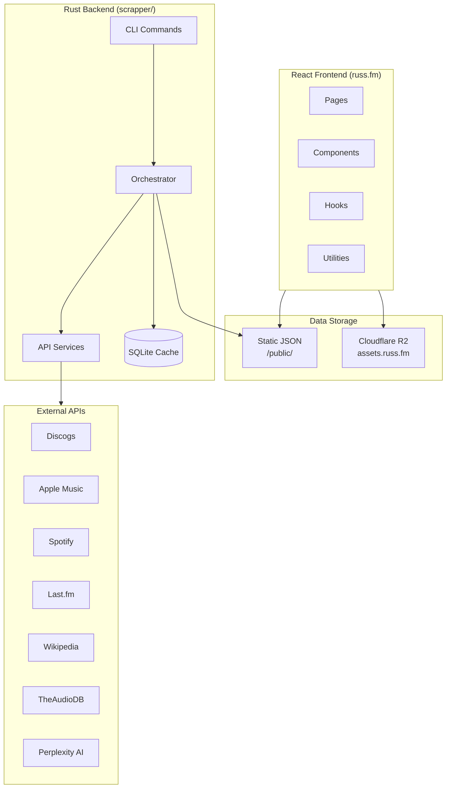
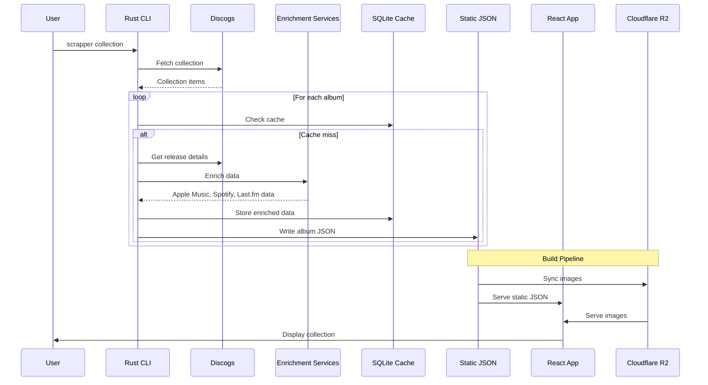

# russ.fm Documentation

A modern, full-stack music collection management and showcase system with a React frontend displaying enriched Discogs collection data processed by a Rust backend.

## Quick Links

| Section | Description |
|---------|-------------|
| [Getting Started](./getting-started/) | Prerequisites, setup, and first run |
| [Architecture](./architecture/) | System design and component interaction |
| [Frontend](./frontend/) | React app, components, hooks, and utilities |
| [Backend](./backend/) | Rust CLI, services, and data processing |
| [Data](./data/) | Schemas, models, and database structure |
| [Build Pipeline](./build-pipeline/) | Asset processing and deployment |
| [API Integrations](./api-integrations/) | Service-by-service documentation |
| [Development](./development/) | Workflows, configuration, and troubleshooting |

## System Architecture Overview



## Technology Stack

### Frontend
- **Framework**: React 19 + TypeScript
- **Build Tool**: Vite 7.0.0
- **Routing**: React Router DOM 7.6.3
- **UI Components**: shadcn/ui (Radix UI primitives)
- **Styling**: Tailwind CSS
- **Icons**: Lucide React
- **Animations**: Framer Motion
- **Search**: Fuse.js

### Backend
- **Language**: Rust
- **Interface**: TUI/CLI binary (`scrapper`)
- **Database**: SQLite
- **Install**: `cd scrapper && ./install.sh` (installs to `~/.cargo/bin`, runs from any directory)

### Infrastructure
- **Hosting**: Cloudflare Workers
- **Assets CDN**: Cloudflare R2
- **CI/CD**: GitHub Actions
- **Domain**: russ.fm / assets.russ.fm

## Key Features

### Collection Management
- Process and enrich Discogs vinyl collection data
- Multi-service data aggregation (Apple Music, Spotify, Last.fm, Wikipedia)
- AI-powered album descriptions via Perplexity
- Resume-capable batch processing

### Frontend Experience
- Responsive album and artist browsing
- Full-text search with fuzzy matching
- Genre filtering and sorting
- Album detail pages with rich metadata
- Music service embeds (Spotify, Apple Music)
- Last.fm scrobbling integration
- Year-in-review "Wrapped" feature
- Dynamic theming from album artwork

### Asset Pipeline
- Automated image processing and resizing
- Color palette extraction from album covers
- Open Graph image generation
- Incremental R2 sync with change detection

## Data Flow



## Project Structure

```
russ-fm/
├── src/                          # React frontend
│   ├── components/               # UI components
│   │   ├── ui/                   # shadcn/ui base components
│   │   └── home/                 # Home page sections
│   ├── pages/                    # Route-level components
│   │   └── wrapped/              # Year-in-review feature
│   ├── hooks/                    # Custom React hooks
│   ├── lib/                      # Utility functions
│   ├── services/                 # API services
│   ├── types/                    # TypeScript definitions
│   └── config/                   # App configuration
├── scrapper/                     # Rust data collection (TUI/CLI binary)
│   ├── src/                      # Rust source
│   ├── install.sh                # Build & install to ~/.cargo/bin
│   └── Cargo.toml                # Crate manifest
├── public/                       # Static data
│   ├── collection.json           # Album index
│   ├── album/{slug}/             # Album data & images
│   ├── artist/{slug}/            # Artist data & images
│   ├── album-colors.json         # Color palettes
│   └── album-colors.css          # CSS custom properties
├── scripts/                      # Build & deploy scripts
├── docs/                         # This documentation
└── .github/workflows/            # CI/CD pipelines
```

## Getting Help

- [Getting Started Guide](./getting-started/) - First-time setup
- [Troubleshooting](./development/troubleshooting.md) - Common issues
- [Configuration Reference](./development/configuration.md) - All options
- [CLI Commands](./backend/cli-commands.md) - Backend operations

## External Links

- [Live Site](https://russ.fm)
- [GitHub Repository](https://github.com/russmckendrick/russ-fm)
