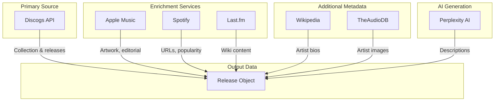
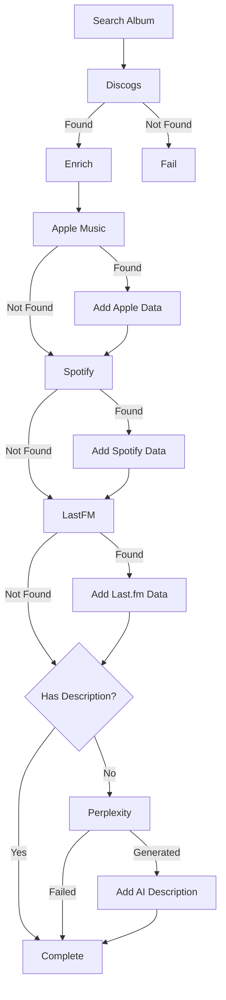

# API Integrations

This section covers all external API integrations used in russ.fm.

## Service Overview



## Quick Links

| Service | Documentation | Purpose |
|---------|---------------|---------|
| [Discogs](./discogs.md) | Primary data source | Collection, releases, artists |
| [Apple Music](./apple-music.md) | Enrichment | Artwork, editorial notes |
| [Spotify](./spotify.md) | Enrichment | Streaming links, popularity |
| [Last.fm](./lastfm.md) | Enrichment | Wiki content, scrobbling |
| [Perplexity](./perplexity.md) | AI generation | Album descriptions |
| [Others](./others.md) | Metadata | Wikipedia, TheAudioDB |

## Rate Limits

| Service | Rate Limit | Notes |
|---------|------------|-------|
| Discogs | 60/minute | Token-based auth |
| Apple Music | 1000/hour | JWT auth |
| Spotify | 100/minute | OAuth client credentials |
| Last.fm | 60/minute | API key auth |
| Perplexity | 20/minute | API key auth |
| Wikipedia | No limit | No auth required |
| TheAudioDB | No official limit | Free tier API |

## Data Priority

When multiple services provide the same data, priority order:

### Album Artwork
1. Apple Music (highest quality)
2. Discogs (primary source)
3. Spotify (fallback)

### Album Description
1. Apple Music editorial notes (short)
2. Apple Music editorial notes (standard)
3. Last.fm wiki summary
4. Perplexity AI (fallback)

### Genre Information
1. Apple Music genres
2. Spotify genres
3. Discogs genres/styles

### Artist Biography
1. Wikipedia extract
2. Last.fm bio
3. TheAudioDB biography

## Authentication Summary

### Token-Based
- **Discogs**: Personal access token
- **Last.fm**: API key + shared secret
- **Perplexity**: API key

### OAuth
- **Apple Music**: JWT with private key
- **Spotify**: Client credentials flow

### No Auth
- **Wikipedia**: Public API
- **TheAudioDB**: Free API (token optional)

## Error Handling

All services use standardized error handling:

```python
try:
    result = service.search_release(artist, album)
except RateLimitError as e:
    # Wait and retry
    time.sleep(e.retry_after or 60)
    result = service.search_release(artist, album)
except AuthenticationError:
    # Re-authenticate
    service.authenticate()
    result = service.search_release(artist, album)
except ServiceError:
    # Service unavailable, continue without
    result = None
```

## Fallback Chain



## Configuration Example

```json
{
  "discogs": {
    "access_token": "YOUR_TOKEN",
    "username": "YOUR_USERNAME",
    "rate_limit": 60
  },
  "apple_music": {
    "key_id": "YOUR_KEY_ID",
    "team_id": "YOUR_TEAM_ID",
    "private_key_path": "/path/to/AuthKey.p8",
    "storefront": "us",
    "rate_limit": 1000
  },
  "spotify": {
    "client_id": "YOUR_CLIENT_ID",
    "client_secret": "YOUR_CLIENT_SECRET",
    "market": "US",
    "rate_limit": 100
  },
  "lastfm": {
    "api_key": "YOUR_API_KEY",
    "shared_secret": "YOUR_SECRET",
    "rate_limit": 60
  },
  "perplexity": {
    "api_key": "YOUR_API_KEY",
    "model": "sonar",
    "rate_limit": 20
  }
}
```

## Testing Services

```bash
# Test all configured services
python main.py test

# Expected output:
# Testing Discogs... OK
# Testing Apple Music... OK
# Testing Spotify... OK
# Testing Last.fm... OK
# Testing Wikipedia... OK
# Testing TheAudioDB... OK
# Testing Perplexity... OK (optional)
```

## Related Documentation

- [Backend Services](../backend/services.md) - Service implementation
- [Orchestration](../backend/orchestration.md) - How services work together
- [Configuration](../development/configuration.md) - Full config reference
