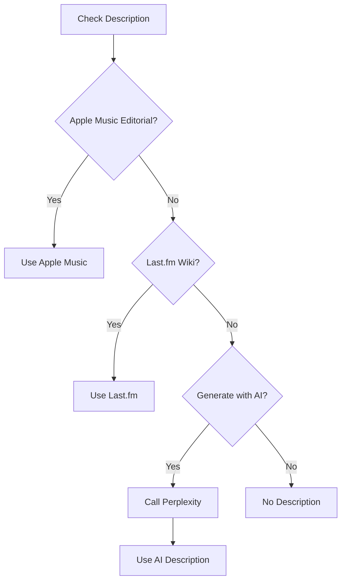

# Perplexity AI Integration

Perplexity AI provides AI-generated album descriptions when other sources are unavailable.

## Overview

- **Base URL**: `https://api.perplexity.ai`
- **Auth**: API key
- **Rate Limit**: 20 requests/minute
- **Model**: Sonar (default)

## Configuration

```json
{
  "perplexity": {
    "api_key": "YOUR_API_KEY",
    "model": "sonar",
    "rate_limit": 20
  }
}
```

### Getting Credentials

1. Go to [perplexity.ai](https://www.perplexity.ai/)
2. Navigate to API settings
3. Generate an API key

## Service Class

**File**: `scrapper/music_collection_manager/services/perplexity/perplexity_service.py`

```python
from music_collection_manager.services.perplexity import PerplexityService

service = PerplexityService(config)
```

## Methods

### is_available()

Check if API key is configured.

```python
if service.is_available():
    # Use service
else:
    print("Perplexity not configured")
```

---

### generate_album_description(artist, album, year=None, genres=None, labels=None)

Generate an AI description for an album.

```python
result = service.generate_album_description(
    artist="Radiohead",
    album="OK Computer",
    year=1997,
    genres=["Alternative Rock", "Art Rock"],
    labels=["Parlophone", "Capitol"]
)
```

**Parameters:**
| Name | Type | Required | Description |
|------|------|----------|-------------|
| artist | string | Yes | Artist name |
| album | string | Yes | Album title |
| year | int | No | Release year |
| genres | list | No | Genre list |
| labels | list | No | Record labels |

**Response:**
```python
{
    "description": "OK Computer, released in 1997 by Radiohead, marked a pivotal moment in alternative rock history. The album departed from the more conventional guitar-driven sound of their earlier work, incorporating electronic elements, atmospheric textures, and themes of modern alienation.\n\nCritically acclaimed upon release, OK Computer is widely regarded as one of the greatest albums ever made. Tracks like 'Paranoid Android,' 'Karma Police,' and 'No Surprises' showcase the band's ability to blend complex arrangements with emotionally resonant songwriting.\n\nThe album's exploration of technology, disconnection, and anxiety proved prescient, influencing countless artists and remaining culturally relevant decades after its release.",
    "generated_at": "2024-01-15T10:30:00Z",
    "model": "sonar",
    "prompt_tokens": 150,
    "completion_tokens": 250
}
```

---

## Prompt Engineering

### System Prompt

```python
system_prompt = """You are a music journalist writing album descriptions for a record collection database. Write informative, engaging descriptions that:
1. Highlight the album's significance and sound
2. Mention critical reception and cultural impact
3. Reference notable tracks or themes
4. Are 2-3 paragraphs long
5. Use an objective, encyclopedic tone"""
```

### User Prompt Template

```python
user_prompt = f"""Write a description of the album "{album}" by {artist}.

Context:
- Release Year: {year or 'Unknown'}
- Genres: {', '.join(genres) if genres else 'Unknown'}
- Labels: {', '.join(labels) if labels else 'Unknown'}

Write 2-3 paragraphs focusing on the album's sound, significance, and reception."""
```

### API Request

```python
import requests

def generate_description(artist, album, year, genres, labels):
    response = requests.post(
        "https://api.perplexity.ai/chat/completions",
        headers={
            "Authorization": f"Bearer {api_key}",
            "Content-Type": "application/json"
        },
        json={
            "model": "sonar",
            "messages": [
                {"role": "system", "content": system_prompt},
                {"role": "user", "content": user_prompt}
            ],
            "max_tokens": 500,
            "temperature": 0.7
        }
    )

    data = response.json()
    return {
        "description": data["choices"][0]["message"]["content"],
        "generated_at": datetime.utcnow().isoformat() + "Z",
        "model": "sonar",
        "prompt_tokens": data["usage"]["prompt_tokens"],
        "completion_tokens": data["usage"]["completion_tokens"]
    }
```

---

## CLI Commands

### List Albums Missing Descriptions

```bash
python main.py enrich-description --list-missing
```

**Output:**
```
Albums without descriptions:
1. 12345678 - Artist Name - Album Title (1999)
2. 23456789 - Another Artist - Another Album (2005)
...
Total: 42 albums
```

### Generate for Single Album

```bash
# By Discogs ID
python main.py enrich-description 12345678

# Preview without saving
python main.py enrich-description 12345678 --dry-run

# Force regenerate existing
python main.py enrich-description 12345678 --force
```

### Generate by Title/Artist

```bash
python main.py enrich-description "OK Computer" --artist "Radiohead"
```

### Batch Processing

```bash
# Multiple IDs
python main.py enrich-description 123,456,789

# Process backwards from ID
python main.py enrich-description --from 33817755

# Custom batch size (pause every N)
python main.py enrich-description --from 33817755 --batch-size 25
```

---

## Fallback Behavior

Perplexity is used as a fallback when other sources fail:



### Orchestrator Integration

```python
# In orchestrator.py
def enrich_release(self, release):
    # Try other sources first
    description = None

    if self.apple_music:
        am_data = self.apple_music.get_release_details(...)
        description = am_data.get("editorialNotes", {}).get("short")

    if not description and self.lastfm:
        lf_data = self.lastfm.get_album_info(...)
        description = lf_data.get("wiki", {}).get("summary")

    # Fallback to Perplexity
    if not description and self.perplexity and self.perplexity.is_available():
        result = self.perplexity.generate_album_description(
            artist=release.artist,
            album=release.title,
            year=release.year,
            genres=release.genres,
            labels=release.labels
        )
        release.raw_data["services"]["perplexity"] = result
```

---

## Data Storage

### Database

```python
# Store in SQLite
db.update_release_perplexity_description(
    discogs_id=123456,
    description={
        "description": "Generated text...",
        "generated_at": "2024-01-15T10:30:00Z",
        "model": "sonar"
    }
)
```

### JSON File

```python
# Update album JSON
updater.update_album_perplexity_description(
    discogs_id=123456,
    title="OK Computer",
    artists=["Radiohead"],
    description_data={
        "description": "Generated text...",
        "generated_at": "2024-01-15T10:30:00Z",
        "model": "sonar"
    }
)
```

### JSON Structure

```json
{
  "raw_data": {
    "services": {
      "perplexity": {
        "description": "OK Computer, released in 1997...",
        "generated_at": "2024-01-15T10:30:00Z",
        "model": "sonar",
        "prompt_tokens": 150,
        "completion_tokens": 250
      }
    }
  }
}
```

---

## Error Handling

```python
try:
    result = service.generate_album_description(artist, album)
except RateLimitError:
    # 20/min limit
    time.sleep(60)
    result = service.generate_album_description(artist, album)
except ServiceError as e:
    print(f"Generation failed: {e}")
    result = None
```

---

## Usage Example

```python
from music_collection_manager.services.perplexity import PerplexityService

service = PerplexityService(config)

if service.is_available():
    result = service.generate_album_description(
        artist="Radiohead",
        album="OK Computer",
        year=1997,
        genres=["Alternative Rock", "Art Rock"],
        labels=["Parlophone"]
    )

    print(f"Description: {result['description']}")
    print(f"Generated: {result['generated_at']}")
    print(f"Tokens used: {result['prompt_tokens']} + {result['completion_tokens']}")
else:
    print("Perplexity API not configured")
```

---

## Frontend Usage

```typescript
// Description priority in AlbumDetailPage.tsx
const description =
  // Apple Music editorial (preferred)
  album.raw_data?.services?.apple_music?.editorial_notes?.short ||
  album.raw_data?.services?.apple_music?.editorial_notes?.standard ||
  // Last.fm wiki
  album.raw_data?.services?.lastfm?.wiki_summary ||
  album.raw_data?.services?.lastfm?.wiki_content ||
  // AI fallback
  album.raw_data?.services?.perplexity?.description ||
  null;

{description && (
  <div className="album-description">
    <p>{description}</p>
    {album.raw_data?.services?.perplexity?.description && (
      <span className="text-muted text-sm">AI-generated description</span>
    )}
  </div>
)}
```

---

## Cost Considerations

- Monitor token usage
- Batch processing with pauses
- Cache results to avoid regeneration
- Use `--dry-run` to preview

## Related Documentation

- [Backend CLI](../backend/cli-commands.md) - enrich-description command
- [Data Schemas](../data/schemas.md) - Perplexity data structure
- [Orchestration](../backend/orchestration.md) - Fallback behavior
