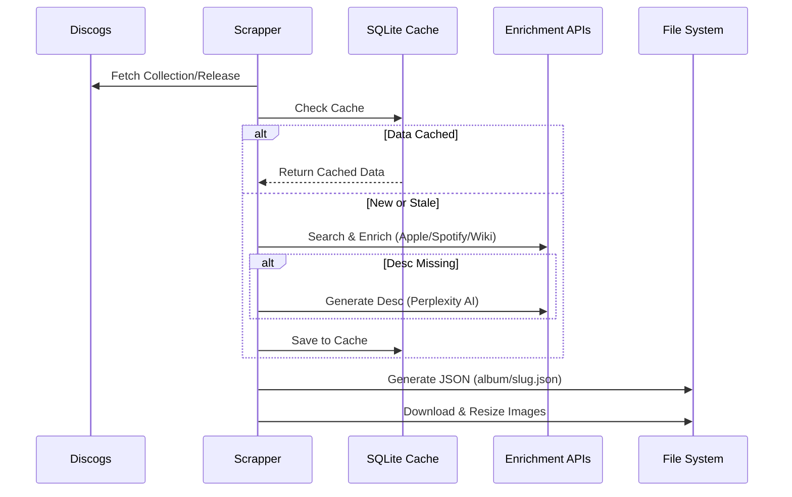
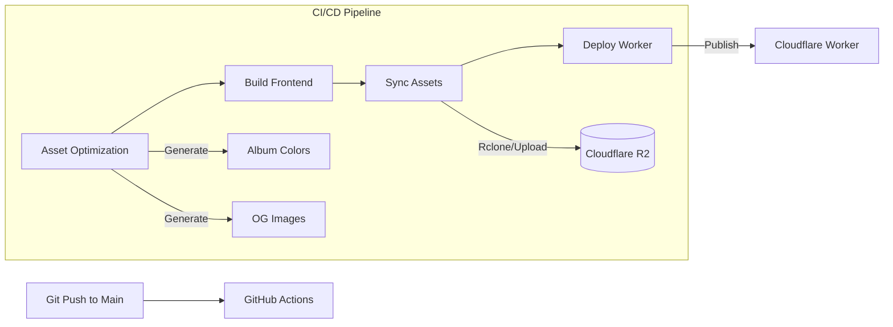
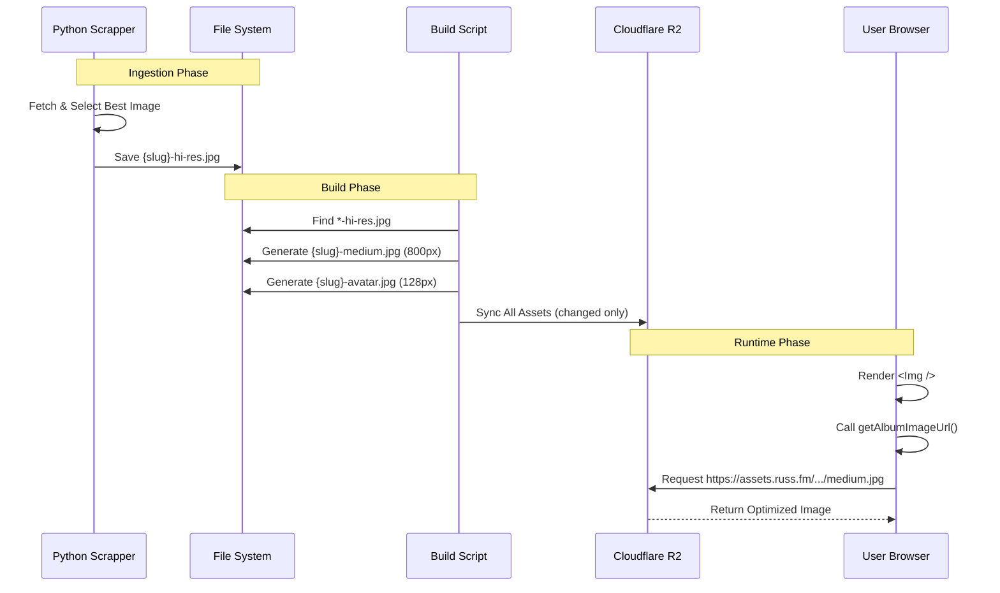

# System Architecture

This document outlines the high-level architecture of the Russ.fm project, illustrating how the data collection engine, frontend application, and deployment pipeline interact.

## High-Level Overview

The system follows a **Static Data, Dynamic UI** pattern. The backend runs offline to generate a static dataset, which the frontend consumes at runtime. This deciphers the complexity of real-time API aggregation from the user experience.

```mermaid
graph TD
    User[User] -->|Visits| Web[Web App (Cloudflare Workers)]
    Web -->|Fetches Data| R2[Cloudflare R2 Storage]
    
    subgraph "Offline Data Processing"
        Scrapper[Python Scrapper] -->|Writes| LocalDB[(SQLite Cache)]
        Scrapper -->|Generates| JSON[Static JSON Files]
        Scrapper -->|Downloads| Images[Image Assets]
    end
    
    subgraph "External APIs"
        Discogs[Discogs]
        Apple[Apple Music]
        Spotify[Spotify]
        LastFM[Last.fm]
        Wiki[Wikipedia]
        Perplexity[Perplexity AI]
    end
    
    Scrapper <--> Discogs
    Scrapper <--> Apple
    Scrapper <--> Spotify
    Scrapper <--> LastFM
    Scrapper <--> Wiki
    Scrapper <--> Perplexity
    
    JSON -->|Deployed to| R2
    Images -->|Deployed to| R2
```

## Data Enrichment Pipeline

The core value of the system is the data enrichment pipeline, which transforms raw Discogs data into a rich media experience.



## Deployment Architecture

The deployment pipeline is automated via GitHub Actions, ensuring that both code and data assets are synchronized efficiently.



## 🧩 Core Components & Classes

This section details the key classes and functions that power the application's unique features.

### Backend (`scrapper/`)

#### Data Management
-   **`ImageManager`** (`utils/image_manager.py`):
    -   **Responsibility**: Handles the downloading and organization of album artwork.
    -   **Logic**: Enforces `hi-res` (2000px+) downloads only. Implements a waterfall fallback strategy (e.g., Apple Music -> Spotify -> Last.fm -> Discogs) to find the highest quality image.
-   **`FolderSanitizer`** (`utils/folder_sanitizer.py`):
    -   **Responsibility**: Ensures consistent folder and file naming across the file system.
    -   **Logic**: Converts "Björk" -> "bjork", "Sigur Rós" -> "sigur-ros". Critical for linking static JSON data with frontend routes.
-   **`Orchestrator`** (`services/orchestrator.py`):
    -   **Responsibility**: The brain of the operation. Coordinations the fetching of data from Discogs, enriching it with external APIs, and calling `ImageManager` and `JsonUpdater`.

### Frontend (`src/`)

#### Image Handling
-   **`Image Asset Pipeline`** (`src/lib/image-utils.ts`):
    -   **`getImageUrl(path)`**: The single source of truth for resolving image paths. Automatically switches between local development (`/public/...`) and Production CDN (`https://assets.russ.fm/...`).
    -   **`getAlbumImageUrl(slug, size)`**: Typsafe helper to generate paths like `/album/artist-album/artist-album-medium.jpg`.
-   **`Build-Time Processor`** (`scripts/process-images.js` & `src/lib/imageProcessor.ts`):
    -   **Responsibility**: Runs during the build to generate optimized assets.
    -   **Input**: `hi-res` images from the backend.
    -   **Output**: Generates `medium` (800px) and `avatar` (128.px) versions.
    -   **Note**: Does **NOT** generate a `small` size, ensuring high-quality visuals on all devices.

---

## 🖼️ Deep Dive: Image Handling Pipeline

The system uses a "Store High, Serve Optimized" strategy for images.

### 1. Ingestion (Python Backend)
The `ImageManager` is strict about quality. It will only save an image if it meets the `hi-res` criteria (default 2000px).
-   **Path**: `data/releases/{slug}-{id}/{slug}-{id}-hi-res.jpg`
-   **Source Priority**:
    1.  **Apple Music**: Usually highest resolution (up to 3000px).
    2.  **Spotify**: Reliable 640px+ fallback.
    3.  **Last.fm**: Good for obscure artists.
    4.  **Discogs**: Often lower quality, used as last resort.

### 2. Build Processing (Node.js)
During the `pnpm run build` or GitHub Actions pipeline, `scripts/process-images.js` executes.
-   **Input**: Scans `public/album` and `public/artist` for `*-hi-res.jpg` files.
-   **Transformation**:
    -   **`medium`**: Resized to 800px width (Perfect for album grids and covers).
    -   **`avatar`**: Resized to 128px square (For artist lists).
    -   **`og-image`**: Separate script generates OpenGraph share images.
-   **Optimization**: Uses `sharp` for high-quality JPEG compression.

### 3. Delivery (React Frontend)
The frontend never "knows" regarding the physical file location.
-   **Development**: Images served directly from local file system.
-   **Production**: Images served from Cloudflare R2 via a custom domain.
-   **Smart Component**: The `` component uses `getAlbumImageUrl` to request the correct size (`medium`) by default, falling back gracefully if an asset is missing.

### Pipeline Sequence Diagram



## Data Models

### Release Data Structure

The generated JSON files (`/public/album/{slug}.json`) follow a schema optimized for frontend consumption:

-   **`id`**: Discogs Release ID
-   **`slug`**: URL-friendly identifier
-   **`artists`**: List of artists (handling collaborations)
-   **`title`**: Album title
-   **`images_uri_release`**: Map of image URLs (`hi-res`, `medium`)
-   **`raw_data`**: Enriched data from all services
    -   `spotify`: ID, popularity, URL
    -   `apple_music`: Editorial notes, tracklist, genre
    -   `lastfm`: Play counts, tags
    -   `wiki`: Content summary
    -   `perplexity`: AI-generated description
