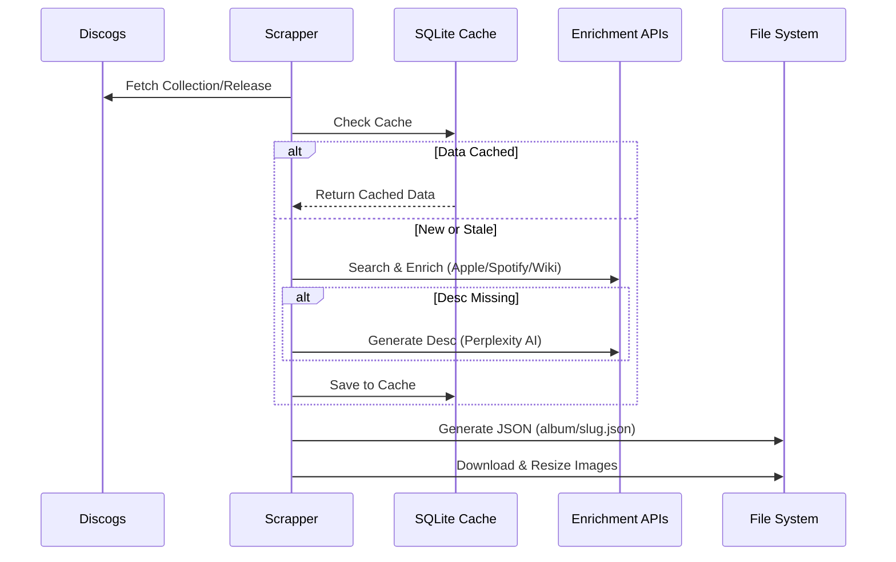
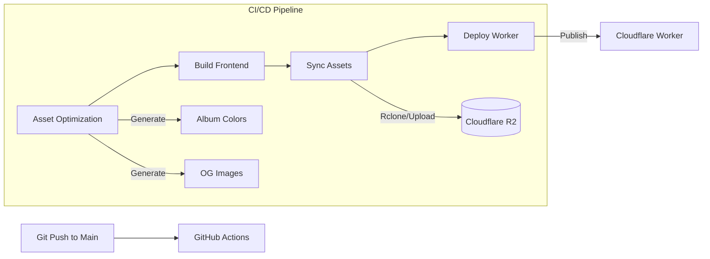

# System Architecture

This document outlines the high-level architecture of the Russ.fm project, illustrating how the data collection engine, frontend application, and deployment pipeline interact.

## High-Level Overview

The system follows a **Static Data, Dynamic UI** pattern. The backend runs offline to generate a static dataset, which the frontend consumes at runtime. This deciphers the complexity of real-time API aggregation from the user experience.

```mermaid
graph TD
    User[User] -->|Visits| Web[Web App (Cloudflare Workers)]
    Web -->|Fetches Data| R2[Cloudflare R2 Storage]
    
    subgraph "Offline Data Processing"
        Scrapper[Python Scrapper] -->|Writes| LocalDB[(SQLite Cache)]
        Scrapper -->|Generates| JSON[Static JSON Files]
        Scrapper -->|Downloads| Images[Image Assets]
    end
    
    subgraph "External APIs"
        Discogs[Discogs]
        Apple[Apple Music]
        Spotify[Spotify]
        LastFM[Last.fm]
        Wiki[Wikipedia]
        Perplexity[Perplexity AI]
    end
    
    Scrapper <--> Discogs
    Scrapper <--> Apple
    Scrapper <--> Spotify
    Scrapper <--> LastFM
    Scrapper <--> Wiki
    Scrapper <--> Perplexity
    
    JSON -->|Deployed to| R2
    Images -->|Deployed to| R2
```

## Data Enrichment Pipeline

The core value of the system is the data enrichment pipeline, which transforms raw Discogs data into a rich media experience.



## Deployment Architecture

The deployment pipeline is automated via GitHub Actions, ensuring that both code and data assets are synchronized efficiently.



## Data Models

### Release Data Structure

The generated JSON files (`/public/album/{slug}.json`) follow a schema optimized for frontend consumption:

-   **`id`**: Discogs Release ID
-   **`slug`**: URL-friendly identifier
-   **`artists`**: List of artists (handling collaborations)
-   **`title`**: Album title
-   **`images_uri_release`**: Map of image URLs (`hi-res`, `medium`)
-   **`raw_data`**: Enriched data from all services
    -   `spotify`: ID, popularity, URL
    -   `apple_music`: Editorial notes, tracklist, genre
    -   `lastfm`: Play counts, tags
    -   `wiki`: Content summary
    -   `perplexity`: AI-generated description
