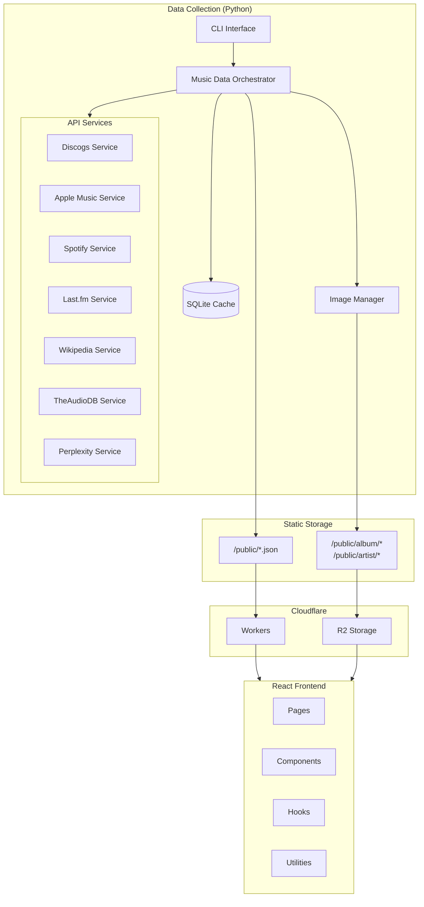
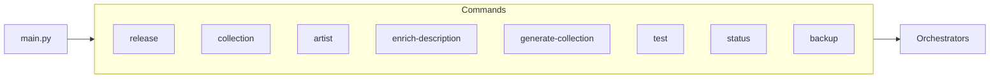
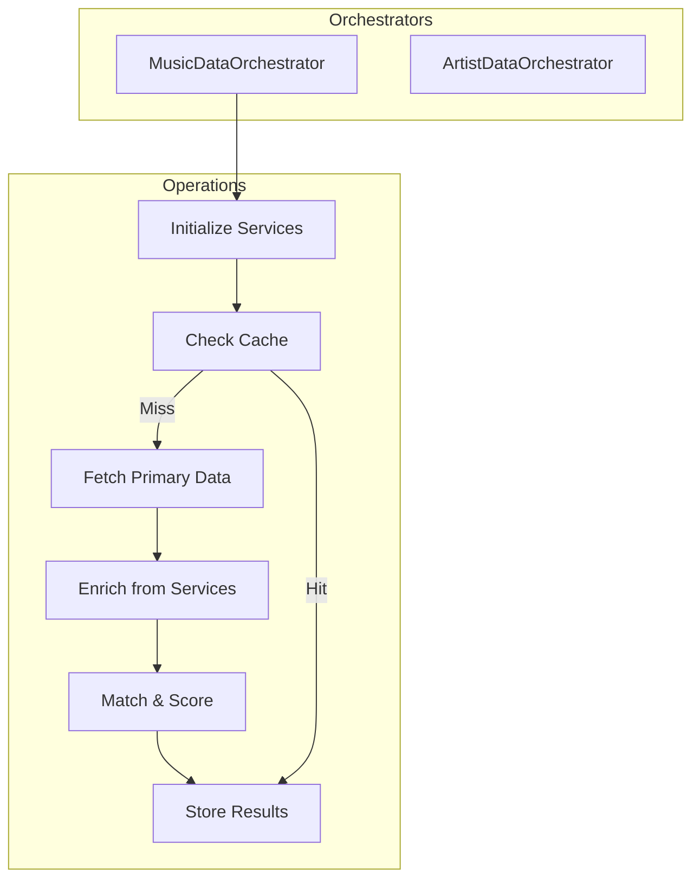
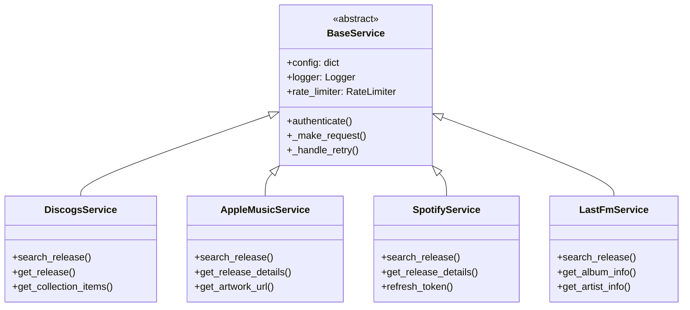
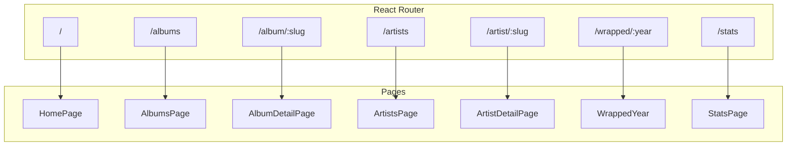
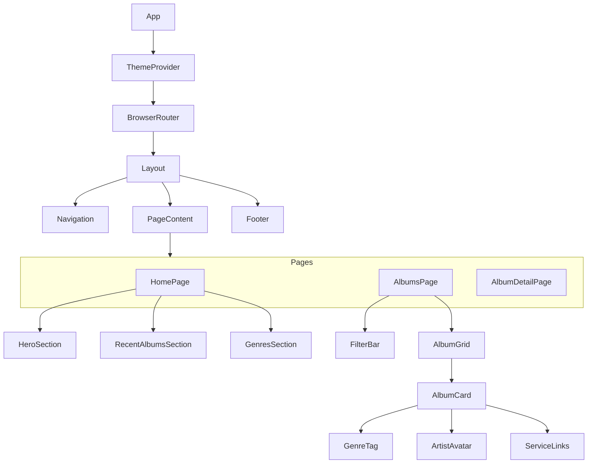
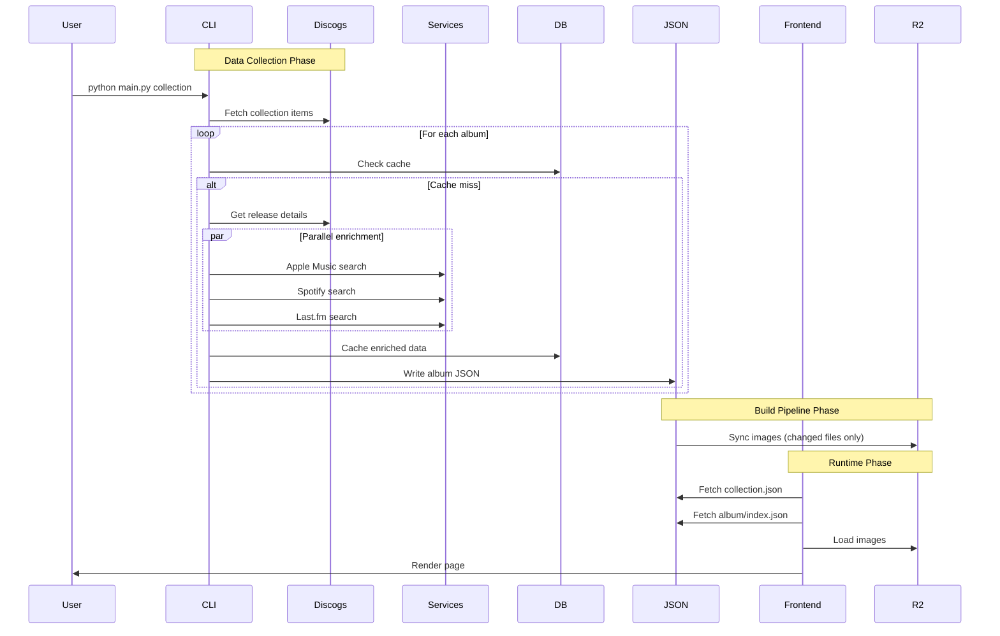
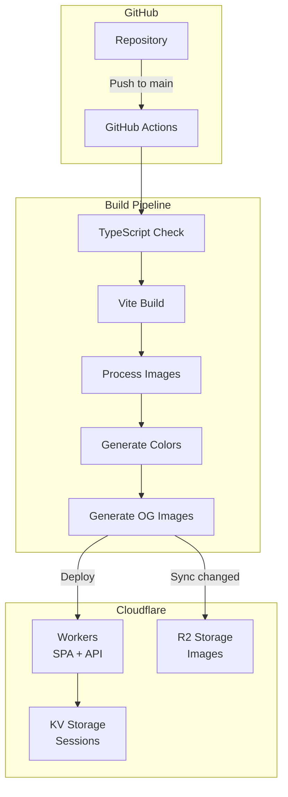

# Architecture

This document describes the high-level architecture of russ.fm, including system components, data flow, and key design patterns.

## System Overview

russ.fm follows a **static site generation** pattern where:
1. A Python backend collects and enriches data from multiple APIs
2. Data is stored as static JSON files
3. A React frontend consumes the static data
4. Images are served from Cloudflare R2 CDN



## Component Architecture

### Backend Components

#### CLI Layer (`scrapper/music_collection_manager/cli/`)

The CLI provides the user interface for all data collection operations.



| Component | File | Purpose |
|-----------|------|---------|
| CLI Entry | `main.py` | Click command group and global options |
| Commands | `commands.py` | Individual command implementations |
| Base Command | `base.py` | Shared command functionality |

#### Orchestrator Layer (`scrapper/music_collection_manager/utils/`)

Orchestrators coordinate data collection from multiple services.



| Component | File | Purpose |
|-----------|------|---------|
| Music Orchestrator | `orchestrator.py` | Album/release data collection |
| Artist Orchestrator | `artist_orchestrator.py` | Artist data with release verification |
| Database Manager | `database.py` | SQLite caching layer |
| Image Manager | `image_manager.py` | Artwork download and storage |

#### Service Layer (`scrapper/music_collection_manager/services/`)

Each external API has a dedicated service class inheriting from `BaseService`.



**Key Features:**
- Rate limiting per service
- Automatic retry with exponential backoff
- Standardized error handling
- Session management with connection pooling

### Frontend Components

#### Page Architecture



#### Component Hierarchy



## Data Architecture

### Static JSON Structure

All data is stored as static JSON files for fast loading and CDN caching.

```
public/
├── collection.json          # Album index (minimal data for listings)
├── album-colors.json        # Pre-extracted color palettes
├── album-colors.css         # CSS custom properties
├── wrapped.json             # Year-in-review data
├── album/
│   └── {slug}/
│       ├── index.json       # Full album data
│       ├── {slug}-hi-res.jpg
│       └── {slug}-medium.jpg
└── artist/
    └── {slug}/
        ├── index.json       # Full artist data
        ├── {slug}-hi-res.jpg
        ├── {slug}-medium.jpg
        └── {slug}-avatar.jpg
```

### Data Flow



## Key Design Patterns

### 1. Orchestrator Pattern

The orchestrator coordinates multiple services without tight coupling.

```python
# Simplified example
class MusicDataOrchestrator:
    def __init__(self, config):
        self.discogs = DiscogsService(config)
        self.apple_music = AppleMusicService(config)
        self.spotify = SpotifyService(config)

    def get_release(self, discogs_id):
        # Primary data from Discogs
        release = self.discogs.get_release(discogs_id)

        # Parallel enrichment
        apple_data = self.apple_music.search_release(release.artist, release.title)
        spotify_data = self.spotify.search_release(release.artist, release.title)

        # Consolidate and return
        return self.consolidate(release, apple_data, spotify_data)
```

### 2. Static Site Generation

Data is pre-computed and stored as static JSON:

```typescript
// Frontend loads pre-generated data
const album = await fetch(`/album/${slug}/index.json`).then(r => r.json());
```

Benefits:
- Fast page loads (no server-side processing)
- CDN-cacheable
- Works offline after initial load
- Simple deployment

### 3. Service Abstraction

All API services share a common interface:

```python
class BaseService(ABC):
    @abstractmethod
    def authenticate(self) -> bool:
        pass

    def _make_request(self, url, **kwargs):
        self.rate_limiter.wait()
        response = self.session.get(url, **kwargs)
        return self._handle_response(response)
```

### 4. Image Pipeline

Images follow a predictable URL pattern:

```
Development (local):
  /album/{slug}/{slug}-medium.jpg  → Vite middleware processes on-demand

Production (R2):
  https://assets.russ.fm/album/{slug}/{slug}-medium.jpg
```

The frontend uses utility functions to abstract this:

```typescript
// Always use these utilities, never hardcode paths
import { getAlbumImageFromData } from '@/lib/image-utils';

const imageUrl = getAlbumImageFromData(album.uri_release, 'medium');
```

## Deployment Architecture



### Workers Configuration

The Cloudflare Worker handles:
- SPA routing (redirect all routes to index.html)
- API endpoints (`/api/auth/*`, `/api/scrobble/*`)
- CORS headers
- Static asset serving

### R2 Storage

Images are stored in R2 with:
- 1-year cache headers
- Incremental sync (only changed files)
- Public domain: `assets.russ.fm`

## Performance Considerations

### Frontend
- Static JSON enables aggressive caching
- Image sizes optimized for context (hi-res: 1400px, medium: 800px)
- Lazy loading for off-screen content
- Code splitting by route

### Backend
- SQLite caching prevents redundant API calls
- Resume capability for interrupted processing
- Rate limiting prevents API throttling
- Parallel service enrichment

### Build Pipeline
- Incremental image processing (only new/changed)
- Cached color extraction
- Git diff-based R2 sync

## Security Considerations

### API Credentials
- Never commit `config.json` to version control
- Use environment variables in CI/CD
- Separate credentials per environment

### Frontend
- No sensitive data in client-side code
- CORS configured for known origins
- Session tokens stored in KV (server-side)

### Rate Limiting
- Per-service rate limits respect API terms
- Automatic backoff on 429 responses
- Retry with exponential delay

## Related Documentation

- [Backend Services](../backend/services.md) - Service implementation details
- [Data Schemas](../data/schemas.md) - JSON and database structures
- [Build Pipeline](../build-pipeline/) - Asset processing and deployment
- [API Integrations](../api-integrations/) - Per-service documentation
