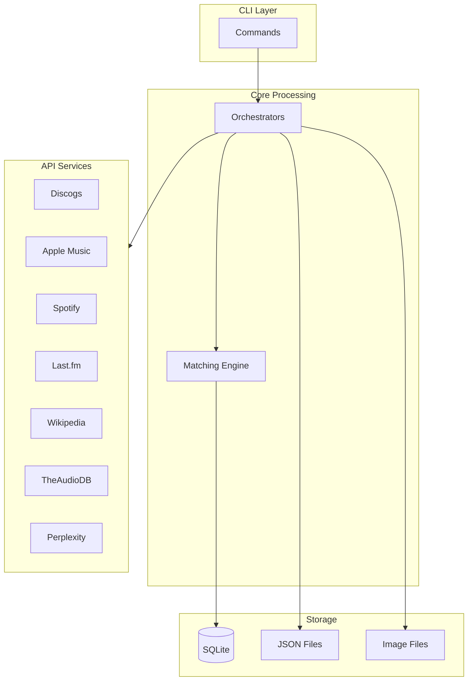
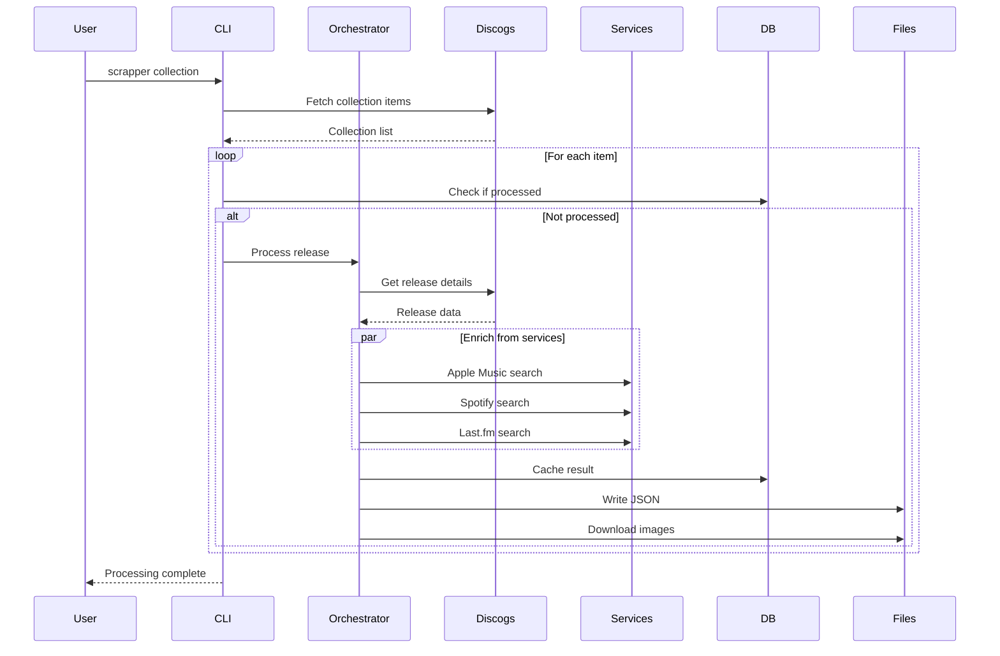

# Backend Documentation

The russ.fm backend is a Rust-based data collection and enrichment system (a TUI/CLI binary named `scrapper`) that processes Discogs collections and enriches them with data from multiple music services.

## Quick Links

| Document | Description |
|----------|-------------|
| [CLI Commands](./cli-commands.md) | All available commands and options |
| [Services](./services.md) | API service implementations |
| [Orchestration](./orchestration.md) | Data flow and coordination |

## Overview

The backend processes music collection data through a multi-stage pipeline:



## Project Structure

```
scrapper/
├── Cargo.toml                       # Crate manifest
├── install.sh                       # Build & install to ~/.cargo/bin
├── config.json                      # API credentials (not in git)
├── config.example.json              # Configuration template
├── collection_cache.db              # SQLite database (not in git)
├── discogs_cache/                   # Cached Discogs responses (not in git)
└── src/                             # Rust source
    ├── main.rs                      # Entry point: TUI when bare, CLI dispatch otherwise
    ├── lib.rs                       # Library crate root
    ├── config.rs                    # config.json + env overrides + path resolution
    ├── db.rs                        # rusqlite/r2d2 layer over collection_cache.db
    ├── sanitize.rs                  # Folder-name sanitizer (data-contract critical)
    ├── logging.rs                   # tracing setup (stderr)
    ├── cli/                         # clap command surface (all commands + flags)
    ├── ops/                         # Command implementations: release, artist, collection,
    │                                #   report, descriptions, videos, maintenance, services
    ├── services/                    # API clients: discogs, apple_music, spotify, lastfm,
    │                                #   wikipedia, theaudiodb, perplexity (+ rate limiting)
    ├── output/                      # JSON writer, image manager, collection.json generator
    └── tui/                         # ratatui app, screens, detail views, modals, runners
```

> The installed `scrapper` binary registers `~/.config/scrapper/config.json` pointing
> at this folder, so the command works from any directory.

## Quick Start

### Setup

Requires a Rust toolchain (install via [rustup](https://rustup.rs/)).

```bash
cd scrapper

# Build and install the `scrapper` binary to ~/.cargo/bin.
# Also registers ~/.config/scrapper/config.json -> this folder,
# so `scrapper` runs from any directory.
./install.sh

# Create config file
cp config.example.json config.json
# Edit config.json with your API credentials
```

> To run against source without installing, use `cargo run -- <cmd>` from inside `scrapper/`.

### Test Services

```bash
scrapper test
```

### Process Collection

```bash
# Full collection (headless)
scrapper collection

# Resume previous run
scrapper collection --resume

# Process specific range
scrapper collection --from 100 --to 200

# Interactive TUI
scrapper collection --interactive
```

### Process Single Release

```bash
scrapper release 123456 --save
```

## Configuration

### config.json Structure

```json
{
  "discogs": {
    "access_token": "YOUR_TOKEN",
    "username": "YOUR_USERNAME",
    "rate_limit": 60
  },
  "apple_music": {
    "key_id": "KEY_ID",
    "team_id": "TEAM_ID",
    "private_key_path": "/path/to/AuthKey.p8",
    "storefront": "us",
    "rate_limit": 1000
  },
  "spotify": {
    "client_id": "CLIENT_ID",
    "client_secret": "CLIENT_SECRET",
    "market": "US",
    "rate_limit": 100
  },
  "lastfm": {
    "api_key": "API_KEY",
    "shared_secret": "SECRET",
    "rate_limit": 60
  },
  "perplexity": {
    "api_key": "API_KEY",
    "model": "sonar",
    "rate_limit": 20
  },
  "database": {
    "path": "collection_cache.db"
  },
  "logging": {
    "level": "INFO",
    "file": "logs/music_collection_manager.log"
  },
  "processing": {
    "batch_size": 10,
    "retry_attempts": 3,
    "retry_delay": 5
  },
  "data": {
    "path": "../public"
  }
}
```

### Environment Variables

Configuration can be overridden with environment variables:

```bash
export DISCOGS_ACCESS_TOKEN="your_token"
export APPLE_MUSIC_KEY_ID="your_key_id"
export SPOTIFY_CLIENT_ID="your_client_id"
```

## Data Flow

### Collection Processing



### Resume Capability

The SQLite database tracks processing state:

```text
# Check if release is already enriched -> skip
# After successful processing -> save release and mark the
# collection item as processed
```

## Logging

The binary logs to **stderr** (no log files are written). The interactive TUI shows progress in
an in-app log pane instead. Control verbosity with `--log-level` (or the `RUST_LOG` env var); to
keep a record, redirect stderr yourself, e.g. `scrapper collection 2> run.log`.

### Log Levels

```bash
# Default (INFO)
scrapper collection

# Debug output
scrapper --log-level DEBUG collection

# Quiet mode
scrapper --log-level WARNING collection
```

## Error Handling

### Rate Limiting

Each service respects API rate limits:

| Service | Rate Limit |
|---------|------------|
| Discogs | 60/minute |
| Apple Music | 1000/hour |
| Spotify | 100/minute |
| Last.fm | 60/minute |
| Perplexity | 20/minute |

### Retry Logic

Failed requests are automatically retried:

```text
# Default retry configuration
retry_attempts: 3
retry_delay: 5 seconds
retryable_codes: 429, 500, 502, 503, 504
```

### Graceful Degradation

If a service fails, processing continues with available data: a failed enrichment
call is logged as a warning and the release is saved with whatever data the other
services returned.

## Database Management

### Check Status

```bash
scrapper status
```

Output:
```
Database Statistics:
  Total releases: 1234
  Enriched releases: 1200
  Pending releases: 34
  Collection items: 1234
  Processed items: 1200
```

### Backup

```bash
scrapper backup
# Creates: collection_cache.db.backup.2024-01-15
```

### Force Refresh

```bash
# Re-process even if cached
scrapper release 123456 --force-refresh --save
```

## Output Files

### Album JSON (`public/album/{slug}/index.json`)

```json
{
  "release_name": "OK Computer",
  "release_artist": "Radiohead",
  "discogs_id": "123456",
  "date_release_year": 1997,
  "genre_names": ["Rock", "Electronic"],
  "uri_release": "/album/radiohead-ok-computer",
  "images_uri_release": {
    "hi-res": "/album/radiohead-ok-computer/radiohead-ok-computer-hi-res.jpg",
    "medium": "/album/radiohead-ok-computer/radiohead-ok-computer-medium.jpg"
  },
  "tracklist": [...],
  "raw_data": {
    "services": {
      "discogs": {...},
      "apple_music": {...},
      "spotify": {...},
      "lastfm": {...}
    }
  }
}
```

### Collection Index (`public/collection.json`)

```json
{
  "generated_at": "2024-01-15T10:30:00Z",
  "total_albums": 1234,
  "albums": [
    {
      "release_name": "OK Computer",
      "release_artist": "Radiohead",
      "uri_release": "/album/radiohead-ok-computer",
      "date_added": "2024-01-10T15:00:00Z",
      "genre_names": ["Rock", "Electronic"],
      "images_uri_release": {...}
    }
  ]
}
```

## Best Practices

### Processing Large Collections

1. **Use resume capability**
   ```bash
   scrapper collection --resume
   ```

2. **Process in batches**
   ```bash
   scrapper collection --from 0 --to 100
   scrapper collection --from 100 --to 200
   ```

3. **Monitor logs** (the binary logs to stderr — redirect to capture)
   ```bash
   scrapper --log-level DEBUG collection 2> run.log &
   tail -f run.log
   ```

### Handling Failures

1. **Check status after processing**
   ```bash
   scrapper status
   ```

2. **Re-process failed items**
   ```bash
   scrapper release 123456 --force-refresh --save
   ```

3. **Backup before major changes**
   ```bash
   scrapper backup
   ```

## Related Documentation

- [CLI Commands Reference](./cli-commands.md)
- [Services Documentation](./services.md)
- [Orchestration Patterns](./orchestration.md)
- [API Integrations](../api-integrations/)
- [Data Schemas](../data/schemas.md)
