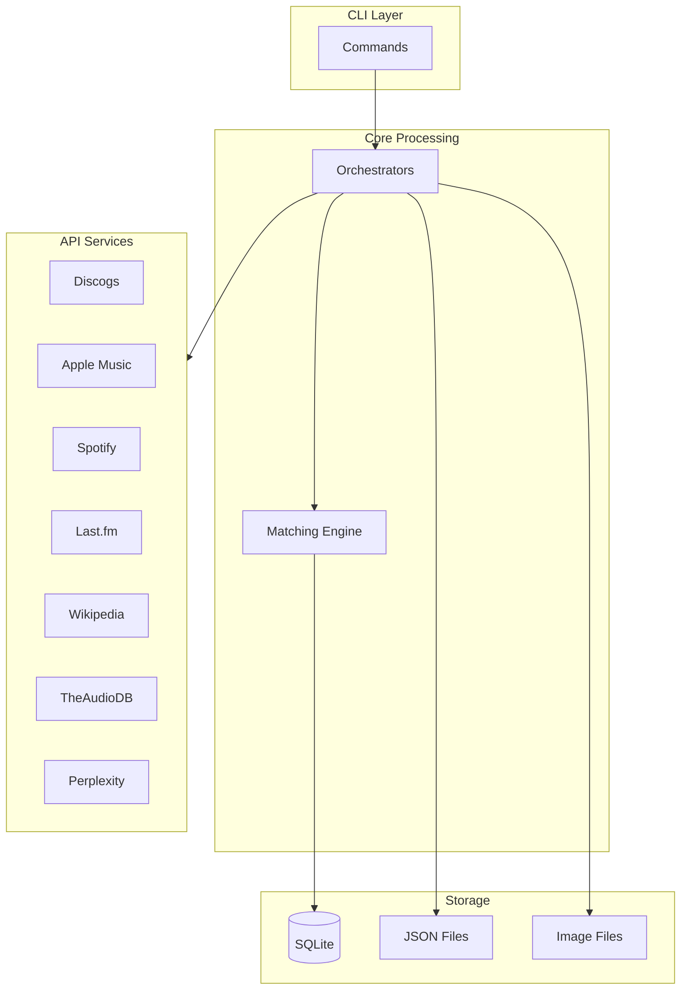
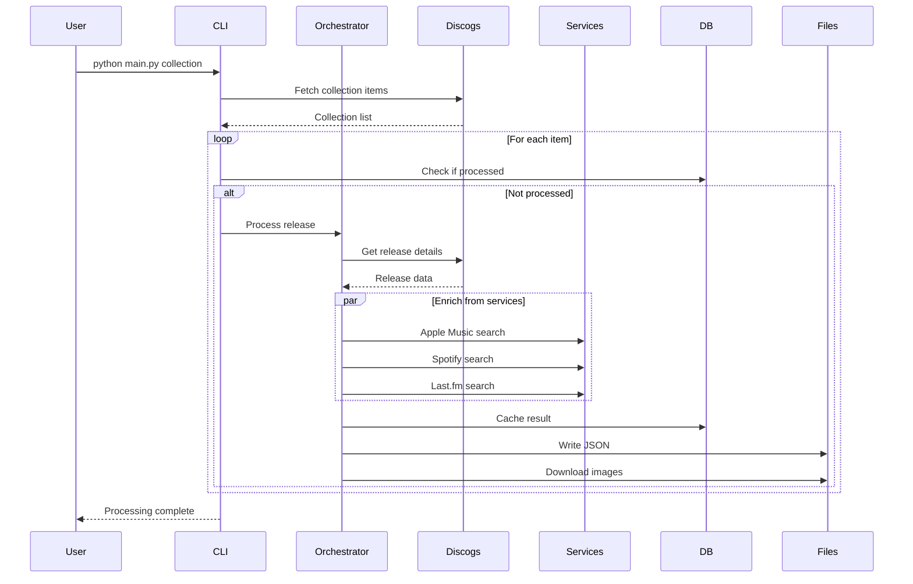

# Backend Documentation

The russ.fm backend is a Python-based data collection and enrichment system that processes Discogs collections and enriches them with data from multiple music services.

## Quick Links

| Document | Description |
|----------|-------------|
| [CLI Commands](./cli-commands.md) | All available commands and options |
| [Services](./services.md) | API service implementations |
| [Orchestration](./orchestration.md) | Data flow and coordination |

## Overview

The backend processes music collection data through a multi-stage pipeline:



## Project Structure

```
scrapper/
├── main.py                          # CLI entry point
├── config.json                      # API credentials (not in git)
├── config.example.json              # Configuration template
├── requirements.txt                 # Python dependencies
├── collection_cache.db              # SQLite database
├── logs/                            # Processing logs
└── music_collection_manager/        # Core package
    ├── __init__.py
    ├── cli/                         # CLI commands
    │   ├── main.py                  # Click command group
    │   ├── commands.py              # Command implementations
    │   └── base.py                  # Base command class
    ├── services/                    # API integrations
    │   ├── base/                    # Base service class
    │   ├── discogs/                 # Discogs API
    │   ├── apple_music/             # Apple Music API
    │   ├── spotify/                 # Spotify API
    │   ├── lastfm/                  # Last.fm API
    │   ├── wikipedia/               # Wikipedia API
    │   ├── theaudiodb/              # TheAudioDB API
    │   └── perplexity/              # Perplexity AI API
    ├── utils/                       # Utilities
    │   ├── orchestrator.py          # Music data orchestration
    │   ├── artist_orchestrator.py   # Artist data orchestration
    │   ├── database.py              # Database management
    │   ├── image_manager.py         # Image downloading
    │   ├── matching.py              # Album matching
    │   ├── serializers.py           # JSON serialization
    │   ├── text_cleaner.py          # Text normalization
    │   ├── folder_sanitizer.py      # Path sanitization
    │   ├── json_updater.py          # JSON file updates
    │   └── collection_generator.py  # collection.json generation
    ├── models/                      # Data models
    │   ├── release.py               # Release, Artist, Track
    │   ├── collection.py            # CollectionItem
    │   └── enrichment.py            # Service-specific data
    └── config/                      # Configuration
        ├── config_manager.py        # Config loading
        └── logger.py                # Logging setup
```

## Quick Start

### Setup

```bash
cd scrapper

# Create virtual environment
python -m venv venv
source venv/bin/activate  # Windows: venv\Scripts\activate

# Install dependencies
pip install -r requirements.txt
pip install -e .

# Create config file
cp config.example.json config.json
# Edit config.json with your API credentials
```

### Test Services

```bash
python main.py test
```

### Process Collection

```bash
# Full collection
python main.py collection

# Resume previous run
python main.py collection --resume

# Process specific range
python main.py collection --from 100 --to 200
```

### Process Single Release

```bash
python main.py release 123456 --save
```

## Configuration

### config.json Structure

```json
{
  "discogs": {
    "access_token": "YOUR_TOKEN",
    "username": "YOUR_USERNAME",
    "rate_limit": 60
  },
  "apple_music": {
    "key_id": "KEY_ID",
    "team_id": "TEAM_ID",
    "private_key_path": "/path/to/AuthKey.p8",
    "storefront": "us",
    "rate_limit": 1000
  },
  "spotify": {
    "client_id": "CLIENT_ID",
    "client_secret": "CLIENT_SECRET",
    "market": "US",
    "rate_limit": 100
  },
  "lastfm": {
    "api_key": "API_KEY",
    "shared_secret": "SECRET",
    "rate_limit": 60
  },
  "perplexity": {
    "api_key": "API_KEY",
    "model": "sonar",
    "rate_limit": 20
  },
  "database": {
    "path": "collection_cache.db"
  },
  "logging": {
    "level": "INFO",
    "file": "logs/music_collection_manager.log"
  },
  "processing": {
    "batch_size": 10,
    "retry_attempts": 3,
    "retry_delay": 5
  },
  "data": {
    "path": "../public"
  }
}
```

### Environment Variables

Configuration can be overridden with environment variables:

```bash
export DISCOGS_ACCESS_TOKEN="your_token"
export APPLE_MUSIC_KEY_ID="your_key_id"
export SPOTIFY_CLIENT_ID="your_client_id"
```

## Data Flow

### Collection Processing



### Resume Capability

The SQLite database tracks processing state:

```python
# Check if release is already processed
if db.has_enriched_release(discogs_id):
    continue  # Skip

# After successful processing
db.save_release(release)
db.mark_collection_item_processed(item_id)
```

## Logging

Logs are stored in `scrapper/logs/`:

```
logs/
├── music_collection_manager.log       # Main log
├── session_2024-01-15_10-30-00.log   # Session-specific log
└── ...
```

### Log Levels

```bash
# Default (INFO)
python main.py collection

# Debug output
python main.py --log-level DEBUG collection

# Quiet mode
python main.py --log-level WARNING collection
```

## Error Handling

### Rate Limiting

Each service respects API rate limits:

| Service | Rate Limit |
|---------|------------|
| Discogs | 60/minute |
| Apple Music | 1000/hour |
| Spotify | 100/minute |
| Last.fm | 60/minute |
| Perplexity | 20/minute |

### Retry Logic

Failed requests are automatically retried:

```python
# Default retry configuration
retry_attempts: 3
retry_delay: 5  # seconds
retryable_codes: [429, 500, 502, 503, 504]
```

### Graceful Degradation

If a service fails, processing continues with available data:

```python
# Service failure doesn't stop processing
try:
    apple_data = apple_music.search_release(artist, album)
except ServiceError:
    logger.warning("Apple Music search failed, continuing...")
    apple_data = None
```

## Database Management

### Check Status

```bash
python main.py status
```

Output:
```
Database Statistics:
  Total releases: 1234
  Enriched releases: 1200
  Pending releases: 34
  Collection items: 1234
  Processed items: 1200
```

### Backup

```bash
python main.py backup
# Creates: collection_cache.db.backup.2024-01-15
```

### Force Refresh

```bash
# Re-process even if cached
python main.py release 123456 --force-refresh --save
```

## Output Files

### Album JSON (`public/album/{slug}/index.json`)

```json
{
  "release_name": "OK Computer",
  "release_artist": "Radiohead",
  "discogs_id": "123456",
  "date_release_year": 1997,
  "genre_names": ["Rock", "Electronic"],
  "uri_release": "/album/radiohead-ok-computer",
  "images_uri_release": {
    "hi-res": "/album/radiohead-ok-computer/radiohead-ok-computer-hi-res.jpg",
    "medium": "/album/radiohead-ok-computer/radiohead-ok-computer-medium.jpg"
  },
  "tracklist": [...],
  "raw_data": {
    "services": {
      "discogs": {...},
      "apple_music": {...},
      "spotify": {...},
      "lastfm": {...}
    }
  }
}
```

### Collection Index (`public/collection.json`)

```json
{
  "generated_at": "2024-01-15T10:30:00Z",
  "total_albums": 1234,
  "albums": [
    {
      "release_name": "OK Computer",
      "release_artist": "Radiohead",
      "uri_release": "/album/radiohead-ok-computer",
      "date_added": "2024-01-10T15:00:00Z",
      "genre_names": ["Rock", "Electronic"],
      "images_uri_release": {...}
    }
  ]
}
```

## Best Practices

### Processing Large Collections

1. **Use resume capability**
   ```bash
   python main.py collection --resume
   ```

2. **Process in batches**
   ```bash
   python main.py collection --from 0 --to 100
   python main.py collection --from 100 --to 200
   ```

3. **Monitor logs**
   ```bash
   tail -f logs/music_collection_manager.log
   ```

### Handling Failures

1. **Check status after processing**
   ```bash
   python main.py status
   ```

2. **Re-process failed items**
   ```bash
   python main.py release 123456 --force-refresh --save
   ```

3. **Backup before major changes**
   ```bash
   python main.py backup
   ```

## Related Documentation

- [CLI Commands Reference](./cli-commands.md)
- [Services Documentation](./services.md)
- [Orchestration Patterns](./orchestration.md)
- [API Integrations](../api-integrations/)
- [Data Schemas](../data/schemas.md)
