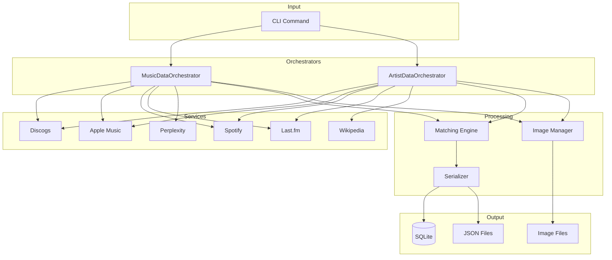
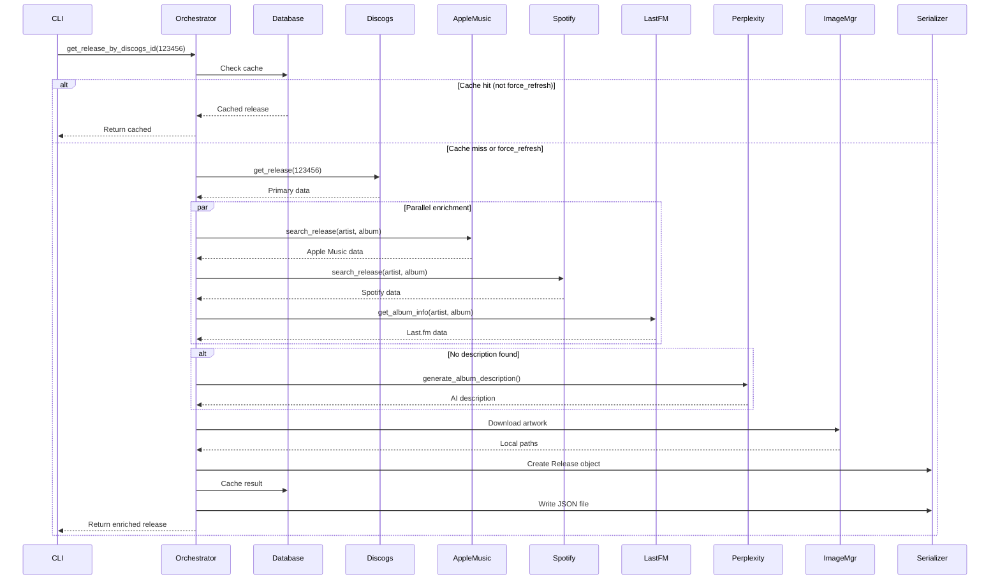
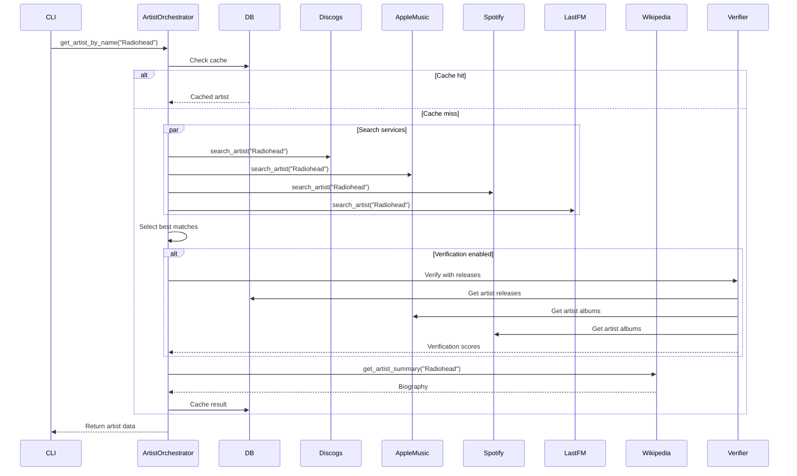
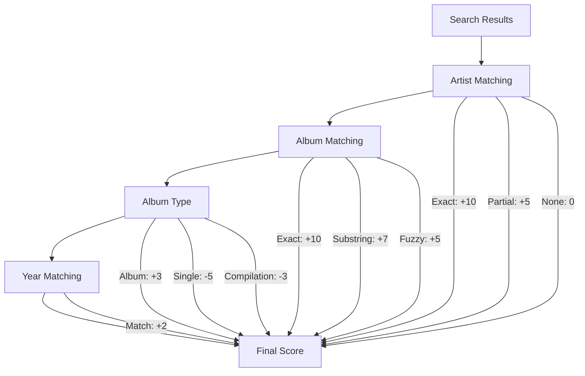

# Orchestration Patterns

This document covers how data flows through the backend orchestration layer.

## Overview

Orchestrators coordinate data collection from multiple services:



## MusicDataOrchestrator

**File:** `utils/orchestrator.py`

Coordinates album/release data collection.

### Initialization

```python
from music_collection_manager.utils.orchestrator import MusicDataOrchestrator

orchestrator = MusicDataOrchestrator(config, logger)

# Optional: Enable interactive mode
orchestrator.set_interactive_mode(True)

# Optional: Override search query
orchestrator.set_search_override("Artist - Album")

# Optional: Use custom artwork
orchestrator.set_custom_cover("https://example.com/cover.jpg")

# Optional: Prefer specific image source
orchestrator.set_preferred_image_source("apple_music")
```

### Processing Flow



### Key Methods

#### get_release_by_discogs_id(discogs_id, force_refresh=False)

Main entry point for release processing.

```python
release = orchestrator.get_release_by_discogs_id(
    discogs_id=123456,
    force_refresh=False  # Set True to bypass cache
)

# Returns: Release object with enriched data
```

**Process:**
1. Check database cache
2. Fetch from Discogs (primary source)
3. Search matching services (parallel)
4. Score and select best matches
5. Download artwork
6. Consolidate data
7. Cache and save

#### set_interactive_mode(enabled)

Enable manual match selection.

```python
orchestrator.set_interactive_mode(True)

# During processing, prompts for selection:
# Found 3 Apple Music matches:
# 1. OK Computer - Radiohead (1997)
# 2. OK Computer OKNOTOK... - Radiohead (2017)
# 3. OK Computer (Deluxe) - Radiohead (2009)
# Select match (1-3) or 0 to skip:
```

#### set_search_override(query)

Override automatic search query.

```python
# Useful when artist/album names have special characters
orchestrator.set_search_override("Björk - Homogenic")
```

#### set_custom_cover(url)

Use specific artwork URL.

```python
orchestrator.set_custom_cover("https://example.com/custom-cover.jpg")
```

#### set_preferred_image_source(source)

Prioritize specific service for images.

```python
orchestrator.set_preferred_image_source("apple_music")
# Options: "discogs", "apple_music", "spotify"
```

---

## ArtistDataOrchestrator

**File:** `utils/artist_orchestrator.py`

Coordinates artist data collection with release verification.

### Initialization

```python
from music_collection_manager.utils.artist_orchestrator import ArtistDataOrchestrator

artist_orchestrator = ArtistDataOrchestrator(config, logger)

# Optional settings
artist_orchestrator.set_interactive_mode(True)
artist_orchestrator.set_custom_image("https://example.com/artist.jpg")
artist_orchestrator.set_preferred_image_source("spotify")
```

### Processing Flow



### Key Methods

#### get_artist_by_name(artist_name, force_refresh=False)

Main entry point for artist processing.

```python
artist = artist_orchestrator.get_artist_by_name(
    artist_name="Radiohead",
    force_refresh=False
)

# Returns: Artist object with enriched data
```

#### verify_apple_music_artist_with_releases(artist_obj, apple_music_id)

Verify Apple Music artist by matching releases.

```python
verified = artist_orchestrator.verify_apple_music_artist_with_releases(
    artist_obj=artist,
    apple_music_id="657515"
)

# Returns: {
#   "verified": True,
#   "match_score": 0.85,
#   "matched_releases": ["OK Computer", "Kid A", "In Rainbows"]
# }
```

#### verify_spotify_artist_with_releases(artist_obj, spotify_id)

Verify Spotify artist by matching releases.

```python
verified = artist_orchestrator.verify_spotify_artist_with_releases(
    artist_obj=artist,
    spotify_id="4Z8W4fKeB5YxbusRsdQVPb"
)
```

---

## Matching Engine

**File:** `utils/matching.py`

Scores and ranks search results across services.

### MusicMatcher

```python
from music_collection_manager.utils.matching import MusicMatcher

matcher = MusicMatcher(logger)
```

### Scoring Algorithm



### Match Candidate

```python
@dataclass
class MatchCandidate:
    id: str
    name: str
    artist: str
    year: Optional[int]
    type: str  # album, single, compilation
    source: str  # apple_music, spotify, etc.
    score: int
    raw_data: dict
```

### Matching Methods

#### find_best_match(candidates, artist, album, year=None)

Find best matching candidate.

```python
best = matcher.find_best_match(
    candidates=search_results,
    artist="Radiohead",
    album="OK Computer",
    year=1997
)

# Returns: MatchCandidate with highest score
```

#### score_candidate(candidate, artist, album, year=None)

Score individual candidate.

```python
score = matcher.score_candidate(
    candidate=result,
    artist="Radiohead",
    album="OK Computer",
    year=1997
)

# Returns: int (0-25 typical range)
```

### Album Title Normalization

```python
def normalize_title(title: str) -> str:
    """Normalize album title for matching."""
    title = title.lower()

    # Remove edition markers
    patterns = [
        r'\(deluxe.*?\)',
        r'\(remaster.*?\)',
        r'\(anniversary.*?\)',
        r'\(expanded.*?\)',
        r'\[.*?\]',
    ]
    for pattern in patterns:
        title = re.sub(pattern, '', title)

    # Remove special characters
    title = re.sub(r'[^\w\s]', '', title)

    return title.strip()
```

### Compilation Detection

```python
def is_compilation(album_data: dict) -> bool:
    """Detect if album is a compilation."""
    indicators = [
        'greatest hits',
        'best of',
        'collection',
        'anthology',
        'compilation'
    ]
    title = album_data.get('name', '').lower()
    return any(ind in title for ind in indicators)
```

---

## Image Manager

**File:** `utils/image_manager.py`

Handles artwork downloading and storage.

### Initialization

```python
from music_collection_manager.utils.image_manager import ImageManager

image_manager = ImageManager(config, logger)
```

### Methods

#### create_release_folder(release_title, discogs_id)

Create folder for release assets.

```python
folder_path = image_manager.create_release_folder(
    release_title="OK Computer",
    discogs_id=123456
)

# Returns: Path("public/album/radiohead-ok-computer")
```

#### download_image(url, file_path, timeout=30)

Download image from URL.

```python
success = image_manager.download_image(
    url="https://example.com/cover.jpg",
    file_path=Path("public/album/slug/slug-hi-res.jpg"),
    timeout=30
)

# Returns: bool (success/failure)
```

#### get_artwork_url_with_size(artwork_url, size)

Transform Apple Music artwork URL.

```python
url = image_manager.get_artwork_url_with_size(
    artwork_url="https://is1.mzstatic.com/.../2000x2000bb.jpg",
    size=2000
)

# Returns: URL with specified dimensions
```

#### sanitize_filename(text)

Create safe filename.

```python
filename = image_manager.sanitize_filename("Sigur Rós - ( )")
# Returns: "sigur-ros-untitled"
```

---

## Database Manager

**File:** `utils/database.py`

SQLite persistence layer.

### Initialization

```python
from music_collection_manager.utils.database import DatabaseManager

db = DatabaseManager(config, logger)
```

### Release Methods

```python
# Check if release exists
exists = db.has_enriched_release(discogs_id)

# Get cached release
release = db.get_release_by_discogs_id(discogs_id)

# Save release
db.save_release(release)

# Get all releases
releases = db.get_all_releases()

# Get releases without descriptions
missing = db.get_releases_without_description(limit=100)

# Update Perplexity description
db.update_release_perplexity_description(
    discogs_id=123456,
    description={"description": "...", "generated_at": "..."}
)
```

### Collection Methods

```python
# Get collection items
items = db.get_collection_items(username)

# Mark item as processed
db.mark_collection_item_processed(item_id)

# Get processing stats
stats = db.get_stats()
```

### Artist Methods

```python
# Get artist
artist = db.get_artist_by_name(name)

# Save artist
db.save_artist(artist)
```

### Utility Methods

```python
# Backup database
db.backup_database(backup_path)

# Get statistics
stats = db.get_stats()
# Returns: {
#   "total_releases": 1234,
#   "enriched_releases": 1200,
#   "total_artists": 456,
#   "total_collection_items": 1234,
#   "processed_items": 1200
# }
```

---

## Serializers

**File:** `utils/serializers.py`

Convert between objects and dictionaries/JSON.

### ReleaseSerializer

```python
from music_collection_manager.utils.serializers import ReleaseSerializer

serializer = ReleaseSerializer()

# To dictionary
data = serializer.to_dict(release, include_enrichment=True)

# From dictionary
release = serializer.from_dict(data)
```

### ArtistSerializer

```python
from music_collection_manager.utils.serializers import ArtistSerializer

serializer = ArtistSerializer()

# To dictionary
data = serializer.to_dict(artist, include_enrichment=True)

# From dictionary
artist = serializer.from_dict(data)
```

---

## Collection Generator

**File:** `utils/collection_generator.py`

Generates collection.json for frontend.

```python
from music_collection_manager.utils.collection_generator import CollectionGenerator

generator = CollectionGenerator(config, logger)

# Generate collection.json
generator.generate_collection_json(output_path="public/collection.json")
```

### Output Structure

```json
{
  "generated_at": "2024-01-15T10:30:00Z",
  "total_albums": 1234,
  "albums": [
    {
      "release_name": "OK Computer",
      "release_artist": "Radiohead",
      "uri_release": "/album/radiohead-ok-computer",
      "date_added": "2024-01-10T15:00:00Z",
      "date_release_year": 1997,
      "genre_names": ["Alternative Rock", "Art Rock"],
      "styles": ["Art Rock", "Indie Rock"],
      "formats": ["Vinyl", "LP", "Album", "Reissue"],
      "format_primary": "Vinyl",
      "labels": ["XL Recordings"],
      "country": "UK",
      "lastfm_listeners": 1842310,
      "images_uri_release": {
        "hi-res": "/album/radiohead-ok-computer/radiohead-ok-computer-hi-res.jpg",
        "medium": "/album/radiohead-ok-computer/radiohead-ok-computer-medium.jpg"
      }
    }
  ]
}
```

The `styles`, `formats`, `format_primary`, `labels`, `country`, and `lastfm_listeners` fields were added in May 2026 so that the `/labels`, `/decade/:slug`, `/country/:slug` browse pages, the `/albums?format=…` filter, and the Stats v2 sections (format donut, label/country bars, hidden-gems wall) can read directly from `collection.json` without lazy-loading per-album JSONs. The denormalisation reads the same DB-backed `Release` objects already loaded for genres and falls back to the per-album JSON only when the object's attribute is missing.

---

## JSON Updater

**File:** `utils/json_updater.py`

Updates existing JSON files.

```python
from music_collection_manager.utils.json_updater import JsonUpdater

updater = JsonUpdater(config, logger)

# Find album JSON
path = updater.find_album_json(
    discogs_id=123456,
    title="OK Computer",
    artists=["Radiohead"]
)

# Check if has description
has_desc = updater.check_album_has_description(
    discogs_id=123456,
    title="OK Computer",
    artists=["Radiohead"]
)

# Update with Perplexity description
updater.update_album_perplexity_description(
    discogs_id=123456,
    title="OK Computer",
    artists=["Radiohead"],
    description_data={
        "description": "OK Computer is...",
        "generated_at": "2024-01-15T10:30:00Z",
        "model": "sonar"
    }
)
```

---

## Error Handling

Orchestrators handle service failures gracefully:

```python
def _enrich_from_services(self, release):
    """Enrich release from multiple services."""
    enrichment = {}

    # Apple Music (optional)
    try:
        if self.apple_music:
            enrichment['apple_music'] = self.apple_music.search_release(
                release.artist, release.title
            )
    except ServiceError as e:
        self.logger.warning(f"Apple Music failed: {e}")
        enrichment['apple_music'] = None

    # Spotify (optional)
    try:
        if self.spotify:
            enrichment['spotify'] = self.spotify.search_release(
                release.artist, release.title
            )
    except ServiceError as e:
        self.logger.warning(f"Spotify failed: {e}")
        enrichment['spotify'] = None

    # Continue with available data
    return enrichment
```

---

## Performance Considerations

### Parallel Enrichment

Services are queried in parallel where possible:

```python
import concurrent.futures

def _enrich_parallel(self, release):
    """Enrich from services in parallel."""
    with concurrent.futures.ThreadPoolExecutor(max_workers=3) as executor:
        futures = {
            executor.submit(self.apple_music.search, release): 'apple_music',
            executor.submit(self.spotify.search, release): 'spotify',
            executor.submit(self.lastfm.search, release): 'lastfm',
        }

        results = {}
        for future in concurrent.futures.as_completed(futures):
            service = futures[future]
            try:
                results[service] = future.result()
            except Exception as e:
                results[service] = None

    return results
```

### Caching Strategy

- Database cache prevents redundant API calls
- Cache can be bypassed with `--force-refresh`
- Partial data is cached to allow resume
