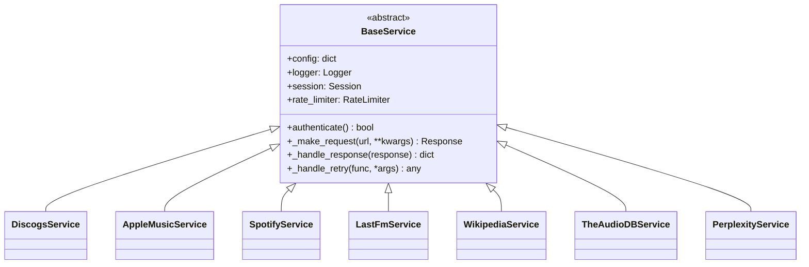

# Services Reference

This document covers the API service implementations in the backend.

## Service Architecture

All services inherit from `BaseService`:



## BaseService (`services/base/base_service.py`)

Abstract base class for all API services.

### Features

- **Rate Limiting**: Configurable requests per time period
- **Automatic Retry**: Exponential backoff on failures
- **Session Management**: Connection pooling
- **Error Handling**: Standardized exception types

### Rate Limiter

```python
class RateLimiter:
    def __init__(self, requests_per_period: int, period_seconds: int = 60):
        self.requests_per_period = requests_per_period
        self.period_seconds = period_seconds
        self.requests = []

    def wait(self):
        """Block until rate limit allows next request."""
        now = time.time()
        # Remove old requests
        self.requests = [r for r in self.requests if now - r < self.period_seconds]
        # Wait if at limit
        if len(self.requests) >= self.requests_per_period:
            sleep_time = self.period_seconds - (now - self.requests[0])
            time.sleep(sleep_time)
        self.requests.append(time.time())
```

### Retry Logic

```python
def _handle_retry(self, func, *args, **kwargs):
    """Retry with exponential backoff."""
    for attempt in range(self.retry_attempts):
        try:
            return func(*args, **kwargs)
        except RetryableError as e:
            if attempt == self.retry_attempts - 1:
                raise
            delay = self.retry_delay * (2 ** attempt)
            self.logger.warning(f"Retry {attempt + 1} in {delay}s: {e}")
            time.sleep(delay)
```

### Error Types

```python
class ServiceError(Exception):
    """Base service exception."""
    pass

class APIError(ServiceError):
    """API returned an error."""
    pass

class RateLimitError(ServiceError):
    """Rate limit exceeded."""
    def __init__(self, retry_after: int = None):
        self.retry_after = retry_after

class AuthenticationError(ServiceError):
    """Authentication failed."""
    pass
```

---

## DiscogsService (`services/discogs/discogs_service.py`)

Primary data source for collection and release information.

### Configuration

```json
{
  "discogs": {
    "access_token": "YOUR_TOKEN",
    "username": "YOUR_USERNAME",
    "rate_limit": 60
  }
}
```

### Methods

#### authenticate()

Test API authentication.

```python
service = DiscogsService(config)
is_valid = service.authenticate()
```

#### search_artist(artist_name, limit=25)

Search for artists.

```python
results = service.search_artist("Radiohead", limit=10)
# Returns: [{"id": 3840, "name": "Radiohead", ...}, ...]
```

#### search_release(artist, album)

Search for releases.

```python
results = service.search_release("Radiohead", "OK Computer")
# Returns: [{"id": 123456, "title": "OK Computer", ...}, ...]
```

#### get_release(discogs_id)

Get detailed release information.

```python
release = service.get_release(123456)
# Returns: {
#   "id": 123456,
#   "title": "OK Computer",
#   "artists": [...],
#   "tracklist": [...],
#   "images": [...],
#   "labels": [...],
#   "formats": [...],
#   "genres": [...],
#   "styles": [...],
#   "year": 1997,
#   "country": "UK"
# }
```

#### get_collection_items(username)

Fetch user's collection.

```python
items = service.get_collection_items("username")
# Returns: [{"id": 123, "instance_id": 456, "basic_information": {...}}, ...]
```

#### get_collection_release_instances(discogs_id)

Get collection instances of a release.

```python
instances = service.get_collection_release_instances(123456)
# Returns: [{"instance_id": 789, "folder_id": 0, ...}, ...]
```

### Rate Limit

60 requests per minute (Discogs API limit)

---

## AppleMusicService (`services/apple_music/apple_music_service.py`)

Apple Music integration for artwork and editorial content.

### Configuration

```json
{
  "apple_music": {
    "key_id": "YOUR_KEY_ID",
    "team_id": "YOUR_TEAM_ID",
    "private_key_path": "/path/to/AuthKey.p8",
    "storefront": "us",
    "rate_limit": 1000
  }
}
```

### JWT Token Generation

```python
def _generate_token(self):
    """Generate JWT token for Apple Music API."""
    headers = {
        "alg": "ES256",
        "kid": self.key_id
    }
    payload = {
        "iss": self.team_id,
        "iat": int(time.time()),
        "exp": int(time.time()) + 3600  # 1 hour
    }
    return jwt.encode(payload, self.private_key, algorithm="ES256", headers=headers)
```

### Methods

#### authenticate()

Generate and validate JWT token.

```python
service = AppleMusicService(config)
is_valid = service.authenticate()
```

#### search_release(artist, album)

Search for albums.

```python
results = service.search_release("Radiohead", "OK Computer")
# Returns: [{
#   "id": "1097862062",
#   "type": "albums",
#   "attributes": {
#     "name": "OK Computer",
#     "artistName": "Radiohead",
#     "artwork": {...},
#     "editorialNotes": {...}
#   }
# }, ...]
```

#### get_release_details(album_id)

Get album details.

```python
album = service.get_release_details("1097862062")
# Returns: {
#   "id": "1097862062",
#   "attributes": {
#     "name": "OK Computer",
#     "artistName": "Radiohead",
#     "releaseDate": "1997-06-16",
#     "genreNames": ["Alternative", "Rock"],
#     "trackCount": 12,
#     "artwork": {
#       "url": "https://is1-ssl.mzstatic.com/image/thumb/Music/..."
#     },
#     "editorialNotes": {
#       "standard": "OK Computer...",
#       "short": "Radiohead's masterpiece..."
#     }
#   }
# }
```

#### get_artist_details(artist_id)

Get artist information.

```python
artist = service.get_artist_details("657515")
```

#### get_artwork_url(artwork_url, size)

Transform artwork URL for specific size.

```python
url = service.get_artwork_url(
    "https://is1-ssl.mzstatic.com/image/thumb/Music/{w}x{h}bb.jpg",
    2000
)
# Returns: "https://is1-ssl.mzstatic.com/image/thumb/Music/2000x2000bb.jpg"
```

### Rate Limit

1000 requests per hour

---

## SpotifyService (`services/spotify/spotify_service.py`)

Spotify integration for streaming links and popularity data.

### Configuration

```json
{
  "spotify": {
    "client_id": "YOUR_CLIENT_ID",
    "client_secret": "YOUR_CLIENT_SECRET",
    "market": "US",
    "rate_limit": 100
  }
}
```

### OAuth Flow

```python
def authenticate(self):
    """OAuth Client Credentials flow."""
    auth = base64.b64encode(
        f"{self.client_id}:{self.client_secret}".encode()
    ).decode()

    response = requests.post(
        "https://accounts.spotify.com/api/token",
        headers={"Authorization": f"Basic {auth}"},
        data={"grant_type": "client_credentials"}
    )

    data = response.json()
    self.access_token = data["access_token"]
    self.token_expires = time.time() + data["expires_in"]
```

### Methods

#### authenticate()

Perform OAuth and get access token.

```python
service = SpotifyService(config)
is_valid = service.authenticate()
```

#### search_release(artist, album)

Search for albums.

```python
results = service.search_release("Radiohead", "OK Computer")
# Returns: [{
#   "id": "6dVIqQ8qmQ5GBnJ9shOYGE",
#   "name": "OK Computer",
#   "artists": [{"name": "Radiohead"}],
#   "images": [...],
#   "release_date": "1997-06-16",
#   "external_urls": {"spotify": "https://open.spotify.com/album/..."}
# }, ...]
```

#### get_release_details(album_id)

Get album details.

```python
album = service.get_release_details("6dVIqQ8qmQ5GBnJ9shOYGE")
# Returns: {
#   "id": "6dVIqQ8qmQ5GBnJ9shOYGE",
#   "name": "OK Computer",
#   "artists": [...],
#   "tracks": {"items": [...]},
#   "popularity": 78,
#   "images": [...]
# }
```

#### get_artist_details(artist_id)

Get artist information.

```python
artist = service.get_artist_details("4Z8W4fKeB5YxbusRsdQVPb")
# Returns: {
#   "id": "4Z8W4fKeB5YxbusRsdQVPb",
#   "name": "Radiohead",
#   "genres": ["alternative rock", "art rock"],
#   "popularity": 75,
#   "followers": {"total": 8000000},
#   "images": [...]
# }
```

#### get_artist_albums(artist_id)

List artist's albums.

```python
albums = service.get_artist_albums("4Z8W4fKeB5YxbusRsdQVPb")
# Returns: [{"id": "...", "name": "...", ...}, ...]
```

### Token Refresh

```python
def _ensure_token_valid(self):
    """Refresh token if expired."""
    if time.time() >= self.token_expires - 60:  # 1 min buffer
        self.authenticate()
```

### Rate Limit

100 requests per minute

---

## LastFmService (`services/lastfm/lastfm_service.py`)

Last.fm integration for wiki content and tags.

### Configuration

```json
{
  "lastfm": {
    "api_key": "YOUR_API_KEY",
    "shared_secret": "YOUR_SECRET",
    "username": "YOUR_USERNAME",
    "rate_limit": 60
  }
}
```

### Methods

#### authenticate()

Test API key.

```python
service = LastFmService(config)
is_valid = service.authenticate()
```

#### search_release(artist, album)

Search for albums.

```python
results = service.search_release("Radiohead", "OK Computer")
```

#### get_album_info(artist, album, mbid=None)

Get album details with wiki.

```python
album = service.get_album_info("Radiohead", "OK Computer")
# Returns: {
#   "name": "OK Computer",
#   "artist": "Radiohead",
#   "mbid": "...",
#   "url": "https://www.last.fm/music/Radiohead/OK+Computer",
#   "wiki": {
#     "summary": "OK Computer is the third studio album...",
#     "content": "Full wiki content..."
#   },
#   "tags": {"tag": [{"name": "alternative"}, ...]},
#   "tracks": {"track": [...]}
# }
```

#### get_artist_info(artist, mbid=None)

Get artist information.

```python
artist = service.get_artist_info("Radiohead")
# Returns: {
#   "name": "Radiohead",
#   "mbid": "...",
#   "url": "https://www.last.fm/music/Radiohead",
#   "bio": {"summary": "...", "content": "..."},
#   "similar": {"artist": [...]},
#   "tags": {"tag": [...]}
# }
```

#### search_artist(artist_name)

Search for artists.

```python
results = service.search_artist("Radiohead")
```

### Rate Limit

60 requests per minute

---

## WikipediaService (`services/wikipedia/wikipedia_service.py`)

Wikipedia integration for artist biographies.

### Configuration

```json
{
  "wikipedia": {
    "language": "en",
    "user_agent": "MusicCollectionManager/1.0"
  }
}
```

**Note:** No API key required.

### Methods

#### search_pages(query, limit=30)

Search Wikipedia pages.

```python
results = service.search_pages("Radiohead band")
# Returns: [{"pageid": 123, "title": "Radiohead", ...}, ...]
```

#### get_page_info(page_title, include_extract=True)

Get page information.

```python
page = service.get_page_info("Radiohead")
# Returns: {
#   "pageid": 123,
#   "title": "Radiohead",
#   "extract": "Radiohead are an English rock band...",
#   "thumbnail": {"source": "...", "width": 220, "height": 165},
#   "fullurl": "https://en.wikipedia.org/wiki/Radiohead"
# }
```

#### get_artist_summary(artist_name)

Get artist biography.

```python
summary = service.get_artist_summary("Radiohead")
# Returns: {
#   "title": "Radiohead",
#   "extract": "Biography text...",
#   "image": "https://..."
# }
```

#### search_release(artist, album)

Search for album pages.

```python
results = service.search_release("Radiohead", "OK Computer")
```

---

## TheAudioDBService (`services/theaudiodb/theaudiodb_service.py`)

TheAudioDB integration for additional artist data.

### Configuration

```json
{
  "TheAudioDB": {
    "api_token": "2",
    "base_url": "https://theaudiodb.com/api/v1/json/"
  }
}
```

### Methods

#### authenticate()

Test API connection.

```python
service = TheAudioDBService(config)
is_valid = service.authenticate()
```

#### search_artist(artist_name)

Search for artists.

```python
results = service.search_artist("Radiohead")
# Returns: [{
#   "idArtist": "111239",
#   "strArtist": "Radiohead",
#   "strBiographyEN": "...",
#   "strArtistThumb": "...",
#   "strCountry": "Oxford, England"
# }, ...]
```

#### get_artist_by_id(artist_id)

Get artist by TheAudioDB ID.

```python
artist = service.get_artist_by_id("111239")
```

#### get_artist_by_musicbrainz_id(mb_id)

Get artist by MusicBrainz ID.

```python
artist = service.get_artist_by_musicbrainz_id("a74b1b7f-71a5-4011-9441-d0b5e4122711")
```

#### get_album_by_id(album_id)

Get album details.

```python
album = service.get_album_by_id("2110923")
```

---

## PerplexityService (`services/perplexity/perplexity_service.py`)

Perplexity AI for generating album descriptions.

### Configuration

```json
{
  "perplexity": {
    "api_key": "YOUR_API_KEY",
    "model": "sonar",
    "rate_limit": 20
  }
}
```

### Methods

#### is_available()

Check if API key is configured.

```python
service = PerplexityService(config)
if service.is_available():
    # Use service
```

#### generate_album_description(artist, album, year=None, genres=None, labels=None)

Generate album description.

```python
result = service.generate_album_description(
    artist="Radiohead",
    album="OK Computer",
    year=1997,
    genres=["Alternative Rock", "Art Rock"],
    labels=["Parlophone", "Capitol"]
)
# Returns: {
#   "description": "OK Computer, released in 1997, marked...",
#   "generated_at": "2024-01-15T10:30:00Z",
#   "model": "sonar",
#   "prompt_tokens": 150,
#   "completion_tokens": 250
# }
```

### Prompt Template

```python
prompt = f"""Write a 2-3 paragraph description of the album "{album}" by {artist}.

Context:
- Release Year: {year}
- Genres: {', '.join(genres)}
- Labels: {', '.join(labels)}

Focus on:
1. The album's significance and sound
2. Critical reception and impact
3. Notable tracks or themes

Write in an engaging, informative style suitable for a music collection database."""
```

### Rate Limit

20 requests per minute

---

## Service Selection

The orchestrator initializes only configured services:

```python
def _initialize_services(self):
    """Initialize available services."""
    self.discogs = DiscogsService(self.config)  # Required

    if self.config.get('apple_music', {}).get('key_id'):
        self.apple_music = AppleMusicService(self.config)

    if self.config.get('spotify', {}).get('client_id'):
        self.spotify = SpotifyService(self.config)

    if self.config.get('lastfm', {}).get('api_key'):
        self.lastfm = LastFmService(self.config)

    # Wikipedia doesn't need credentials
    self.wikipedia = WikipediaService(self.config)

    if self.config.get('perplexity', {}).get('api_key'):
        self.perplexity = PerplexityService(self.config)
```

## Error Handling

All services use standardized error handling:

```python
try:
    result = service.search_release(artist, album)
except RateLimitError as e:
    logger.warning(f"Rate limited, retry after {e.retry_after}s")
    time.sleep(e.retry_after)
except AuthenticationError:
    logger.error("Authentication failed")
    raise
except APIError as e:
    logger.error(f"API error: {e}")
    return None
except ServiceError as e:
    logger.warning(f"Service error: {e}")
    return None
```
