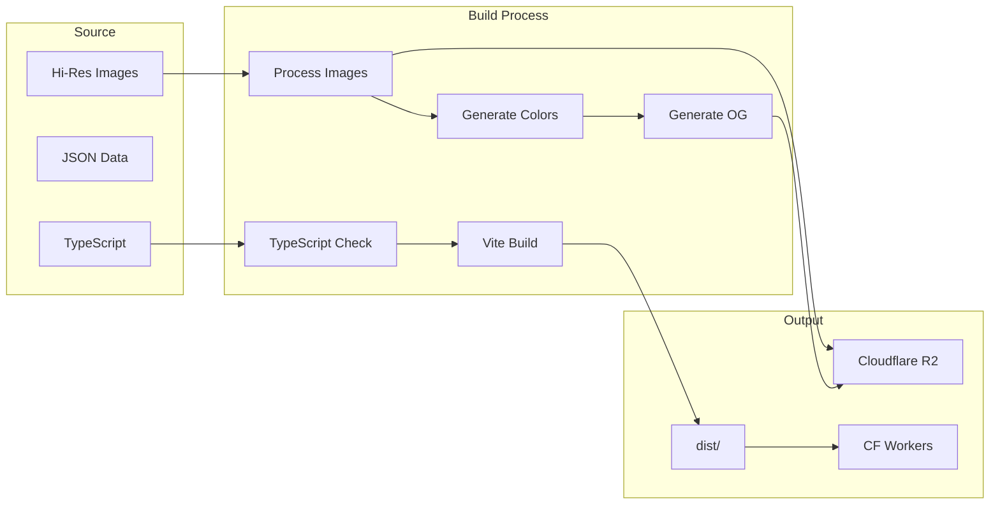
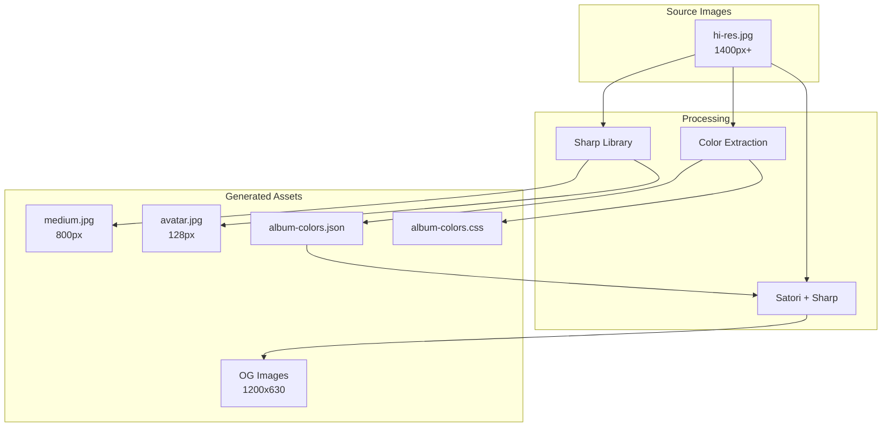

# Build Pipeline Documentation

This section covers the build process, asset generation, and deployment pipeline.

## Quick Links

| Document | Description |
|----------|-------------|
| [Asset Processing](./asset-processing.md) | Image processing, colors, OG images |
| [Deployment](./deployment.md) | CI/CD, R2 sync, Cloudflare Workers |

## Build Overview



## Build Commands

Runtime requirement: Node.js 22.19.0 or newer with pnpm 10.

### Development

```bash
# Start dev server with hot reload
pnpm run dev

# Type checking (watch mode)
pnpm run tsc --noEmit --watch
```

### Production Build

```bash
# Full production build
pnpm run build

# Build steps:
# 1. rm -rf dist
# 2. tsc --noEmit (type check)
# 3. vite build (bundle)
# 4. process-images (resize)
# 5. generate-colors (extract palettes)
# 6. build:wrapped (year data)
# 7. generate-og (social images)
# 8. cp dist/og-image.png public/og-image.png (for worker build)
```

### Fast Build (Skip Assets)

```bash
# Build without image processing
pnpm run build:fast
```

### Worker Build

```bash
# Optimized build for Cloudflare Workers
pnpm run build:worker
# - Excludes album/artist images from bundle (served from R2)
# - Copies JSON files to dist-worker
# - Includes og-image.png (from cache or public/)
# - Smaller deployment size (~300MB vs ~2GB)
```

## Build Scripts

| Script | Description |
|--------|-------------|
| `dev` | Start Vite dev server |
| `build` | Full production build |
| `build:fast` | Build without assets |
| `build:worker` | Worker-optimized build |
| `build:sync` | Build + sync to R2 |
| `build:sync:dry` | Preview R2 sync |
| `process-images` | Resize images |
| `generate-colors` | Extract color palettes |
| `generate-og` | Create OG images |
| `build:wrapped` | Generate wrapped.json |
| `preview` | Preview production build |
| `deploy` | Deploy to Cloudflare |

## Vite Configuration

```typescript
// vite.config.ts
export default defineConfig({
  plugins: [
    react(),
    imageProcessingMiddleware()  // Dev image resizing
  ],

  resolve: {
    alias: {
      '@': path.resolve(__dirname, './src')
    }
  },

  build: {
    outDir: 'dist',
    rollupOptions: {
      output: {
        manualChunks: {
          'react-vendor': ['react', 'react-dom', 'react-router-dom'],
          'ui-vendor': ['@radix-ui/react-*'],
          'animation-vendor': ['framer-motion'],
          'chart-vendor': ['d3', 'recharts'],
          'utils-vendor': ['fuse.js', 'clsx', 'tailwind-merge']
        }
      }
    },
    minify: 'terser',
    terserOptions: {
      compress: {
        drop_console: true,
        drop_debugger: true
      }
    },
    cssCodeSplit: true
  },

  server: {
    fs: { strict: false }
  }
});
```

### Image Processing Middleware

In development, images are processed on-demand:

```typescript
// Intercepts medium/avatar requests
// Processes from hi-res source
// Serves from memory (no file writes)
// Returns 404 if source missing
```

## Asset Pipeline



## Caching Strategy

### Build Cache

```bash
node_modules/.cache/assets/
├── images/        # Processed images
└── og/            # Generated OG images
```

### GitHub Actions Cache

```yaml
# Cache key includes:
# - OS
# - pnpm-lock.yaml hash
# - scripts/ hash (bust on script changes)
```

### R2 Cache Headers

```javascript
// 1-year cache for static assets
'Cache-Control': 'public, max-age=31536000'
```

## Output Structure

```
dist/
├── index.html
├── assets/
│   ├── index-[hash].js
│   ├── index-[hash].css
│   └── vendor-[hash].js
├── collection.json
├── album-colors.json
├── album-colors.css
├── wrapped.json
├── album/
│   └── {slug}/
│       ├── index.json
│       ├── {slug}-hi-res.jpg
│       └── {slug}-medium.jpg
├── artist/
│   └── {slug}/
│       ├── index.json
│       ├── {slug}-hi-res.jpg
│       ├── {slug}-medium.jpg
│       └── {slug}-avatar.jpg
└── og-images/
    └── {slug}.png
```

## Environment Variables

### Development

No special environment needed - uses local `/public/` files.

### Production Build

```bash
# Required for R2 sync
R2_ACCOUNT_ID=your-account-id
R2_ACCESS_KEY_ID=your-access-key
R2_SECRET_ACCESS_KEY=your-secret-key
R2_BUCKET_NAME=russ-fm-assets
R2_PUBLIC_DOMAIN=https://assets.russ.fm
```

### Build-time Variables

```bash
# Feature flags
VITE_SCROBBLING_ENABLED=true
```

## Performance Optimizations

### Code Splitting

- Vendor chunks (react, ui, animation, chart, utils)
- Route-based lazy loading
- CSS code splitting

### Image Optimization

- Only two sizes: hi-res (1400px), medium (800px)
- JPEG quality: 85%
- Sharp for fast processing

### Build Speed

- Incremental image processing (skip unchanged)
- Color extraction caching
- Parallel asset generation

## Related Documentation

- [Asset Processing](./asset-processing.md) - Detailed asset pipeline
- [Deployment](./deployment.md) - CI/CD and production deployment
- [Configuration](../development/configuration.md) - Build configuration options
