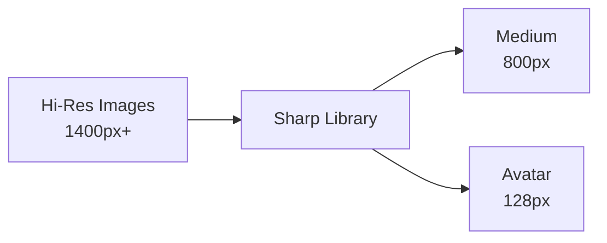
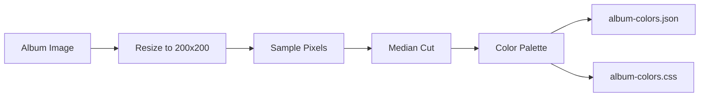
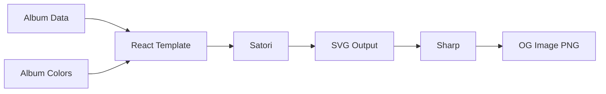

# Asset Processing

This document covers the image processing, color extraction, and OG image generation pipelines.

## Image Processing

### Overview



### Process Images Script

**File:** `scripts/process-images.js`

**Usage:**
```bash
# Process all images
pnpm run process-images

# With caching
pnpm run process-images -- --cache-dir node_modules/.cache/assets/images
```

**What it does:**
1. Scans `/public/album/` and `/public/artist/` for hi-res images
2. Generates medium (800px) versions for albums
3. Generates medium (800px) and avatar (128px) for artists
4. Copies processed images to dist directory

### Image Sizes

| Size | Dimensions | Use Case | Exists For |
|------|------------|----------|------------|
| hi-res | 1400px | Detail views, hero | Albums, Artists |
| medium | 800px | Cards, thumbnails | Albums, Artists |
| avatar | 128px | Small artist icons | Artists only |

**Important:** There is NO `small` size. Never reference it.

### Sharp Configuration

```javascript
// Medium size (800px)
await sharp(hiResPath)
  .resize(800, 800, {
    fit: 'inside',
    withoutEnlargement: true
  })
  .jpeg({ quality: 85 })
  .toFile(mediumPath);

// Avatar size (128px square)
await sharp(hiResPath)
  .resize(128, 128, {
    fit: 'cover'
  })
  .jpeg({ quality: 85 })
  .toFile(avatarPath);
```

### Caching

Outputs are written to the `--cache-dir` (CI) or straight to `dist/`. Before
processing, each hi-res source is SHA-1 hashed and compared with a sidecar
file that sits next to the outputs, e.g.
`album/<slug>/<slug>.hi-res.sha1`:

```javascript
const sourceHash = await hashFile(hiResPath);

if (outputsExist(outputPaths) && readSidecar(outputPaths) === sourceHash) {
  // Skipping (cached)
} else {
  await processImage(hiResPath, outputPaths);
  writeSidecar(outputPaths, sourceHash);
}
```

The check is content-based on purpose. An earlier version compared mtimes,
but a fresh git checkout stamps every source with the current time, so in CI
the whole cache looked stale and all ~4,700 images were re-encoded on every
run. Hashing also means replaced artwork (same filename, new bytes) is
regenerated, which an existence-only check would miss.

The sidecar files are copied into `dist/` along with the images, but the R2
sync only globs image extensions, so they are never uploaded.

---

## Color Extraction

### Overview



### Generate Colors Script

**File:** `scripts/generate-album-colors.js`

**Usage:**
```bash
pnpm run generate-colors
```

**What it does:**
1. Loads existing `album-colors.json` (cache)
2. Scans for new albums without colors
3. Extracts dominant colors using Sharp
4. Generates palette (background, foreground, accent, muted)
5. Writes JSON and CSS files

### Algorithm

```javascript
async function extractColors(imagePath) {
  // 1. Resize for faster processing
  const { data, info } = await sharp(imagePath)
    .resize(200, 200, { fit: 'cover' })
    .raw()
    .toBuffer({ resolveWithObject: true });

  // 2. Sample pixels (every 4th pixel)
  const pixels = [];
  for (let i = 0; i < data.length; i += 12) {
    pixels.push({
      r: data[i],
      g: data[i + 1],
      b: data[i + 2]
    });
  }

  // 3. Median cut quantization
  const palette = medianCut(pixels, 8);

  // 4. Calculate vibrance and select colors
  const sorted = palette.sort((a, b) => getVibrance(b) - getVibrance(a));

  return {
    background: getDarkestColor(sorted),
    foreground: '#ffffff',
    accent: sorted[0],  // Most vibrant
    muted: sorted[1]    // Second most vibrant
  };
}
```

### Vibrance Calculation

```javascript
function getVibrance(color) {
  const { r, g, b } = color;
  const max = Math.max(r, g, b);
  const min = Math.min(r, g, b);
  const saturation = max === 0 ? 0 : (max - min) / max;
  const lightness = (max + min) / 2 / 255;

  // Prefer saturated colors that aren't too dark or light
  return saturation * (1 - Math.abs(lightness - 0.5));
}
```

### Output Files

**album-colors.json:**
```json
{
  "radiohead-ok-computer": {
    "background": "#1a1a2e",
    "foreground": "#ffffff",
    "accent": "#4a90a4",
    "muted": "#6b7b8a"
  }
}
```

**album-colors.css:**
```css
.radiohead-ok-computer {
  --album-bg: #1a1a2e;
  --album-fg: #ffffff;
  --album-accent: #4a90a4;
  --album-muted: #6b7b8a;
}
```

### Incremental Processing

```javascript
// Load existing colors
const existing = JSON.parse(fs.readFileSync('album-colors.json'));

// Only process new albums
const albums = getAlbumList();
for (const album of albums) {
  if (existing[album.slug]) continue;  // Skip cached

  const colors = await extractColors(album.imagePath);
  existing[album.slug] = colors;
}

// Write merged result
fs.writeFileSync('album-colors.json', JSON.stringify(existing, null, 2));
```

---

### Keeping the committed palettes current

`public/album-colors.json` and `public/album-colors.css` are committed, and
the CI build only extracts palettes for albums missing from the JSON. If the
committed file falls behind the collection, CI re-extracts the backlog on
every run (at one point 215 albums), and in any incremental build that lacks
the hi-res sources those albums would get the default grey palette instead.

Two things keep the files current:

- **The output is deterministic.** The CSS carries no timestamp, so running
  the script with no new albums leaves both files byte-identical.
- **A pre-commit hook regenerates them.** `scripts/git-hooks/pre-commit`
  runs `generate-album-colors.js` and stages the two files whenever a commit
  includes album artwork (`public/album/*/*-hi-res.jpg`) or
  `public/collection.json`. `pnpm install` installs it into `.git/hooks`
  via the `prepare` script (`scripts/install-git-hooks.js`); run
  `pnpm run hooks:install` to install it by hand. The installer never
  overwrites a hook it did not create, and does nothing in CI.

---

## OG Image Generation

### Overview



### Generate OG Script

**File:** `scripts/generate-og-images.mjs`

**Usage:**
```bash
pnpm run generate-og

# With caching
pnpm run generate-og -- --cache-dir node_modules/.cache/assets/og
```

### Image Types

| Type | Caching | Notes |
|------|---------|-------|
| Album OG | Cached | Only regenerates if missing from cache |
| Artist OG | Cached | Only regenerates if missing from cache |
| Generic Site OG | **Always regenerated** | Shows "last 4 albums added", must stay current |

The generic `og-image.png` is always regenerated on each build because it displays the most recently added albums, which changes whenever new albums are added to the collection.

### Artist Card Image Fallback

An artist card needs one image. `resolveArtistImagePath()` tries, in order:

1. The declared hi-res path (`images_uri_artist['hi-res']`, or
   `artist/<slug>/<slug>-hi-res.jpg`).
2. The same path with a `.jpeg` or `.png` extension.
3. The cover of the artist's most recently added album.

If none exists the artist is skipped with a warning rather than an error.
Every image is also normalised through Sharp to a real JPEG before being
embedded, because the card uses a `data:image/jpeg` URI and Satori parses
the JPEG header. A PNG saved with a `.jpg` extension used to fail with
"Offset is outside the bounds of the DataView" on every run.

### Image Specifications

- **Dimensions:** 1200x630px (standard OG size)
- **Format:** PNG
- **Layout:**
  - Left: Album artwork (550x550px)
  - Right: Album info (title, artist, year, genres)

### Satori Template

```jsx
const template = (
  <div style={{
    display: 'flex',
    width: '1200px',
    height: '630px',
    background: colors.background
  }}>
    {/* Album artwork */}
    <div style={{
      width: '630px',
      height: '630px',
      display: 'flex',
      alignItems: 'center',
      justifyContent: 'center'
    }}>
      
    </div>

    {/* Album info */}
    <div style={{
      flex: 1,
      padding: '40px',
      display: 'flex',
      flexDirection: 'column',
      justifyContent: 'center',
      color: colors.foreground
    }}>
      <h1 style={{ fontSize: '48px', fontWeight: 'bold' }}>
        {album.title}
      </h1>
      <p style={{ fontSize: '32px', color: colors.muted }}>
        {album.artist}
      </p>
      <p style={{ fontSize: '24px' }}>
        {album.year}
      </p>
      <div style={{ display: 'flex', gap: '8px', marginTop: '16px' }}>
        {album.genres.slice(0, 3).map(genre => (
          <span style={{
            background: colors.accent,
            padding: '4px 12px',
            borderRadius: '4px'
          }}>
            {genre}
          </span>
        ))}
      </div>
    </div>
  </div>
);
```

### Font Loading

```javascript
import { readFileSync } from 'fs';
import { resolve } from 'path';

// Load Inter font
const interRegular = readFileSync(
  resolve('./node_modules/@fontsource/inter/files/inter-latin-400-normal.woff')
);

const interBold = readFileSync(
  resolve('./node_modules/@fontsource/inter/files/inter-latin-700-normal.woff')
);

// Use in Satori
const svg = await satori(template, {
  width: 1200,
  height: 630,
  fonts: [
    { name: 'Inter', data: interRegular, weight: 400 },
    { name: 'Inter', data: interBold, weight: 700 }
  ]
});
```

### SVG to PNG Conversion

```javascript
import sharp from 'sharp';

// Convert SVG to PNG
await sharp(Buffer.from(svg))
  .png()
  .toFile(`dist/og-images/${slug}.png`);
```

---

## Wrapped Data Generation

### Overview

**File:** `scripts/generate-wrapped-data.ts`

**Usage:**
```bash
pnpm run build:wrapped
```

### What it Generates

- `wrapped.json` with year-by-year data
- Album color palettes included
- Timeline and insight calculations

### Data Structure

```typescript
interface WrappedYear {
  year: number;
  summary: {
    totalAlbums: number;
    totalArtists: number;
    newArtists: number;
  };
  releases: WrappedRelease[];
  insights: {
    genres: { top: [...], distribution: {...} };
    decades: { "2020s": 15, "2010s": 10, ... };
    timeline: { "January": 5, "February": 3, ... };
    topArtists: [...];
  };
}
```

---

## Development Mode

### On-Demand Processing

In development, images are processed on-demand via Vite middleware:

```typescript
// vite.config.ts
function imageProcessingMiddleware() {
  return {
    name: 'image-processing',
    configureServer(server) {
      server.middlewares.use(async (req, res, next) => {
        // Check if requesting medium/avatar
        if (req.url.includes('-medium.') || req.url.includes('-avatar.')) {
          const sourcePath = getHiResPath(req.url);
          if (existsSync(sourcePath)) {
            const processed = await processOnDemand(sourcePath, req.url);
            res.setHeader('Content-Type', 'image/jpeg');
            res.setHeader('Cache-Control', 'no-cache');
            res.end(processed);
            return;
          }
        }
        next();
      });
    }
  };
}
```

### Benefits

- No need to pre-process for development
- Faster startup
- Only process what's viewed

---

## Utility Scripts

### Check Corrupted Images

```bash
node scripts/check-corrupted-images.js
```

Validates all images and reports any that fail to load.

### Cleanup Old Images

```bash
node scripts/cleanup-old-images.js
```

Removes orphaned processed images not in source.

---

## Performance Tips

### Parallel Processing

```javascript
// Process albums in parallel batches
const BATCH_SIZE = 10;
for (let i = 0; i < albums.length; i += BATCH_SIZE) {
  const batch = albums.slice(i, i + BATCH_SIZE);
  await Promise.all(batch.map(processAlbum));
}
```

### Skip Unchanged

```javascript
// Content hash of the source, recorded in a sidecar next to the outputs
const sourceHash = sha1(readFileSync(sourcePath));
const recorded = existsSync(sidecarPath) ? readFileSync(sidecarPath, 'utf8').trim() : null;

if (outputsExist && recorded === sourceHash) {
  return; // Already processed from this exact source
}
```

### Memory Management

```javascript
// Clear Sharp cache periodically
if (processedCount % 100 === 0) {
  sharp.cache(false);
  sharp.cache(true);
}
```
