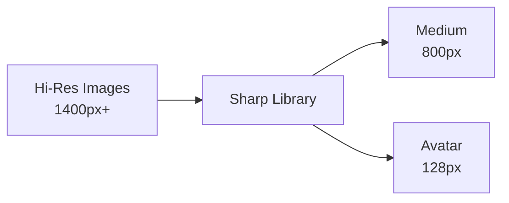
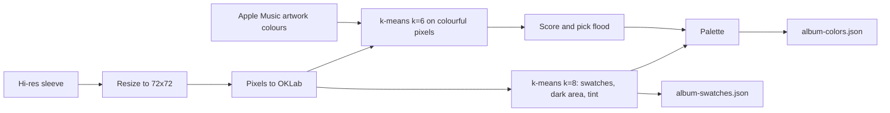
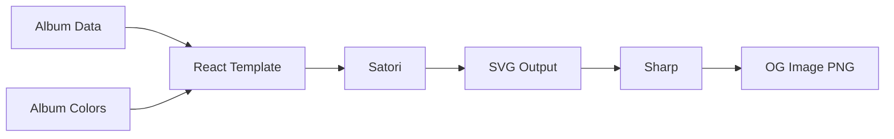

# Asset Processing

This document covers the image processing, color extraction, and OG image generation pipelines.

## Image Processing

### Overview



### Process Images Script

**File:** `scripts/process-images.js`

**Usage:**
```bash
# Process all images
pnpm run process-images

# With caching
pnpm run process-images -- --cache-dir node_modules/.cache/assets/images
```

**What it does:**
1. Scans `/public/album/` and `/public/artist/` for hi-res images
2. Generates medium (800px) versions for albums
3. Generates medium (800px) and avatar (128px) for artists
4. Copies processed images to dist directory

After processing (or copying from the cache), the script hard-links every
`*-hi-res.jpg` from `public/` into the output directory next to the
generated `medium` and `avatar` files, so the output tree is the complete
set the R2 sync uploads. Hard links cost no disk space; it falls back to a
copy across filesystems.

### Image Sizes

| Size | Dimensions | Use Case | Exists For |
|------|------------|----------|------------|
| hi-res | 1400px | Detail views, hero | Albums, Artists |
| medium | 800px | Cards, thumbnails | Albums, Artists |
| avatar | 128px | Small artist icons | Artists only |

**Important:** There is NO `small` size. Never reference it.

### Sharp Configuration

```javascript
// Medium size (800px)
await sharp(hiResPath)
  .resize(800, 800, {
    fit: 'inside',
    withoutEnlargement: true
  })
  .jpeg({ quality: 85 })
  .toFile(mediumPath);

// Avatar size (128px square)
await sharp(hiResPath)
  .resize(128, 128, {
    fit: 'cover'
  })
  .jpeg({ quality: 85 })
  .toFile(avatarPath);
```

### Caching

Outputs are written to the `--cache-dir` (CI) or straight to `dist/`. Before
processing, each hi-res source is SHA-1 hashed and compared with a sidecar
file that sits next to the outputs, e.g.
`album/<slug>/<slug>.hi-res.sha1`:

```javascript
const sourceHash = await hashFile(hiResPath);

if (outputsExist(outputPaths) && readSidecar(outputPaths) === sourceHash) {
  // Skipping (cached)
} else {
  await processImage(hiResPath, outputPaths);
  writeSidecar(outputPaths, sourceHash);
}
```

The check is content-based on purpose. An earlier version compared mtimes,
but a fresh git checkout stamps every source with the current time, so in CI
the whole cache looked stale and all ~4,700 images were re-encoded on every
run. Hashing also means replaced artwork (same filename, new bytes) is
regenerated, which an existence-only check would miss.

The sidecar files are copied into `dist/` along with the images, but the R2
sync only globs image extensions, so they are never uploaded.

---

## Color Extraction

### Overview



### Generate Colors Script

**File:** `scripts/generate-album-colors.js`

**Usage:**
```bash
pnpm run generate-colors

# Redo every album (about a minute for ~3,700 albums)
node scripts/generate-album-colors.js --force
```

**What it does:**
1. Loads the existing `album-colors.json` and `album-swatches.json` (cache)
2. Walks `collection.json`, reusing any entry whose `v` matches the script's `VERSION`
   and which has swatches
3. Extracts the rest from `public/album/<slug>/<slug>-hi-res.jpg`, with Apple Music
   artwork colours from `public/album/<slug>/<slug>.json`
4. Writes `public/album-colors.json` (palettes) and `public/album-swatches.json`
   (swatches). There is no generated stylesheet.

Everything the frontend needs (flood, ink, ground, glow, secondary, hue, vividness) is
decided here, Apple Music colours included, so every page (tiles, walls, nav, album page,
home hero) shows the same flood for a sleeve.

### Algorithm

All colour work is done in OKLab / OKLCH so "colourful" and "light" match what the eye sees.

1. **Swatches.** The sleeve is downsampled to 72×72 and k-means (k=8) runs over every
   pixel. Near-identical clusters are merged. This gives the sleeve's main swatches
   (with the share of the sleeve each covers), its darkest area and its overall tint.
2. **Flood candidates.** A second k-means (k=6) runs over only the colourful pixels
   (OKLCH chroma ≥ 0.05). Each candidate is the mean of the more colourful half of its
   cluster rather than the whole cluster, so a small bright area (a red logo on black)
   is not averaged away.
3. **Apple Music colours.** `services.apple_music.raw_attributes.artwork` `bgColor`,
   `textColor1` and `textColor2` join as candidates when they cover at least 1% of the
   sleeve, with their score multiplied by 1.1.
4. **Scoring.** Candidates are scored on chroma, lightness (best between OKLab L 0.45
   and 0.8) and coverage; small areas only count when they are properly colourful. The
   best candidate becomes the flood if it scores at least 0.3. Otherwise the flood is a
   pale neutral tinted with the sleeve's own cast (L 0.84–0.92, depending on the
   sleeve's mean lightness).
5. **The rest of the palette:**
   - `ground`: the sleeve's darkest substantial cluster, clamped to OKLab L 0.17–0.24
     and chroma ≤ 0.045. Never pure black.
   - `glow`: the flood, lightened (keeping its hue) until it reaches 3:1 on the ground.
   - `secondary`: the next candidate that differs from the flood by at least 40° of hue
     or 0.18 of lightness, else `null`.
   - `ink`: `#0e0d0c` or `#fbf7ef`, whichever has more contrast on the flood.
   - `hue`: the flood's OKLCH hue as 0–1; `vivid`: the winning score (0 for monochrome
     sleeves, up to about 2.6).

k-means is seeded, so re-running on the same sleeve gives the same palette. Albums with
no hi-res artwork get a default palette (flood `#e8e2d6`, ground `#1c1916`) and no
swatches.

### Output Files

Both files are keyed by `uri_release`, one album per line, in `collection.json` order.
Albums no longer in the collection are dropped. See
[schemas.md](../data/schemas.md#album-colorsjson) for the fields.

**album-colors.json:**
```json
{
  "/album/glastonbury-1994-38527017/": {"v":2,"flood":"#05abcb","ink":"#0e0d0c","ground":"#0a232b","glow":"#05abcb","secondary":"#0f5a97","hue":0.605,"vivid":0.94}
}
```

**album-swatches.json:** up to six `[hex, percentOfSleeve]` pairs, largest first.
```json
{
  "/album/glastonbury-1994-38527017/": [["#183139",23],["#465428",23],["#135084",11],["#efc74e",11],["#9c7f32",10],["#39b7b0",9]]
}
```

The swatches live in their own file because only the album page shows them; in the
palette map they would roughly double the gzipped size of a file every page loads
(about 138 KB for the map, 178 KB for the swatches).

The frontend reads palettes only from these files, through `useAlbumColors`,
`useAlbumColorMap`, `useAlbumSwatches` and `src/lib/sleeveColour.ts`. The old
`album-colors.css` (around 510KB of per-album classes, render-blocking and
unused by any component) is no longer generated or imported.

### Incremental Processing

```javascript
const VERSION = 2; // bump when the algorithm or output shape changes

for (const album of collection) {
  const uri = album.uri_release;
  const kept = existing[uri];
  if (!force && kept?.v === VERSION && existingSwatches[uri]) {
    colours[uri] = kept;             // reuse
    swatches[uri] = existingSwatches[uri];
    continue;
  }
  // ...extract palette and swatches from the sleeve
}

// Rebuilt from collection.json each run, so removed albums drop out
await writeOnePerLine(jsonPath, colours);
await writeOnePerLine(swatchesPath, swatches);
```

Bump `VERSION` whenever the algorithm changes: every older entry is then redone on the
next run, as if `--force` had been passed.

---

### Keeping the committed palettes current

`public/album-colors.json` and `public/album-swatches.json` are committed, and
the CI build only extracts palettes for albums missing from them (or at an older
`VERSION`). If the
committed files fall behind the collection, CI re-extracts the backlog on
every run (at one point 215 albums), and in any incremental build that lacks
the hi-res sources those albums would get the default neutral palette instead.

Two things keep the files current:

- **The output is deterministic.** The JSON carries no timestamp, k-means is
  seeded and entries follow `collection.json` order, so running the script with
  no new albums leaves both files byte-identical.
- **A pre-commit hook regenerates it.** `scripts/git-hooks/pre-commit`
  runs `generate-album-colors.js` and stages both `album-colors.json` and
  `album-swatches.json` whenever a
  commit includes album artwork (`public/album/*/*-hi-res.jpg`) or
  `public/collection.json`. `pnpm install` installs it into `.git/hooks`
  via the `prepare` script (`scripts/install-git-hooks.js`); run
  `pnpm run hooks:install` to install it by hand. The installer never
  overwrites a hook it did not create, and does nothing in CI.

---

## OG Image Generation

### Overview



### Generate OG Script

**File:** `scripts/generate-og-images.mjs`

**Usage:**
```bash
pnpm run generate-og

# With caching
pnpm run generate-og -- --cache-dir node_modules/.cache/assets/og
```

### Image Types

| Type | Caching | Notes |
|------|---------|-------|
| Album OG | Cached | Only regenerates if missing from cache |
| Artist OG | Cached | Only regenerates if missing from cache |
| Generic Site OG | **Always regenerated** | Shows "last 4 albums added", must stay current |

The generic `og-image.png` is always regenerated on each build because it displays the most recently added albums, which changes whenever new albums are added to the collection.

### Artist Card Image Fallback

An artist card needs one image. `resolveArtistImagePath()` tries, in order:

1. The declared hi-res path (`images_uri_artist['hi-res']`, or
   `artist/<slug>/<slug>-hi-res.jpg`).
2. The same path with a `.jpeg` or `.png` extension.
3. The cover of the artist's most recently added album.

If none exists the artist is skipped with a warning rather than an error.

### Artist Skip List

`scripts/og-skip.json` lists artist slugs that should never get an OG card,
for example session musicians with no artwork anywhere:

```json
{ "artists": ["chris-hague", "joel-white", "ocean-machine"] }
```

`generate-og-images.mjs` skips them before doing any work (reported as
"skipped" in the summary), and `generate-static-meta.mjs` points their
page's `og:image` at the site-wide `/og-image.png` instead of the per-artist
card, so social previews never reference a missing file.
Every image is also normalised through Sharp to a real JPEG before being
embedded, because the card uses a `data:image/jpeg` URI and Satori parses
the JPEG header. A PNG saved with a `.jpg` extension used to fail with
"Offset is outside the bounds of the DataView" on every run.

### Image Specifications

- **Dimensions:** 1200x630px (standard OG size)
- **Format:** PNG
- **Layout:**
  - Left: Album artwork (550x550px)
  - Right: Album info (title, artist, year, genres). The year is `year_original`,
    falling back to `date_release_year`

### Satori Template

Album cards take their colours from the album's `album-colors.json` palette through
`ogColours()`: the sleeve's `ground` as the background, cream (`#fbf7ef`) text, and
`glow` for accents (the artist name and the site mark).

```javascript
function ogColours(palette) {
  if (!palette) return null;
  return { background: palette.ground, foreground: '#fbf7ef', accent: palette.glow };
}
```

Cards already in the CI cache (`node_modules/.cache/assets/og`) are not redrawn, so
they keep their old colours until that cache is cleared.

```jsx
const template = (
  <div style={{
    display: 'flex',
    width: '1200px',
    height: '630px',
    background: colors.background
  }}>
    {/* Album artwork */}
    <div style={{
      width: '630px',
      height: '630px',
      display: 'flex',
      alignItems: 'center',
      justifyContent: 'center'
    }}>
      
    </div>

    {/* Album info */}
    <div style={{
      flex: 1,
      padding: '40px',
      display: 'flex',
      flexDirection: 'column',
      justifyContent: 'center',
      color: colors.foreground
    }}>
      <h1 style={{ fontSize: '48px', fontWeight: 'bold' }}>
        {album.title}
      </h1>
      <p style={{ fontSize: '32px', color: colors.accent }}>
        {album.artist}
      </p>
      <p style={{ fontSize: '24px' }}>
        {album.year}
      </p>
      <div style={{ display: 'flex', gap: '8px', marginTop: '16px' }}>
        {album.genres.slice(0, 3).map(genre => (
          <span style={{
            background: colors.accent,
            padding: '4px 12px',
            borderRadius: '4px'
          }}>
            {genre}
          </span>
        ))}
      </div>
    </div>
  </div>
);
```

### Font Loading

```javascript
import { readFileSync } from 'fs';
import { resolve } from 'path';

// Load Inter font
const interRegular = readFileSync(
  resolve('./node_modules/@fontsource/inter/files/inter-latin-400-normal.woff')
);

const interBold = readFileSync(
  resolve('./node_modules/@fontsource/inter/files/inter-latin-700-normal.woff')
);

// Use in Satori
const svg = await satori(template, {
  width: 1200,
  height: 630,
  fonts: [
    { name: 'Inter', data: interRegular, weight: 400 },
    { name: 'Inter', data: interBold, weight: 700 }
  ]
});
```

### SVG to PNG Conversion

```javascript
import sharp from 'sharp';

// Convert SVG to PNG
await sharp(Buffer.from(svg))
  .png()
  .toFile(`dist/og-images/${slug}.png`);
```

---

## Wrapped Data Generation

### Overview

**File:** `scripts/generate-wrapped-data.ts`

**Usage:**
```bash
pnpm run build:wrapped
```

### What it Generates

- `wrapped.json` with year-by-year data
- Sleeve palettes copied from `album-colors.json` (each release's `colors` and the theme palettes)
- Timeline and insight calculations
- Each release carries `year_original`; `insights.decades` counts by it,
  falling back to `date_release_year`

### Data Structure

```typescript
interface WrappedYear {
  year: number;
  summary: {
    totalAlbums: number;
    totalArtists: number;
    newArtists: number;
  };
  releases: WrappedRelease[];
  insights: {
    genres: { top: [...], distribution: {...} };
    decades: { "2020s": 15, "2010s": 10, ... };
    timeline: { "January": 5, "February": 3, ... };
    topArtists: [...];
  };
}
```

---

## Development Mode

### On-Demand Processing

In development, images are processed on-demand via Vite middleware:

```typescript
// vite.config.ts
function imageProcessingMiddleware() {
  return {
    name: 'image-processing',
    configureServer(server) {
      server.middlewares.use(async (req, res, next) => {
        // Check if requesting medium/avatar
        if (req.url.includes('-medium.') || req.url.includes('-avatar.')) {
          const sourcePath = getHiResPath(req.url);
          if (existsSync(sourcePath)) {
            const processed = await processOnDemand(sourcePath, req.url);
            res.setHeader('Content-Type', 'image/jpeg');
            res.setHeader('Cache-Control', 'no-cache');
            res.end(processed);
            return;
          }
        }
        next();
      });
    }
  };
}
```

### Benefits

- No need to pre-process for development
- Faster startup
- Only process what's viewed

---

## Utility Scripts

### Check Corrupted Images

```bash
node scripts/check-corrupted-images.js
```

Validates all images and reports any that fail to load.

### Cleanup Old Images

```bash
node scripts/cleanup-old-images.js
```

Removes orphaned processed images not in source.

---

## Performance Tips

### Parallel Processing

```javascript
// Process albums in parallel batches
const BATCH_SIZE = 10;
for (let i = 0; i < albums.length; i += BATCH_SIZE) {
  const batch = albums.slice(i, i + BATCH_SIZE);
  await Promise.all(batch.map(processAlbum));
}
```

### Skip Unchanged

```javascript
// Content hash of the source, recorded in a sidecar next to the outputs
const sourceHash = sha1(readFileSync(sourcePath));
const recorded = existsSync(sidecarPath) ? readFileSync(sidecarPath, 'utf8').trim() : null;

if (outputsExist && recorded === sourceHash) {
  return; // Already processed from this exact source
}
```

### Memory Management

```javascript
// Clear Sharp cache periodically
if (processedCount % 100 === 0) {
  sharp.cache(false);
  sharp.cache(true);
}
```
