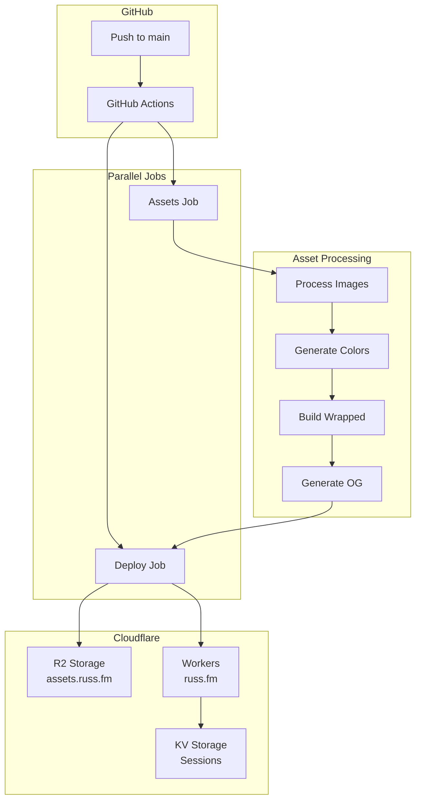

# Deployment

This document covers the CI/CD pipeline, Cloudflare R2 sync, and Workers deployment.

## Deployment Overview



## GitHub Actions Workflow

**File:** `.github/workflows/deploy.yml`

### Trigger

```yaml
on:
  push:
    branches: [main]
    paths-ignore:
      - 'docs/**'
      - 'project/**'
      - 'README.md'
      - 'scrapper/**'
```

### Jobs

The workflow is a single `deploy` job. It used to be split into an "assets" job
that filled the cache and a "deploy" job that consumed it, but `actions/cache`
only saves when the primary key misses, so the first job's output was discarded
on every run and the second job repeated all of its work. Collapsing them
removed a full checkout of the 2 GB working tree plus a duplicate asset pass.

#### Deploy Job

```yaml
deploy:
  runs-on: ubuntu-latest
  steps:
    - uses: actions/checkout@v5
      with:
        fetch-depth: 0  # Full history for git diff

    - name: Setup Node.js
      uses: actions/setup-node@v6
      with:
        node-version: '22.19.0'

    - name: Install pnpm
      uses: pnpm/action-setup@v6
      # version comes from package.json "packageManager"

    - name: Setup pnpm + assets cache
      uses: actions/cache@v5
      with:
        path: |
          ${{ env.STORE_PATH }}          # pnpm store
          node_modules/.cache/assets     # processed images + OG images
        key: ${{ runner.os }}-assets-v2-${{ hashFiles('**/pnpm-lock.yaml') }}-${{ hashFiles('scripts/**', 'src/lib/imageProcessor.ts') }}
        restore-keys: |
          ${{ runner.os }}-assets-v2-

    - name: Install dependencies
      run: pnpm install

    - name: Generate Assets
      run: |
        rm -rf dist
        pnpm run generate-sitemap
        pnpm run process-images -- --cache-dir node_modules/.cache/assets/images
        pnpm run generate-colors
        pnpm run build:wrapped
        pnpm run generate-sitemap
        pnpm run generate-og -- --cache-dir node_modules/.cache/assets/og

        # Copy generic og-image.png to public/ for worker build
        cp dist/og-image.png public/og-image.png

    - name: Detect changed files
      run: |
        git diff --name-only ${{ github.event.before }} HEAD > changed_files.txt

    - name: Sync to R2
      run: node scripts/sync-to-r2.js --force --changed-files changed_files.txt
      env:
        R2_ACCOUNT_ID: ${{ secrets.R2_ACCOUNT_ID }}
        R2_ACCESS_KEY_ID: ${{ secrets.R2_ACCESS_KEY_ID }}
        R2_SECRET_ACCESS_KEY: ${{ secrets.R2_SECRET_ACCESS_KEY }}
        R2_BUCKET_NAME: ${{ secrets.R2_BUCKET_NAME }}

    - name: Build Worker & Deploy to Cloudflare
      run: |
        pnpm tsc --noEmit
        node scripts/build-worker.js
        pnpm exec wrangler deploy
      env:
        CLOUDFLARE_API_TOKEN: ${{ secrets.CLOUDFLARE_API_TOKEN }}
        CLOUDFLARE_ACCOUNT_ID: ${{ secrets.CLOUDFLARE_ACCOUNT_ID }}
```

Notes on the shape of the job:

- **The app is type-checked and bundled once.** CI calls `build-worker.js`
  directly rather than `pnpm run deploy`, because `deploy` goes through
  `build:fast`, which would run `tsc` and a throwaway Vite build into `dist/`
  before `build-worker.js` runs its own Vite build into `dist-worker/`.
  The asset step therefore does not run Vite at all; `dist/` only receives
  processed images and OG images for the R2 sync. Because the script is
  launched with plain `node`, `node_modules/.bin` is not on `PATH`, so
  `build-worker.js` resolves the Vite binary from `node_modules/.bin` itself.
- **The cache key is versioned** (`assets-v2`). Bump the suffix to force a
  full regenerate and a fresh save of the blob. Between bumps, the blob is
  only re-saved when the lockfile or the asset scripts change. Images added
  since the last save are regenerated on each run, which is cheap because the
  image processor skips anything already present in the cache (see
  [Asset Processing](./asset-processing.md#caching)).

---

## Cloudflare R2 Sync

### Overview

Images are stored in Cloudflare R2 and served from `assets.russ.fm`.

### Sync Script

**File:** `scripts/sync-to-r2.js`

**Usage:**
```bash
# Sync all images
pnpm run build:sync

# Dry run (preview)
pnpm run build:sync:dry

# Sync only changed files
node scripts/sync-to-r2.js --changed-files changed_files.txt

# Sync specific types
node scripts/sync-to-r2.js --type album
node scripts/sync-to-r2.js --type artist
node scripts/sync-to-r2.js --size hi-res
node scripts/sync-to-r2.js --size medium

# Force overwrite
node scripts/sync-to-r2.js --force
```

### Changed File Detection

```javascript
// Parse git diff output
function getChangedTargets(changedFilesPath) {
  const changed = fs.readFileSync(changedFilesPath, 'utf-8')
    .split('\n')
    .filter(Boolean);

  const targets = new Set();

  for (const file of changed) {
    // Extract album/artist slugs
    const albumMatch = file.match(/public\/album\/([^/]+)/);
    const artistMatch = file.match(/public\/artist\/([^/]+)/);

    if (albumMatch) targets.add(`album/${albumMatch[1]}`);
    if (artistMatch) targets.add(`artist/${artistMatch[1]}`);
  }

  return [...targets];
}
```

### Upload Process

```javascript
import { S3Client, PutObjectCommand } from '@aws-sdk/client-s3';
import { Upload } from '@aws-sdk/lib-storage';

const client = new S3Client({
  region: 'auto',
  endpoint: `https://${accountId}.r2.cloudflarestorage.com`,
  credentials: {
    accessKeyId,
    secretAccessKey
  }
});

async function uploadFile(localPath, remotePath) {
  const fileStream = fs.createReadStream(localPath);
  const contentType = getContentType(localPath);

  const upload = new Upload({
    client,
    params: {
      Bucket: bucketName,
      Key: remotePath,
      Body: fileStream,
      ContentType: contentType,
      CacheControl: 'public, max-age=31536000'  // 1 year
    }
  });

  upload.on('httpUploadProgress', (progress) => {
    // Track progress
  });

  await upload.done();
}
```

### R2 Utilities

```bash
# List bucket contents
pnpm run r2:list

# Clean orphaned files
pnpm run r2:clean --confirm
```

---

## Cloudflare Workers

### Runtime Requirements

- Node.js 22.19.0 or newer is required for the Workers deployment tooling.
- Wrangler 4.x (currently 4.128.0) resolves Miniflare with Undici 8, which requires Node 22.19.0+.

### Wrangler Configuration

**File:** `wrangler.toml`

```toml
name = "russ-fm"
compatibility_date = "2024-03-01"
main = "./_worker.js"

[assets]
directory = "./dist-worker"
binding = "ASSETS"

[[kv_namespaces]]
binding = "SESSIONS"
id = "826248011b2e42daa3052edb12763522"
preview_id = "b791af7209cd437f9ecef0155597f7bd"

[vars]
ENVIRONMENT = "production"
ALLOWED_ORIGINS_STRING = "https://russ.fm,https://preview.russ.fm"

[[routes]]
pattern = "russ.fm/*"
zone_name = "russ.fm"

[[routes]]
pattern = "www.russ.fm/*"
zone_name = "russ.fm"

[env.preview]
name = "russ-fm-preview"
route = "preview.russ.fm/*"

[env.production]
name = "russ-fm"
route = "russ.fm/*"
```

### Worker Build

**File:** `scripts/build-worker.js`

Optimizes build for Workers:

```javascript
// 1. Move images out of public temporarily
moveImages('public/album', '.temp-images/album');
moveImages('public/artist', '.temp-images/artist');

// 2. Build without images (Vite copies public/og-image.png automatically)
execSync('pnpm vite build --outDir dist-worker');

// 3. Restore images
moveImages('.temp-images/album', 'public/album');
moveImages('.temp-images/artist', 'public/artist');

// 4. Copy JSON files to dist-worker
copyJsonFiles('public/album', 'dist-worker/album');
copyJsonFiles('public/artist', 'dist-worker/artist');

// 5. Copy og-image.png (with fallback)
// First tries cache, then falls back to public/
if (existsSync('node_modules/.cache/assets/og/og-image.png')) {
  copyFile('...cache.../og-image.png', 'dist-worker/og-image.png');
} else if (existsSync('public/og-image.png')) {
  copyFile('public/og-image.png', 'dist-worker/og-image.png');
}
```

**Note:** The workflow copies `dist/og-image.png` to `public/og-image.png` before the worker build runs, ensuring the freshly generated OG image is included in the Vite build automatically.

### Worker Handler

**File:** `_worker.js`

```javascript
export default {
  async fetch(request, env) {
    const url = new URL(request.url);

    // API routes
    if (url.pathname.startsWith('/api/')) {
      return handleAPI(request, env);
    }

    // Static assets
    const asset = await env.ASSETS.fetch(request);
    if (asset.status !== 404) {
      return addCorsHeaders(asset);
    }

    // SPA fallback
    return env.ASSETS.fetch(new Request(new URL('/', url)));
  }
};

async function handleAPI(request, env) {
  const url = new URL(request.url);

  if (url.pathname.startsWith('/api/auth/')) {
    return handleAuth(request, env);
  }

  if (url.pathname.startsWith('/api/scrobble/')) {
    return handleScrobble(request, env);
  }

  return new Response('Not Found', { status: 404 });
}
```

### SEO Redirect Rules

`_worker.js` enforces canonical URL form before any asset fetch. Order matters; the first match wins.

| Rule | Trigger | Result |
|------|---------|--------|
| `www` → apex | `hostname === 'www.russ.fm'` | 301 to `https://russ.fm` + same path/query |
| Trailing slash strip | `pathname.length > 1 && pathname.endsWith('/')` | 301 to slash-trimmed URL |
| Hugo-era 410 | `/index.{xml,json}` and `/(artist\|artists\|genres?\|styles)/<slug>/index.{xml,json}` | 410 Gone |
| Slug rename map | `SLUG_REDIRECTS` lookup table | 301 to current slug |
| Genre query-string | `/albums(/<n>)?` with `?genre=<value>` | 301 to `/genre/<slugified>` |

The canonical form (matching `<link rel="canonical">` and the sitemap) is **non-www, no trailing slash, lowercase**. Any new redirect rules should be added to `seoRedirect()` in [_worker.js](../../_worker.js); add the matching unit-test case if you extend the table.

The `/albums/<slug>/` → `/album/<slug>` family of redirects (157 URLs in GSC) is handled by a Cloudflare zone-level rule outside this repo. If that rule is ever removed, port it to `seoRedirect()`.

---

## Environment Secrets

### Required Secrets

| Secret | Description |
|--------|-------------|
| `R2_ACCOUNT_ID` | Cloudflare account ID |
| `R2_ACCESS_KEY_ID` | R2 access key |
| `R2_SECRET_ACCESS_KEY` | R2 secret key |
| `R2_BUCKET_NAME` | R2 bucket name |
| `CLOUDFLARE_API_TOKEN` | Wrangler deploy token |
| `CLOUDFLARE_ACCOUNT_ID` | Cloudflare account |

### Setting Secrets

```bash
# GitHub CLI
gh secret set R2_ACCOUNT_ID --body "your-account-id"
gh secret set R2_ACCESS_KEY_ID --body "your-key"
gh secret set R2_SECRET_ACCESS_KEY --body "your-secret"
```

---

## Deployment Workflow

### Standard Deployment

1. Push to `main` branch
2. GitHub Actions triggers
3. Assets job processes images
4. Deploy job builds and deploys
5. Changed files synced to R2
6. Workers deployed

### Manual Deployment

```bash
# Build locally
pnpm run build

# Sync to R2
pnpm run build:sync

# Deploy to Workers
pnpm run deploy
```

### Preview Deployment

```bash
# Deploy to preview environment
pnpm run wrangler deploy --env preview
```

---

## Monitoring

### Deployment Status

Check GitHub Actions for build status:
```
https://github.com/russmckendrick/russ-fm/actions
```

### Cloudflare Dashboard

- **Workers:** Monitor requests, errors, CPU time
- **R2:** Storage usage, request metrics
- **Analytics:** Page views, geographic distribution

### Logs

```bash
# Worker logs
pnpm run wrangler tail

# Filtered logs
pnpm run wrangler tail --format json | jq '.logs[]'
```

---

## Rollback

### Revert Worker

```bash
# List deployments
pnpm run wrangler deployments list

# Rollback to previous
pnpm run wrangler rollback
```

### Revert R2 Assets

R2 doesn't have versioning enabled. To rollback:

1. Checkout previous commit
2. Run full sync: `pnpm run build:sync --force`

---

## Troubleshooting

### Build Failures

```bash
# Check TypeScript errors
pnpm run tsc --noEmit

# Verify build locally
pnpm run build
```

### R2 Sync Issues

```bash
# Dry run to check what would sync
pnpm run build:sync:dry

# Check R2 connectivity
node scripts/sync-to-r2.js --type album --size medium --dry-run
```

### Worker Deployment Issues

If deployment fails while loading Wrangler/Miniflare with:

```text
TypeError: webidl.util.markAsUncloneable is not a function
```

Check the Node version used by the runner. This happens when Undici 8 is loaded under Node 20; GitHub Actions should use Node.js 22.19.0 or newer.

```bash
# Check wrangler auth
pnpm run wrangler whoami

# Validate config
pnpm run wrangler config validate
```
