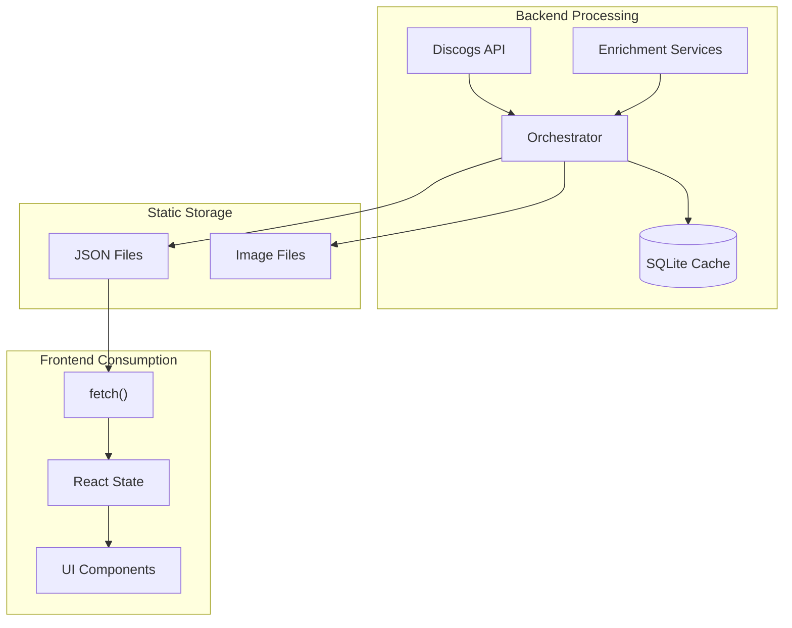

# Data Documentation

This section covers the data architecture, JSON schemas, and data models used in russ.fm.

## Quick Links

| Document | Description |
|----------|-------------|
| [Schemas](./schemas.md) | JSON file structures and database schema |
| [Models](./models.md) | Rust data models and TypeScript interfaces |

## Data Architecture

russ.fm uses a static data architecture where all data is pre-processed and stored as JSON files:



## File Structure

```
public/
├── collection.json           # Album index for listings
├── album-colors.json         # Pre-extracted color palettes
├── album-colors.css          # CSS custom properties
├── wrapped.json              # Year-in-review data
├── album/
│   └── {album-slug}/
│       ├── index.json        # Full album data
│       ├── {slug}-hi-res.jpg # High resolution (1400px)
│       └── {slug}-medium.jpg # Medium resolution (800px)
└── artist/
    └── {artist-slug}/
        ├── index.json        # Full artist data
        ├── {slug}-hi-res.jpg # High resolution
        ├── {slug}-medium.jpg # Medium resolution
        └── {slug}-avatar.jpg # Avatar (128px square)
```

## Data Flow

### Collection Processing

1. **Input**: Discogs collection items
2. **Enrichment**: Data from Apple Music, Spotify, Last.fm, etc.
3. **Storage**: SQLite cache + JSON files
4. **Output**: Static JSON consumed by frontend

### Frontend Loading

```typescript
// Collection index (lightweight, for listings)
const albums = await fetch('/collection.json').then(r => r.json());

// Individual album (full data)
const album = await fetch(`/album/${slug}/index.json`).then(r => r.json());

// Album colors
const colors = await fetch('/album-colors.json').then(r => r.json());
```

## Key Design Decisions

### Static JSON vs API

**Why static JSON?**
- Fast page loads (no server processing)
- CDN-cacheable
- Works offline after initial load
- Simple deployment
- No backend required at runtime

**Trade-offs:**
- Requires rebuild for data updates
- Larger initial payload
- No real-time data

### Two-Tier Data Structure

**collection.json**: Minimal data for listings
- Album name, artist, date added
- Genre names
- Image URIs
- No tracklist, no enrichment details

**album/*/index.json**: Full data for detail views
- Complete metadata
- Tracklist with durations
- All service data (raw_data)
- Editorial notes, wiki content

### Image Sizing

| Size | Dimensions | Use Case |
|------|------------|----------|
| hi-res | 1400px | Detail views, hero sections |
| medium | 800px | Cards, thumbnails |
| avatar | 128px | Artist avatars only |

**Note**: Only `hi-res` and `medium` exist for albums. `small` does NOT exist.

### Slug Generation

Album and artist slugs are generated consistently by the backend. The rules:

1. Lowercase the name
2. Replace whitespace with dashes
3. Strip characters that aren't word characters or dashes
4. Collapse repeated dashes into one
5. Trim leading/trailing dashes
6. Fall back to `unknown` if nothing remains

Examples:
- "OK Computer" → "ok-computer"
- "Sigur Rós" → "sigur-ros"
- "( )" → "unknown" (empty after sanitization)

## Caching Strategy

### Backend (SQLite)

- Caches all processed releases
- Enables resume capability
- Stores raw API responses

### Frontend (Browser)

- Static files are cacheable
- collection.json: Short cache (data may update)
- Individual JSONs: Long cache (rarely change)
- Images: Long cache (1 year)

### Build Pipeline

- Incremental image processing
- Color extraction cache
- Only sync changed files to R2

## Data Update Workflow

1. Add albums to Discogs collection
2. Run `scrapper collection --resume`
3. Run `scrapper generate-collection`
4. Run `pnpm run build`
5. Deploy (GitHub Actions handles sync)

## Related Documentation

- [Schemas Reference](./schemas.md) - Detailed JSON structures
- [Models Reference](./models.md) - Rust/TypeScript types
- [Backend Overview](../backend/) - Data processing
- [Build Pipeline](../build-pipeline/) - Asset generation
