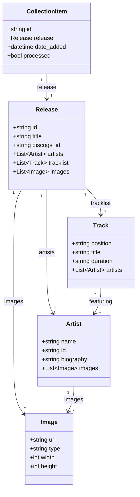

# Data Models Reference

This document covers the Rust record structs (backend) and TypeScript interfaces (frontend).

## Rust Records

Located in [`scrapper/src/db.rs`](../../scrapper/src/db.rs). One struct per SQLite table, loaded
and saved as full rows (`save_release` / `save_artist` are `INSERT OR REPLACE` upserts). `Value`
fields are `serde_json::Value` columns stored as JSON text.

### ReleaseRecord

```rust
pub struct ReleaseRecord {
    pub id: String,
    pub discogs_id: Option<String>,
    pub title: String,
    pub artists: Value,        // [{name, discogs_id, role, biography?, wikipedia_url?}]
    pub year: Option<i64>,
    pub released: Option<String>,
    pub country: Option<String>,
    pub formats: Value,        // ["Vinyl", "LP", …]
    pub labels: Value,
    pub genres: Value,
    pub styles: Value,
    pub images: Value,         // [{url, type, width, height, resource_url}]
    pub tracklist: Value,      // [{position, title, duration}]
    pub videos: Value,         // ["https://…", …] — flat URL strings
    pub apple_music_id: Option<String>,
    pub spotify_id: Option<String>,
    pub lastfm_mbid: Option<String>,
    pub discogs_url: Option<String>,
    pub apple_music_url: Option<String>,
    pub spotify_url: Option<String>,
    pub lastfm_url: Option<String>,
    pub release_name_discogs: Option<String>,      // collection.json prefers this over title
    pub release_name_apple_music: Option<String>,
    pub release_name_spotify: Option<String>,
    pub enrichment_data: Value,
    pub local_images: Value,   // {hi-res, medium, small} relative paths
    pub raw_data: Value,       // per-service payloads: apple_music/spotify/lastfm/perplexity
    pub created_at: Option<String>,
    pub updated_at: Option<String>,
    pub date_added: Option<String>,   // drives collection.json sort order
}
```

### ArtistRecord

```rust
pub struct ArtistRecord {
    pub id: String,
    pub name: String,          // folder slug = sanitize_folder_name(name)
    pub biography: Option<String>,
    pub discogs_id: Option<String>,
    pub apple_music_id: Option<String>,
    pub spotify_id: Option<String>,
    pub lastfm_mbid: Option<String>,
    pub discogs_url: Option<String>,
    pub apple_music_url: Option<String>,
    pub spotify_url: Option<String>,
    pub lastfm_url: Option<String>,
    pub wikipedia_url: Option<String>,
    pub genres: Value,
    pub popularity: Option<i64>,
    pub followers: Option<i64>,
    pub country: Option<String>,
    pub formed_date: Option<String>,
    pub images: Value,
    pub local_images: Value,   // {hi-res, medium, avatar} relative paths
    pub enrichment_data: Value,
    pub raw_data: Value,       // apple_music/spotify/lastfm/discogs/theaudiodb/perplexity
    pub created_at: Option<String>,
    pub updated_at: Option<String>,
}
```

Notes:

- The public JSON writers (`release_to_value` / `artist_to_value` in
  [`scrapper/src/output/json.rs`](../../scrapper/src/output/json.rs)) serialize from these
  records; release `artists[]` entries are enriched at write time by joining the artists table
  (discogs_id first, case-insensitive name fallback).
- Per-field editing is declared on the `ReleaseField` / `ArtistField` enums in
  `scrapper/src/ops/release.rs` / `scrapper/src/ops/artist.rs` — see the Detail Editor section of
  [`docs/backend/README.md`](../backend/README.md).
- The canonical Perplexity location is top-level `raw_data.perplexity`; legacy Python-era rows
  may nest it under `raw_data.services.perplexity` (readers fall back).

---

## TypeScript Interfaces

Located in `src/types/`

### Album Types (`types/album.ts`)

```typescript
export interface Album {
  release_name: string;
  release_artist: string;
  discogs_id: string;
  date_added: string;
  date_release_year: number;
  uri_release: string;
  uri_artist: string;

  artists: AlbumArtist[];
  genre_names: string[];
  style_names?: string[];

  labels?: Label[];
  formats?: Format[];
  country?: string;
  tracklist?: Track[];

  images_uri_release: ImageUris;
  images_uri_artist?: ArtistImageUris;

  spotify_url?: string;
  apple_music_url?: string;
  discogs_url: string;
  lastfm_url?: string;

  json_detailed_release?: string;
  json_detailed_artist?: string;

  raw_data?: RawServiceData;
}

export interface AlbumArtist {
  name: string;
  slug: string;
  uri: string;
  discogs_id?: string;
}

export interface ImageUris {
  'hi-res': string;
  medium: string;
}

export interface ArtistImageUris {
  'hi-res': string;
  medium: string;
  avatar: string;
}

export interface Track {
  position: string;
  title: string;
  duration?: string;
  artists?: AlbumArtist[];
}

export interface Label {
  name: string;
  catalog_number?: string;
}

export interface Format {
  name: string;
  qty?: string;
  descriptions?: string[];
}
```

### Artist Types

```typescript
export interface Artist {
  name: string;
  slug: string;
  uri: string;
  biography?: string;

  discogs_id?: string;
  apple_music_id?: string;
  spotify_id?: string;

  genres?: string[];
  country?: string;
  formed_date?: string;

  images: ArtistImageUris;

  external_urls?: {
    discogs?: string;
    spotify?: string;
    apple_music?: string;
    wikipedia?: string;
  };

  popularity?: {
    spotify_followers?: number;
    spotify_popularity?: number;
  };

  discography_count?: number;
  latestAlbum?: Album;
}
```

### Service Data Types

```typescript
export interface RawServiceData {
  services: {
    discogs?: DiscogsServiceData;
    apple_music?: AppleMusicServiceData;
    spotify?: SpotifyServiceData;
    lastfm?: LastFmServiceData;
    perplexity?: PerplexityServiceData;
  };
}

export interface AppleMusicServiceData {
  id: string;
  artwork?: {
    url: string;
    width?: number;
    height?: number;
    bgColor?: string;
    textColor1?: string;
  };
  editorial_notes?: {
    short?: string;
    standard?: string;
  };
  genre_names?: string[];
}

export interface SpotifyServiceData {
  id: string;
  popularity?: number;
  images?: { url: string; width: number; height: number }[];
}

export interface LastFmServiceData {
  mbid?: string;
  wiki_summary?: string;
  wiki_content?: string;
  tags?: string[];
}

export interface PerplexityServiceData {
  description: string;
  generated_at: string;
  model: string;
}
```

### Wrapped Types (`types/wrapped.ts`)

```typescript
export interface WrappedData {
  year: number;
  isYearToDate: boolean;
  summary: WrappedSummary;
  releases: WrappedRelease[];
  insights: WrappedInsights;
  theme?: WrappedTheme;
}

export interface WrappedSummary {
  totalAlbums: number;
  totalArtists: number;
  newArtists: number;
  firstAlbum: WrappedRelease;
  lastAlbum: WrappedRelease;
}

export interface WrappedRelease {
  release_name: string;
  release_artist: string;
  date_added: string;
  date_release_year: number;
  slug: string;
  images: ImageUris;
  artists: { name: string; slug: string }[];
  colors?: ColorPalette;
}

export interface WrappedInsights {
  genres: {
    top: { name: string; count: number }[];
    distribution: Record<string, number>;
  };
  decades: Record<string, number>;
  timeline: Record<string, number>;
  topArtists: { name: string; count: number }[];
  topAlbumsByMonth: Record<string, WrappedRelease>;
}

export interface WrappedTheme {
  primary: string;
  secondary: string;
  accent: string;
}
```

### Scrobble Types (`types/scrobble.ts`)

```typescript
export interface LastFmUser {
  username: string;
  sessionKey: string;
  userInfo?: {
    realname?: string;
    country?: string;
    playcount?: number;
    registered?: string;
  };
  userAvatar?: string;
  lastAlbumArt?: string;
}

export interface ScrobbleRequest {
  artist: string;
  track: string;
  album?: string;
  timestamp?: number;
  duration?: number;
}

export interface AlbumScrobbleRequest {
  artist: string;
  album: string;
  tracks: {
    title: string;
    duration?: number;
  }[];
}

export interface ScrobbleResponse {
  success: boolean;
  scrobbles?: {
    accepted: number;
    ignored: number;
  };
  error?: string;
}
```

### Color Types

```typescript
export interface ColorPalette {
  background: string;
  foreground: string;
  accent: string;
  muted: string;
}

export type AlbumColors = Record<string, ColorPalette>;
```

### Asset Types (`types/assets.ts`)

```typescript
export type ImageSize = 'hi-res' | 'medium' | 'avatar';

export interface AssetConfig {
  baseUrl: string;
  useR2: boolean;
  fallbackUrl: string;
}
```

### Search Types

```typescript
export interface SearchResult {
  id: string;
  type: 'album' | 'artist';
  title: string;
  subtitle?: string;
  image?: string;
  url: string;
  year?: number;
  genres?: string[];
  score: number;
  matches?: FuseMatch[];
}

export interface SearchOptions {
  limit?: number;
  threshold?: number;
  includeMatches?: boolean;
  filterByType?: 'album' | 'artist';
}

export interface SearchIndex {
  albums: Album[];
  artists: Artist[];
  isReady: boolean;
}
```

---

## Model Relationships


