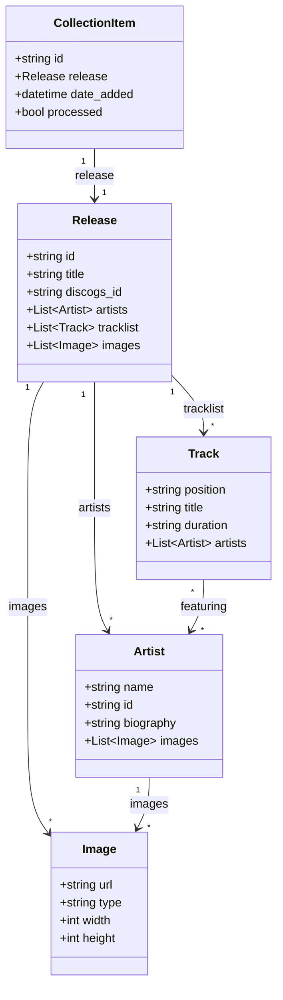

# Data Models Reference

This document covers Python data models (backend) and TypeScript interfaces (frontend).

## Python Models

Located in `scrapper/music_collection_manager/models/`

### Release Model (`models/release.py`)

```python
from dataclasses import dataclass, field
from typing import List, Optional, Dict, Any
from datetime import datetime
from pathlib import Path

@dataclass
class Release:
    """Represents a music release/album."""

    id: str
    title: str
    discogs_id: str

    # Metadata
    year: Optional[int] = None
    released: Optional[str] = None
    country: Optional[str] = None
    formats: List[str] = field(default_factory=list)
    labels: List[str] = field(default_factory=list)
    genres: List[str] = field(default_factory=list)
    styles: List[str] = field(default_factory=list)

    # Related entities
    artists: List['Artist'] = field(default_factory=list)
    images: List['Image'] = field(default_factory=list)
    tracklist: List['Track'] = field(default_factory=list)

    # External service IDs
    apple_music_id: Optional[str] = None
    spotify_id: Optional[str] = None
    lastfm_mbid: Optional[str] = None

    # External URLs
    discogs_url: Optional[str] = None
    apple_music_url: Optional[str] = None
    spotify_url: Optional[str] = None
    lastfm_url: Optional[str] = None

    # Service-specific names (may differ)
    release_name_discogs: Optional[str] = None
    release_name_apple_music: Optional[str] = None
    release_name_spotify: Optional[str] = None

    # Local image paths
    local_images: Dict[str, Optional[Path]] = field(default_factory=dict)

    # Raw API responses
    raw_data: Dict[str, Any] = field(default_factory=dict)

    # Timestamps
    created_at: Optional[datetime] = None
    updated_at: Optional[datetime] = None
    date_added: Optional[datetime] = None

    def get_primary_artist(self) -> Optional['Artist']:
        """Get the primary artist."""
        return self.artists[0] if self.artists else None

    def get_primary_image(self) -> Optional['Image']:
        """Get the primary cover image."""
        for img in self.images:
            if img.type == 'primary':
                return img
        return self.images[0] if self.images else None

    def has_complete_data(self) -> bool:
        """Check if release has all required data."""
        return bool(
            self.title and
            self.discogs_id and
            self.artists and
            self.images
        )
```

### Artist Model (`models/release.py`)

```python
@dataclass
class Artist:
    """Represents a music artist."""

    name: str
    id: Optional[str] = None
    role: Optional[str] = None  # 'artist', 'featuring', 'producer'

    # Biography
    biography: Optional[str] = None

    # External IDs
    discogs_id: Optional[str] = None
    apple_music_id: Optional[str] = None
    spotify_id: Optional[str] = None
    lastfm_mbid: Optional[str] = None

    # External URLs
    discogs_url: Optional[str] = None
    apple_music_url: Optional[str] = None
    spotify_url: Optional[str] = None
    lastfm_url: Optional[str] = None
    wikipedia_url: Optional[str] = None

    # Details
    genres: List[str] = field(default_factory=list)
    popularity: Optional[int] = None
    followers: Optional[int] = None
    country: Optional[str] = None
    formed_date: Optional[str] = None

    # Images
    images: List['Image'] = field(default_factory=list)
    local_images: Dict[str, Optional[Path]] = field(default_factory=dict)

    # Raw API responses
    raw_data: Dict[str, Any] = field(default_factory=dict)

    def get_slug(self) -> str:
        """Generate URL-safe slug from name."""
        from ..utils.folder_sanitizer import sanitize_folder_name
        return sanitize_folder_name(self.name)
```

### Track Model (`models/release.py`)

```python
@dataclass
class Track:
    """Represents a track on a release."""

    position: str
    title: str
    artists: List[Artist] = field(default_factory=list)
    duration: Optional[str] = None
    role: Optional[str] = None  # 'track', 'index', 'heading'

    def get_duration_seconds(self) -> Optional[int]:
        """Parse duration to seconds."""
        if not self.duration:
            return None
        try:
            parts = self.duration.split(':')
            if len(parts) == 2:
                return int(parts[0]) * 60 + int(parts[1])
            elif len(parts) == 3:
                return int(parts[0]) * 3600 + int(parts[1]) * 60 + int(parts[2])
        except ValueError:
            return None
        return None
```

### Image Model (`models/release.py`)

```python
@dataclass
class Image:
    """Represents an image asset."""

    url: str
    type: str  # 'primary', 'secondary', 'artist'
    width: Optional[int] = None
    height: Optional[int] = None
    resource_url: Optional[str] = None

    def is_high_quality(self) -> bool:
        """Check if image is high resolution."""
        if self.width and self.height:
            return min(self.width, self.height) >= 1000
        return False
```

### CollectionItem Model (`models/collection.py`)

```python
@dataclass
class CollectionItem:
    """Represents an item in a user's collection."""

    id: str
    release: Release
    folder_id: Optional[str] = None
    date_added: Optional[datetime] = None
    notes: Optional[str] = None
    rating: Optional[int] = None
    instance_id: Optional[str] = None
    processed: bool = False
    enriched: bool = False
```

---

## Enrichment Models (`models/enrichment.py`)

Service-specific data structures.

### DiscogsData

```python
@dataclass
class DiscogsData:
    """Discogs-specific release data."""
    id: int
    master_id: Optional[int] = None
    resource_url: str = ""
    uri: str = ""
    status: str = ""
    data_quality: str = ""
    community: Optional[Dict] = None
    companies: List[Dict] = field(default_factory=list)
    extraartists: List[Dict] = field(default_factory=list)
    identifiers: List[Dict] = field(default_factory=list)
    videos: List[Dict] = field(default_factory=list)
```

### AppleMusicData

```python
@dataclass
class AppleMusicData:
    """Apple Music-specific data."""
    id: str
    url: str = ""
    artwork_url: Optional[str] = None
    artwork_colors: Optional[Dict] = None
    editorial_notes: Optional[Dict] = None
    content_rating: Optional[str] = None
    is_complete: bool = True
    track_count: int = 0
    genre_names: List[str] = field(default_factory=list)
    release_date: Optional[str] = None
```

### SpotifyData

```python
@dataclass
class SpotifyData:
    """Spotify-specific data."""
    id: str
    url: str = ""
    uri: str = ""
    popularity: int = 0
    total_tracks: int = 0
    available_markets: List[str] = field(default_factory=list)
    copyrights: List[Dict] = field(default_factory=list)
    external_ids: Dict = field(default_factory=dict)
    images: List[Dict] = field(default_factory=list)
```

### LastFmData

```python
@dataclass
class LastFmData:
    """Last.fm-specific data."""
    mbid: Optional[str] = None
    url: str = ""
    listeners: int = 0
    playcount: int = 0
    wiki_summary: Optional[str] = None
    wiki_content: Optional[str] = None
    tags: List[str] = field(default_factory=list)
    similar: List[str] = field(default_factory=list)
```

### WikipediaData

```python
@dataclass
class WikipediaData:
    """Wikipedia-specific data."""
    page_id: Optional[int] = None
    title: str = ""
    url: str = ""
    extract: Optional[str] = None
    thumbnail: Optional[str] = None
    original_image: Optional[str] = None
```

### PerplexityData

```python
@dataclass
class PerplexityData:
    """Perplexity AI-generated data."""
    description: str
    generated_at: str
    model: str = "sonar"
    prompt_tokens: int = 0
    completion_tokens: int = 0
```

---

## TypeScript Interfaces

Located in `src/types/`

### Album Types (`types/album.ts`)

```typescript
export interface Album {
  release_name: string;
  release_artist: string;
  discogs_id: string;
  date_added: string;
  date_release_year: number;
  uri_release: string;
  uri_artist: string;

  artists: AlbumArtist[];
  genre_names: string[];
  style_names?: string[];

  labels?: Label[];
  formats?: Format[];
  country?: string;
  tracklist?: Track[];

  images_uri_release: ImageUris;
  images_uri_artist?: ArtistImageUris;

  spotify_url?: string;
  apple_music_url?: string;
  discogs_url: string;
  lastfm_url?: string;

  json_detailed_release?: string;
  json_detailed_artist?: string;

  raw_data?: RawServiceData;
}

export interface AlbumArtist {
  name: string;
  slug: string;
  uri: string;
  discogs_id?: string;
}

export interface ImageUris {
  'hi-res': string;
  medium: string;
}

export interface ArtistImageUris {
  'hi-res': string;
  medium: string;
  avatar: string;
}

export interface Track {
  position: string;
  title: string;
  duration?: string;
  artists?: AlbumArtist[];
}

export interface Label {
  name: string;
  catalog_number?: string;
}

export interface Format {
  name: string;
  qty?: string;
  descriptions?: string[];
}
```

### Artist Types

```typescript
export interface Artist {
  name: string;
  slug: string;
  uri: string;
  biography?: string;

  discogs_id?: string;
  apple_music_id?: string;
  spotify_id?: string;

  genres?: string[];
  country?: string;
  formed_date?: string;

  images: ArtistImageUris;

  external_urls?: {
    discogs?: string;
    spotify?: string;
    apple_music?: string;
    wikipedia?: string;
  };

  popularity?: {
    spotify_followers?: number;
    spotify_popularity?: number;
  };

  discography_count?: number;
  latestAlbum?: Album;
}
```

### Service Data Types

```typescript
export interface RawServiceData {
  services: {
    discogs?: DiscogsServiceData;
    apple_music?: AppleMusicServiceData;
    spotify?: SpotifyServiceData;
    lastfm?: LastFmServiceData;
    perplexity?: PerplexityServiceData;
  };
}

export interface AppleMusicServiceData {
  id: string;
  artwork?: {
    url: string;
    width?: number;
    height?: number;
    bgColor?: string;
    textColor1?: string;
  };
  editorial_notes?: {
    short?: string;
    standard?: string;
  };
  genre_names?: string[];
}

export interface SpotifyServiceData {
  id: string;
  popularity?: number;
  images?: { url: string; width: number; height: number }[];
}

export interface LastFmServiceData {
  mbid?: string;
  wiki_summary?: string;
  wiki_content?: string;
  tags?: string[];
}

export interface PerplexityServiceData {
  description: string;
  generated_at: string;
  model: string;
}
```

### Wrapped Types (`types/wrapped.ts`)

```typescript
export interface WrappedData {
  year: number;
  isYearToDate: boolean;
  summary: WrappedSummary;
  releases: WrappedRelease[];
  insights: WrappedInsights;
  theme?: WrappedTheme;
}

export interface WrappedSummary {
  totalAlbums: number;
  totalArtists: number;
  newArtists: number;
  firstAlbum: WrappedRelease;
  lastAlbum: WrappedRelease;
}

export interface WrappedRelease {
  release_name: string;
  release_artist: string;
  date_added: string;
  date_release_year: number;
  slug: string;
  images: ImageUris;
  artists: { name: string; slug: string }[];
  colors?: ColorPalette;
}

export interface WrappedInsights {
  genres: {
    top: { name: string; count: number }[];
    distribution: Record<string, number>;
  };
  decades: Record<string, number>;
  timeline: Record<string, number>;
  topArtists: { name: string; count: number }[];
  topAlbumsByMonth: Record<string, WrappedRelease>;
}

export interface WrappedTheme {
  primary: string;
  secondary: string;
  accent: string;
}
```

### Scrobble Types (`types/scrobble.ts`)

```typescript
export interface LastFmUser {
  username: string;
  sessionKey: string;
  userInfo?: {
    realname?: string;
    country?: string;
    playcount?: number;
    registered?: string;
  };
  userAvatar?: string;
  lastAlbumArt?: string;
}

export interface ScrobbleRequest {
  artist: string;
  track: string;
  album?: string;
  timestamp?: number;
  duration?: number;
}

export interface AlbumScrobbleRequest {
  artist: string;
  album: string;
  tracks: {
    title: string;
    duration?: number;
  }[];
}

export interface ScrobbleResponse {
  success: boolean;
  scrobbles?: {
    accepted: number;
    ignored: number;
  };
  error?: string;
}
```

### Color Types

```typescript
export interface ColorPalette {
  background: string;
  foreground: string;
  accent: string;
  muted: string;
}

export type AlbumColors = Record<string, ColorPalette>;
```

### Asset Types (`types/assets.ts`)

```typescript
export type ImageSize = 'hi-res' | 'medium' | 'avatar';

export interface AssetConfig {
  baseUrl: string;
  useR2: boolean;
  fallbackUrl: string;
}
```

### Search Types

```typescript
export interface SearchResult {
  id: string;
  type: 'album' | 'artist';
  title: string;
  subtitle?: string;
  image?: string;
  url: string;
  year?: number;
  genres?: string[];
  score: number;
  matches?: FuseMatch[];
}

export interface SearchOptions {
  limit?: number;
  threshold?: number;
  includeMatches?: boolean;
  filterByType?: 'album' | 'artist';
}

export interface SearchIndex {
  albums: Album[];
  artists: Artist[];
  isReady: boolean;
}
```

---

## Model Relationships


