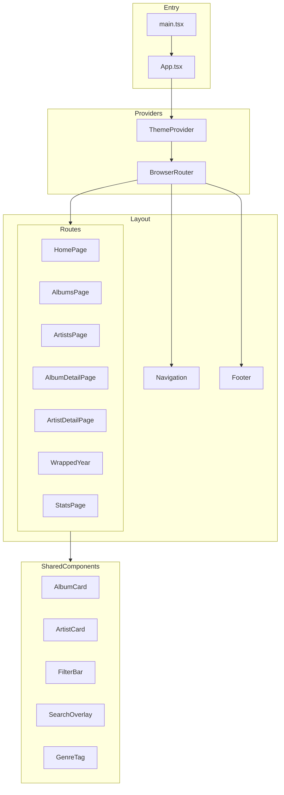
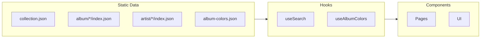

# Frontend Documentation

The russ.fm frontend is a React 19 single-page application built with TypeScript, Vite, and Tailwind CSS.

**Visual system.** In April 2026 the UI was reskinned as an editorial
vinyl-catalogue site (see `docs/project/completed/Redesign/CHANGELOG.md`
for the per-phase log). The shell runs on a warm paper/ink palette with
sharp corners, hairline rules, Archivo Variable + JetBrains Mono, and
mono metadata labels. Cover-colour shadows and hero washes come
from pre-extracted album palettes exposed both as
`/public/album-colors.json` for hooks and `/public/album-colors.css`
for class-driven treatments like the home and album-detail heroes.
The Home hero uses a fixed desktop height, the configured featured-release
count, album-accent active states, and a reduced-motion-safe countdown
waveform in the metadata rail. Album detail now mirrors that Home hero grammar
with a single-record paper split header, tags, actions, and metadata rail.
Feature-page headers read their visible copy from
`redesignConfig.pageHeaders` so the Albums, Artists, Search, Stats,
Genres, and Wrapped intro wording can be edited from one file.
A dev-only
`TweaksPanel` (opened with `Cmd/Ctrl+Shift+D`) lets the author tune
density / mono visibility / cover-colour / tint intensity in place
without shipping knobs to public visitors — defaults live in
`src/config/redesign.config.ts`.

## Quick Links

| Document | Description |
|----------|-------------|
| [Components](./components.md) | UI component library and patterns |
| [Pages](./pages.md) | Route-level components and features |
| [Hooks](./hooks.md) | Custom React hooks |
| [Utilities](./utilities.md) | Shared utility functions |

## Technology Stack

| Technology | Version | Purpose |
|------------|---------|---------|
| React | 19.x | UI framework |
| TypeScript | 5.x | Type safety |
| Vite | 7.0.0 | Build tool and dev server |
| React Router DOM | 7.6.3 | Client-side routing |
| Tailwind CSS | 3.x | Utility-first styling |
| shadcn/ui | Latest | Component library (Radix UI) |
| Framer Motion | Latest | Animations (Wrapped presentation mode only) |
| Fuse.js | Latest | Fuzzy search |
| Lucide React | Latest | Icon library |
| @fontsource-variable/archivo | Latest | Editorial variable typeface |
| @fontsource-variable/jetbrains-mono | Latest | Editorial mono typeface |

## Project Structure

```
src/
├── components/           # Reusable UI components
│   ├── ui/              # shadcn/ui base components
│   ├── home/            # Home page sections (hero, walls, stats aside…)
│   ├── browse/          # Shared browse primitives (BrowseHeader)
│   ├── layout/          # PageContainer, SectionHeader, DragWall
│   └── *.tsx            # Feature components
├── pages/               # Route-level components
│   └── wrapped/         # Year-in-review feature
├── hooks/               # Custom React hooks
├── lib/                 # Utility functions
├── services/            # API/data services
├── types/               # TypeScript definitions
├── config/              # Application configuration
│   ├── app.config.ts        # Original tunables (pagination, homepage)
│   └── redesign.config.ts   # Editorial redesign knobs (walls, stats, random, tint)
└── styles/
    ├── design-tokens.css    # Paper/ink palette + density/mono/tint classes
    └── index.css            # shadcn HSL mapping + base typography
```

## Component Architecture



## Data Flow

The frontend consumes static JSON data from `/public/`:



### Data Loading Pattern

```typescript
// Pages fetch data on mount
useEffect(() => {
  fetch('/collection.json')
    .then(res => res.json())
    .then(setAlbums);
}, []);

// Detail pages fetch by slug
useEffect(() => {
  fetch(`/album/${slug}/index.json`)
    .then(res => res.json())
    .then(setAlbum);
}, [slug]);
```

## Styling System

### Tailwind CSS

All styling uses Tailwind utility classes:

```tsx
<div className="flex items-center gap-4 p-6 bg-background rounded-lg shadow-md">
  
  <h2 className="text-xl font-semibold text-foreground">{title}</h2>
</div>
```

### Theme System

Light/dark mode via CSS custom properties:

```tsx
// ThemeProvider wraps the app
<ThemeProvider defaultTheme="system" storageKey="russ-fm-theme">
  <App />
</ThemeProvider>

// Components use theme-aware classes
<div className="bg-background text-foreground" />
<div className="dark:bg-slate-900 dark:text-white" />
```

### Album Colors

Dynamic theming from album artwork:

```tsx
import { useAlbumColors } from '@/hooks/useAlbumColors';

function AlbumHero({ slug }) {
  const { colors, loading } = useAlbumColors(slug);

  return (
    <div style={{
      background: colors?.background,
      color: colors?.foreground
    }}>
      {/* Album content */}
    </div>
  );
}
```

## Routing

React Router DOM handles all navigation:

| Route | Component | Description |
|-------|-----------|-------------|
| `/` | HomePage | Featured albums, recent additions |
| `/albums` | AlbumsPage | Paginated album grid |
| `/albums/:page` | AlbumsPage | Paginated with page number |
| `/album/:slug` | AlbumDetailPage | Album details |
| `/artists` | ArtistsPage | Paginated artist grid |
| `/artist/:slug` | ArtistDetailPage | Artist details |
| `/wrapped` | Redirect | Redirects to latest year |
| `/wrapped/:year` | WrappedYear | Year-in-review |
| `/stats` | StatsPage | Collection statistics |
| `/genres` | GenrePage | Genre browser |
| `/random` | RandomPage | Random album |
| `/search` | SearchResultsPage | Search results |

## State Management

No global state library - uses:

1. **React Context** - Theme, authentication
2. **URL State** - Pagination, filters, sorting
3. **Local State** - Component-specific data
4. **localStorage** - User preferences

```tsx
// URL-based state for shareable filters
const [searchParams, setSearchParams] = useSearchParams();
const page = parseInt(searchParams.get('page') || '1');
const sort = searchParams.get('sort') || 'date_added';
```

## Image Handling

**Critical**: Always use image utility functions, never hardcode paths.

```tsx
import { getAlbumImageFromData, getArtistAvatarUrl } from '@/lib/image-utils';

// Correct


// Incorrect - will break in production


```

**Available sizes**:
- `hi-res` - 1400px (full detail views)
- `medium` - 800px (cards, thumbnails)
- `avatar` - 128px (artist avatars only)

**Note**: `small` size does NOT exist in the data.

## Search Integration

Fuse.js powers fuzzy search:

```tsx
import { useSearch } from '@/hooks/useSearch';

function SearchComponent() {
  const { query, setQuery, results, isLoading } = useSearch();

  return (
    <>
      <input value={query} onChange={e => setQuery(e.target.value)} />
      {results.map(result => (
        <SearchResult key={result.id} {...result} />
      ))}
    </>
  );
}
```

## Development Commands

```bash
# Start development server
pnpm run dev

# Type checking
pnpm run tsc --noEmit

# Linting
pnpm run lint

# Build for production
pnpm run build

# Preview production build
pnpm run preview
```

## Best Practices

### Component Guidelines

1. **Use TypeScript** - Strict mode enabled
2. **Prefer composition** - Small, focused components
3. **Use shadcn/ui** - For consistent base components
4. **Handle loading states** - Show skeletons/spinners
5. **Handle errors** - Fallback UI for failed fetches

### Performance

1. **Lazy load pages** - React.lazy for routes
2. **Optimize images** - Use appropriate sizes
3. **Memoize expensive operations** - useMemo, useCallback
4. **Avoid prop drilling** - Use context sparingly

### Accessibility

1. **Semantic HTML** - Proper heading hierarchy
2. **ARIA labels** - For interactive elements
3. **Keyboard navigation** - Focus management
4. **Color contrast** - WCAG AA compliance

## Related Documentation

- [Components Reference](./components.md)
- [Pages Reference](./pages.md)
- [Hooks Reference](./hooks.md)
- [Utilities Reference](./utilities.md)
- [Configuration](../development/configuration.md)
