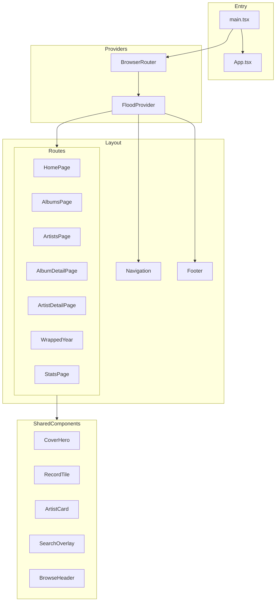
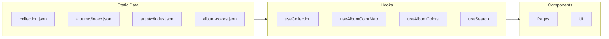

# Frontend Documentation

The russ.fm frontend is a React 19 single-page application built with TypeScript, Vite, and Tailwind CSS.

**Visual system.** The UI uses the "player" design: a warm near-black
ground, bold colour floods lifted from each sleeve, Archivo display type
and records drawn as physical objects (sleeves, discs, stickers, crates,
box sets). [`design-system.md`](./design-system.md) is the canonical
reference for tokens, type, components and page patterns. The site is
dark-ground only; there is no theme toggle. Each page with a colour hero
sets the flood through `usePageFlood`, and the sticky navigation paints
itself in the same colour until the page scrolls.

A dev-only `TweaksPanel` (opened with `Cmd/Ctrl+Shift+D`) still ships in
`App.tsx`; its defaults live in `src/config/redesign.config.ts`.

## Quick Links

| Document | Description |
|----------|-------------|
| [Design system](./design-system.md) | Player design: principles, tokens, type, colour rules, page patterns |
| [Components](./components.md) | UI component library and patterns |
| [Pages](./pages.md) | Route-level components and features |
| [Hooks](./hooks.md) | Custom React hooks |
| [Utilities](./utilities.md) | Shared utility functions |

## Technology Stack

| Technology | Version | Purpose |
|------------|---------|---------|
| React | 19.x | UI framework |
| TypeScript | 5.x | Type safety |
| Vite | 7.x | Build tool and dev server |
| React Router DOM | 7.x | Client-side routing |
| Tailwind CSS | 3.x | Utility-first styling |
| shadcn/ui | Latest | Component library (Radix UI) |
| Framer Motion | Latest | Genre graph transitions |
| D3 | 7.x | Genre graph layout and zoom |
| Three.js | Latest | `/random` crate scene |
| Fuse.js | Latest | Fuzzy search |
| Lucide React | Latest | Icon library |
| @fontsource-variable/archivo | Latest | Display type (`t-disp`, `t-cond`, `t-dispn`) |
| @fontsource-variable/hanken-grotesk | Latest | Body type |
| @fontsource-variable/jetbrains-mono | Latest | Mono labels (`t-mono`, `t-kicker`) |

## Project Structure

```
src/
├── components/           # Reusable UI components
│   ├── player/          # Player design: FloodProvider, CoverHero, HeroRecord, Sleeve, Vinyl, RecordTile…
│   ├── album/           # BoxSet (box set hero art and "In this box")
│   ├── browse/          # BrowseHeader, FacetFan, FacetCard, facetSleeves.ts
│   ├── genres/          # Genre map, explorer panel, genreColours.ts
│   ├── layout/          # PageContainer, PageStates (EditorialEmpty, EditorialSkeleton)
│   ├── ui/              # shadcn/ui base components
│   └── *.tsx            # Feature components
├── pages/               # Route-level components
│   └── wrapped/         # Year-in-review feature
├── hooks/               # Custom React hooks
├── lib/                 # Utilities (collection loader, sleeveColour, boxDiscs, image-utils…)
├── services/            # API/data services
├── types/               # TypeScript definitions
├── config/              # Application configuration
│   ├── app.config.ts        # Tunables (pagination, home hero and rows)
│   └── redesign.config.ts   # Stats counts, tweaks defaults
├── index.css                # Font imports, shadcn HSL mapping, base typography
└── styles/
    ├── player.css           # Player tokens, type classes, sleeve/vinyl/pill/tile/chip classes
    └── design-tokens.css    # Legacy token names, now mapped to dark values
```

## Component Architecture



## Data Flow

The frontend consumes static JSON data from `/public/`:



## Analytics

Production builds initialize Plausible Analytics from
`src/lib/analytics.ts` using the bundled
`@plausible-analytics/tracker` package. The tracker is configured for
`russ.fm`, automatically records browser-router pageviews, and keeps
`window.plausible` available for Plausible installation verification.
Local development builds do not initialize analytics.

## Data Loading Pattern

`collection.json` is loaded once per tab through the shared, cached loader in
`src/lib/collection.ts`:

```typescript
import { loadDetailJson, useCollection } from '@/lib/collection';

const { albums, loading, error } = useCollection();
// or, outside React state: const albums = await loadCollection();
// or synchronously, if it has already loaded: getLoadedCollection() ?? null

// Detail pages load per-item JSON through a second cache, keyed by path
useEffect(() => {
  loadDetailJson<AlbumDetail>(album.json_detailed_release).then(setDetail);
}, [album]);
```

Once the collection has loaded, `useCollection()` returns it on the first render, so moving
between pages shows no loading state. The album and artist detail pages find their record
in the shared collection synchronously and render the hero from it straight away; the detail
JSON fills in the rest when `loadDetailJson` resolves. The home hero prefetches its featured
releases through the same cache, so opening one from the hero is instant. Search uses
`loadCollection()` too, and only builds its Fuse index once the search overlay or mobile
search modal is opened.

Heavy derived data is memoised per collection array: `getGenreExplorer(collection)` in
`src/lib/genreExplorer.ts` and `excludeBoxsetMembers()` in `src/lib/boxsets.ts` return the
same object for the same input. `excludeBoxsetMembers()` hands back a shared array, so copy
it before sorting in place (`[...excludeBoxsetMembers(albums)].sort(...)`).

## Styling System

### Tailwind and tokens

Pages use Tailwind utilities plus the player classes. Colours come from CSS variables:

- `src/styles/player.css` — the player tokens (`--ground`, `--ground-2`, `--ground-3`,
  `--cream`, `--cream-dim`, `--cream-rule`, `--neutral-flood`, `--flood`, `--flood-ink`,
  `--ease-out`), the type classes (`t-disp`, `t-cond`, `t-dispn`, `t-mono`, `t-kicker`) and
  the object classes (`.sleeve`, `.vinyl`, `.rec`, `.sticker`, `.pill*`, `.icon-btn`,
  `.chip`, `.tile`, `.shelf-scroll`, `.flood-surface`), with a `prefers-reduced-motion`
  block that stops spinning and transitions.
- `src/styles/design-tokens.css` — the older `paper` / `ink` / `rule` names, now set to the
  dark ground and cream values so `bg-paper`, `text-ink-3`, `border-rule` and friends still
  read correctly.
- `src/index.css` — imports the fonts and both token files, and maps the
  shadcn HSL slots (`--background` etc.) to the dark ground.

```tsx
<section className="flood-surface" style={{ background: flood.flood, color: flood.ink }}>
  <h2 className="t-disp text-[48px]">Latest additions</h2>
  <span className="t-mono text-[13px] text-[color:var(--cream-dim)]">16 added in 2026</span>
</section>
```

### Fonts

| Family | Package | Use |
|--------|---------|-----|
| Archivo Variable | `@fontsource-variable/archivo` | `--font-display`: `t-disp` (125% width), `t-cond` (66%), `t-dispn` (112%) |
| Hanken Grotesk Variable | `@fontsource-variable/hanken-grotesk` | `--font-grot`: body text (Tailwind `font-grot` / `font-sans`) |
| JetBrains Mono Variable | `@fontsource-variable/jetbrains-mono` | `--font-mono`: `t-mono`, `t-kicker` |

### Dark ground only

There is no light theme and no theme toggle. `index.html` hardcodes
`<html class="dark" style="color-scheme: dark">`, and there is no theme provider or theme
hook. The Spotify and Apple Music embeds always request their dark player theme, whatever
the operating system's light/dark setting.

### Album colours

Colour comes from the sleeve, never a fixed accent. Palettes are pre-extracted into
`/public/album-colors.json`:

- `useAlbumColors(uri)` — palette for one album.
- `useAlbumColorMap()` — the whole URI → palette map, for grids, shelves and other pages that
  paint many sleeves.
- `floodFor(palette, extra?)` in `src/lib/sleeveColour.ts` — picks the most vivid swatch and
  returns `{ flood, ink, sub, ground }`. Album pages also pass Apple Music artwork colours
  (`appleArtworkColours`) as extra candidates.
- `usePageFlood(flood, ink)` — tells the navigation which colour the hero is.

```tsx
import { useAlbumColors } from '@/hooks/useAlbumColors';
import { floodFor } from '@/lib/sleeveColour';
import { usePageFlood } from '@/components/player';

const palette = useAlbumColors(album.uri_release);
const flood = floodFor(palette);
usePageFlood(flood.flood, flood.ink);

<section style={{ background: flood.flood, color: flood.ink }}>…</section>
```

`album-colors.json` is the only palette output; there is no generated colour stylesheet.
`useAlbumColors()` returns the palette on the first render once the JSON has loaded, so pages
flood in the right colour without a neutral flash.

## Routing

React Router DOM handles all navigation:

| Route | Component | Description |
|-------|-----------|-------------|
| `/` | HomePage | Cover hero of recent additions, rows, genres, colour strip |
| `/albums` | AlbumsPage | Paginated album grid |
| `/albums/:page` | AlbumsPage | Paginated with page number (`?sort=colour` for the colour wall) |
| `/album/:slug` | AlbumDetailPage | Album details |
| `/artists` | ArtistsPage | Paginated artist grid |
| `/artist/:slug` | ArtistDetailPage | Artist details |
| `/wrapped` | Redirect | Redirects to latest year |
| `/wrapped/:year` | WrappedYear | Year-in-review |
| `/stats` | StatsPage | Collection statistics |
| `/genres` | GenrePage | Genre browser |
| `/genre/:slug` | FacetDetailPage | Records in one genre |
| `/browse` | BrowseIndexPage | Browse by genre, label, decade, country |
| `/labels`, `/decades`, `/countries` | FacetListPage | Every value of one facet |
| `/label/:slug`, `/decade/:slug`, `/country/:slug` | FacetDetailPage | Records for one value |
| `/random` | RandomPage | Shuffle: random record crate |
| `/search` | SearchResultsPage | Search results |

`App.tsx` renders a `ScrollToTop` component that scrolls to the top on PUSH and REPLACE
pathname changes; back and forward (POP) are left to the browser so it can restore the
previous position. The album and artist routes go through `AlbumRouteHandler` and
`ArtistRouteHandler`, which key the detail page by slug (`<AlbumDetailPage key={albumPath} />`),
so moving from one album or artist to another mounts a fresh page rather than re-rendering
the old one in place.

## State Management

No global state library - uses:

1. **React Context** - Page flood colour (`FloodProvider`), authentication
2. **URL State** - Pagination, filters, sorting
3. **Local State** - Component-specific data
4. **localStorage** - User preferences

```tsx
// URL-based state for shareable filters
const [searchParams, setSearchParams] = useSearchParams();
const page = parseInt(searchParams.get('page') || '1');
const sort = searchParams.get('sort') || 'date_added';
```

## Image Handling

**Critical**: Always use image utility functions, never hardcode paths.

```tsx
import { getAlbumImageFromData, getArtistAvatarUrl } from '@/lib/image-utils';

// Correct


// Incorrect - will break in production


```

**Available sizes**:
- `hi-res` - 1400px (full detail views)
- `medium` - 800px (cards, thumbnails)
- `avatar` - 128px (artist avatars only)

**Note**: `small` size does NOT exist in the data.

## Search Integration

Fuse.js powers fuzzy search:

```tsx
import { useSearch } from '@/hooks/useSearch';

function SearchComponent() {
  const { query, setQuery, results, isLoading } = useSearch();

  return (
    <>
      <input value={query} onChange={e => setQuery(e.target.value)} />
      {results.map(result => (
        <SearchResult key={result.id} {...result} />
      ))}
    </>
  );
}
```

## Development Commands

```bash
# Start development server
pnpm run dev

# Type checking
pnpm run tsc --noEmit

# Linting
pnpm run lint

# Build for production
pnpm run build

# Preview production build
pnpm run preview
```

## Best Practices

### Component Guidelines

1. **Use TypeScript** - Strict mode enabled
2. **Prefer composition** - Small, focused components
3. **Use shadcn/ui** - For consistent base components
4. **Handle loading states** - Show skeletons/spinners
5. **Handle errors** - Fallback UI for failed fetches

### Performance

1. **Lazy load pages** - React.lazy for routes
2. **Optimize images** - Use appropriate sizes
3. **Memoize expensive operations** - useMemo, useCallback
4. **Avoid prop drilling** - Use context sparingly
5. **Reuse the shared caches** - `useCollection()` / `loadCollection()`, `loadDetailJson()`,
   `getGenreExplorer()` and `excludeBoxsetMembers()` rather than fetching or rebuilding
   (see [Design System](./design-system.md#performance))

### Accessibility

1. **Semantic HTML** - Proper heading hierarchy
2. **ARIA labels** - For interactive elements
3. **Keyboard navigation** - Focus management
4. **Color contrast** - WCAG AA compliance

## Related Documentation

- [Design System](./design-system.md)
- [Components Reference](./components.md)
- [Pages Reference](./pages.md)
- [Hooks Reference](./hooks.md)
- [Utilities Reference](./utilities.md)
- [Configuration](../development/configuration.md)
