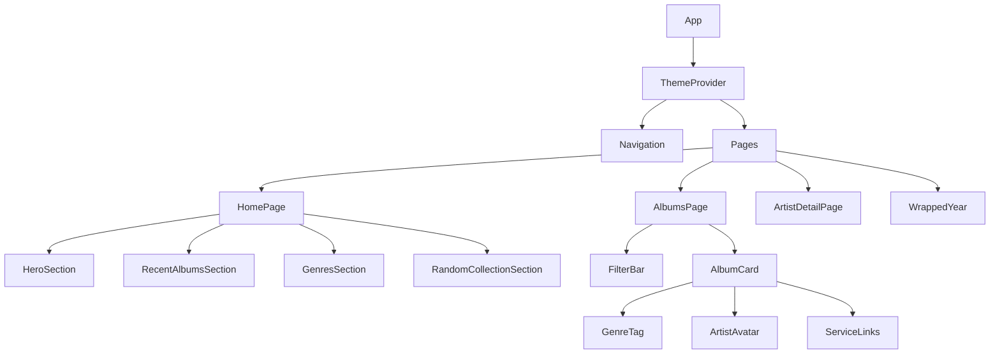

# Components Reference

This document covers all React components in the russ.fm frontend.

> **Editorial redesign (April 2026).** The shell now runs on a warm
> paper/ink palette with sharp corners, hairline rules, Archivo Variable,
> and JetBrains Mono. The section below lists the redesign's
> new shared primitives before moving into the legacy reference.

## Editorial primitives

| Component | Path | Role |
|-----------|------|------|
| `PageContainer` | `components/layout/PageContainer.tsx` | Page shell. `standard` gives the `max-w-[1640px]` gutter; `hero` goes edge-to-edge for full-bleed detail pages. |
| `DossierHero` | `components/layout/EditorialPrimitives.tsx` | Large editorial page intro with mono kicker, display title, subtitle, action slot, and optional fact strip. |
| `FactGrid` | `components/layout/EditorialPrimitives.tsx` | Hairline metadata grid for KPI and quick-fact blocks. |
| `RailSection` | `components/layout/EditorialPrimitives.tsx` | Sidebar/rail section heading and body wrapper. |
| `CatalogueList` | `components/layout/EditorialPrimitives.tsx` | Divide-y catalogue list wrapper for dense result rows. |
| `EditorialEmpty` / `EditorialSkeleton` | `components/layout/EditorialPrimitives.tsx` | Paper/ink empty and loading states. |
| `StageVinyl` | `components/layout/EditorialPrimitives.tsx` | Blueprint-style outline record used behind feature sleeves without adding a heavy filled disc. |
| `SectionHeader` | `components/layout/SectionHeader.tsx` | `num · label · count · action` editorial heading with a hairline rule. Used at the top of every home / browse / stats / wrapped block. |
| `DragWall` | `components/layout/DragWall.tsx` | Horizontal drag-scroll strip with wheel-translation, overflow-aware chevrons, and no `setPointerCapture` (so child links still navigate). |
| `BrowseHeader` | `components/browse/BrowseHeader.tsx` | `num · kicker · display title · subtitle · counts` header for `/albums`, `/artists`, `/search`. |
| `StatsAside` | `components/home/StatsAside.tsx` | Compact dark home-page collection overview with configured era exclusions, top-decade percentages, curated genre bars, and yearly additions timeline. |
| `AlbumCard` | `components/AlbumCard.tsx` | Editorial tile: square cover, cover-colour drop-shadow, optional `CAT. NNN` index badge, hover-reveal meta strip painted with the album's pre-computed `{background, foreground}` pair. |
| `ArtistCard` | `components/ArtistCard.tsx` | Square rounded portrait + mono rank + grot name + release count. Tinted shadow when a latest album is available. |
| `TweaksPanel` | `components/TweaksPanel.tsx` | **Dev-only.** `Cmd/Ctrl+Shift+D` opens a 320px bottom-right panel with density / mono / cover-colour / tint knobs. Persists to `localStorage['russfm.tweaks']`. Hidden from the public nav.  |
| `SearchOverlay` | `components/SearchOverlay.tsx` | Compact right-anchored dropdown under the nav search input. Shares its continuous outline with the input while open. Segregates results into `Albums` / `Artists` groups. |

All of these are Tailwind-driven; the tokens they reference live
in `src/styles/design-tokens.css` and map through `tailwind.config.js`
(`paper`, `ink`, `rule`, `hl`, `tint`, `font-grot`, `font-mono`).

## Component Hierarchy



## Core Components

### Navigation (`src/components/Navigation.tsx`)

Sticky editorial navigation bar with grouped browse/explore menus and search integration.

**Features:**
- `xl+` desktop rail with `Home`, `Albums`, `Artists`, plus `Browse` and `Explore` dropdown groups
- Compact `< xl` header with logo, search icon, menu trigger, and `md+` account/theme actions
- Full search input on wide desktop only; compact widths open the full-viewport search sheet
- Scroll-aware behavior
- Theme toggle integration
- Search button trigger
- Ink-colour spinning record mark and aligned `russ.fm / Personal Record Collection` brand lockup, with the tagline reserved for `2xl+`
- Icon-led primary nav and grouped menu items with hairline active states instead of boxed tabs

```tsx
import { Navigation } from '@/components/Navigation';

// Used in App.tsx layout
<Navigation />
```

**Props:** None (uses router context)

---

### Footer (`src/components/Footer.tsx`)

Site footer with links and copyright.

**Features:**
- Shared spinning record mark and matching `russ.fm / Personal Record Collection` footer lockup
- Copyright year is derived at render time rather than hard-coded
- Icon-only internal and external links in one compact row, with accessible labels retained for screen readers
- Mobile footer order is icons first, then a stretched colophon row with copyright on the left and the logo/site lockup on the right. Desktop returns to a single row with the colophon left and icons right

```tsx
import { Footer } from '@/components/Footer';

<Footer />
```

---

### Logo (`src/components/Logo.tsx`)

Brand logo component with optional link.

```tsx
import { Logo } from '@/components/Logo';

<Logo />
<Logo size="lg" />
```

**Props:**
| Prop | Type | Default | Description |
|------|------|---------|-------------|
| size | `'sm' \| 'md' \| 'lg'` | `'md'` | Logo size |

---

## Album Components

### AlbumCard (`src/components/AlbumCard.tsx`)

Primary album display component for grid views.

```tsx
import { AlbumCard } from '@/components/AlbumCard';

<AlbumCard album={album} />
```

**Props:**
| Prop | Type | Required | Description |
|------|------|----------|-------------|
| album | `Album` | Yes | Album data object |
| showArtist | `boolean` | No | Show artist name |
| showYear | `boolean` | No | Show release year |
| showGenres | `boolean` | No | Show genre tags |

**Features:**
- Lazy-loaded images with fallbacks
- Genre tags with filtering
- Artist avatars for multi-artist albums
- Service links (Spotify, Apple Music)
- Responsive sizing

**Example:**
```tsx
import { AlbumCard } from '@/components/AlbumCard';
import { getAlbumImageFromData } from '@/lib/image-utils';

function AlbumGrid({ albums }) {
  return (
    <div className="grid grid-cols-2 md:grid-cols-4 gap-4">
      {albums.map(album => (
        <AlbumCard
          key={album.uri_release}
          album={album}
          showGenres
          showYear
        />
      ))}
    </div>
  );
}
```

---

### AlbumModal (`src/components/AlbumModal.tsx`)

Album detail overlay/modal dialog.

```tsx
import { AlbumModal } from '@/components/AlbumModal';

<AlbumModal
  album={selectedAlbum}
  open={isOpen}
  onClose={() => setIsOpen(false)}
/>
```

**Props:**
| Prop | Type | Required | Description |
|------|------|----------|-------------|
| album | `Album \| null` | Yes | Album to display |
| open | `boolean` | Yes | Modal visibility |
| onClose | `() => void` | Yes | Close handler |

---

## Artist Components

### ArtistCard (`src/components/ArtistCard.tsx`)

Artist display component for grid views.

```tsx
import { ArtistCard } from '@/components/ArtistCard';

<ArtistCard artist={artist} />
```

**Props:**
| Prop | Type | Required | Description |
|------|------|----------|-------------|
| artist | `Artist` | Yes | Artist data object |
| showAlbumCount | `boolean` | No | Display album count |

---

## Search Components

### SearchOverlay (`src/components/SearchOverlay.tsx`)

Full-screen search overlay for desktop.

```tsx
import { SearchOverlay } from '@/components/SearchOverlay';

<SearchOverlay
  isOpen={searchOpen}
  onClose={() => setSearchOpen(false)}
/>
```

**Features:**
- Full-text fuzzy search
- Real-time results
- Keyboard navigation (arrow keys, Enter, Escape)
- Recent searches
- Category filtering (albums, artists)

---

### MobileSearchModal (`src/components/MobileSearchModal.tsx`)

Mobile-optimized search modal.

```tsx
import { MobileSearchModal } from '@/components/MobileSearchModal';

<MobileSearchModal
  isOpen={searchOpen}
  onClose={() => setSearchOpen(false)}
/>
```

---

### SearchResults (`src/components/SearchResults.tsx`)

Search results display component.

```tsx
import { SearchResults } from '@/components/SearchResults';

<SearchResults
  results={searchResults}
  layout="grid"
  onResultClick={handleClick}
/>
```

**Props:**
| Prop | Type | Required | Description |
|------|------|----------|-------------|
| results | `SearchResult[]` | Yes | Search results |
| layout | `'grid' \| 'list'` | No | Display layout |
| onResultClick | `(result) => void` | No | Click handler |
| loading | `boolean` | No | Loading state |

---

### SearchFAB (`src/components/SearchFAB.tsx`)

Floating action button for mobile search trigger.

```tsx
import { SearchFAB } from '@/components/SearchFAB';

<SearchFAB onClick={() => setSearchOpen(true)} />
```

---

## Music Player Components

### MusicPlayerSection (`src/components/MusicPlayerSection.tsx`)

Embedded music player wrapper with service selection.

```tsx
import { MusicPlayerSection } from '@/components/MusicPlayerSection';

<MusicPlayerSection
  album={album}
  spotifyUrl={album.spotify_url}
  appleMusicUrl={album.apple_music_url}
/>
```

---

### SpotifyEmbed (`src/components/SpotifyEmbed.tsx`)

Spotify embedded player.

```tsx
import { SpotifyEmbed } from '@/components/SpotifyEmbed';

<SpotifyEmbed
  albumId="3hUJ7cC5O1ndwKnPqJUHxk"
  height={352}
/>
```

**Props:**
| Prop | Type | Required | Description |
|------|------|----------|-------------|
| albumId | `string` | Yes | Spotify album ID |
| height | `number` | No | Player height (default: 352) |

---

### AppleMusicEmbed (`src/components/AppleMusicEmbed.tsx`)

Apple Music embedded player.

```tsx
import { AppleMusicEmbed } from '@/components/AppleMusicEmbed';

<AppleMusicEmbed
  albumId="1551901962"
  height={450}
/>
```

---

### PlayerToggle (`src/components/PlayerToggle.tsx`)

Toggle between Spotify and Apple Music players.

```tsx
import { PlayerToggle } from '@/components/PlayerToggle';

<PlayerToggle
  activePlayer={player}
  onChange={setPlayer}
  hasSpotify={!!spotifyUrl}
  hasAppleMusic={!!appleMusicUrl}
/>
```

---

## Scrobbling Components

### ScrobbleButton (`src/components/ScrobbleButton.tsx`)

Individual track scrobble button.

```tsx
import { ScrobbleButton } from '@/components/ScrobbleButton';

<ScrobbleButton
  artist={track.artist}
  track={track.title}
  album={album.title}
/>
```

---

### AlbumScrobbleButton (`src/components/AlbumScrobbleButton.tsx`)

Scrobble entire album to Last.fm.

```tsx
import { AlbumScrobbleButton } from '@/components/AlbumScrobbleButton';

<AlbumScrobbleButton
  album={album}
  tracks={album.tracklist}
/>
```

---

### ScrobbleProgress (`src/components/ScrobbleProgress.tsx`)

Visual progress indicator for batch scrobbling.

```tsx
<ScrobbleProgress
  current={5}
  total={12}
  currentTrack="Track Name"
/>
```

---

## User Components

### UserProfileMenu (`src/components/UserProfileMenu.tsx`)

User profile dropdown with Last.fm integration.

```tsx
import { UserProfileMenu } from '@/components/UserProfileMenu';

<UserProfileMenu />
```

**Features:**
- Last.fm authentication status
- User avatar display
- Logout functionality

---

### LastFmAuthDialog (`src/components/LastFmAuthDialog.tsx`)

Last.fm authentication dialog.

```tsx
import { LastFmAuthDialog } from '@/components/LastFmAuthDialog';

<LastFmAuthDialog
  open={showAuth}
  onClose={() => setShowAuth(false)}
/>
```

---

## Theme Components

### ThemeProvider (`src/components/theme-provider.tsx`)

React context provider for theme management.

```tsx
import { ThemeProvider } from '@/components/theme-provider';

<ThemeProvider defaultTheme="system" storageKey="russ-fm-theme">
  <App />
</ThemeProvider>
```

---

### ThemeToggle (`src/components/theme-toggle.tsx`)

Theme switcher button.

```tsx
import { ThemeToggle } from '@/components/theme-toggle';

<ThemeToggle />
```

---

## Filter Components

### FilterBar (`src/components/FilterBar.tsx`)

Search, filter, and sort controls for collection pages.

```tsx
import { FilterBar } from '@/components/FilterBar';

<FilterBar
  searchQuery={query}
  onSearchChange={setQuery}
  sortBy={sort}
  onSortChange={setSort}
  genres={allGenres}
  selectedGenre={genre}
  onGenreChange={setGenre}
/>
```

**Props:**
| Prop | Type | Required | Description |
|------|------|----------|-------------|
| searchQuery | `string` | Yes | Current search query |
| onSearchChange | `(query: string) => void` | Yes | Search handler |
| sortBy | `string` | Yes | Current sort field |
| onSortChange | `(sort: string) => void` | Yes | Sort handler |
| genres | `string[]` | No | Available genres |
| selectedGenre | `string` | No | Active genre filter |
| onGenreChange | `(genre: string) => void` | No | Genre handler |

---

## Statistics Components

### CollectionStats (`src/components/CollectionStats.tsx`)

Collection statistics display.

```tsx
import { CollectionStats } from '@/components/CollectionStats';

<CollectionStats stats={stats} />
```

**Props:**
| Prop | Type | Required | Description |
|------|------|----------|-------------|
| stats | `StatsData` | Yes | Statistics object |

**StatsData Structure:**
```typescript
interface StatsData {
  totalAlbums: number;
  totalArtists: number;
  genreCount: number;
  decadeBreakdown: Record<string, number>;
  topGenres: { name: string; count: number }[];
}
```

---

## Home Page Sections

### HeroSection (`src/components/home/HeroSection.tsx`)

Poster-led featured hero: the configured latest releases form a numbered
selector row under the active sleeve, while the right metadata rail carries
a full-width countdown waveform for the next record.

```tsx
import { HeroSection } from '@/components/home/HeroSection';

<HeroSection
  currentFeatured={currentFeatured}
  featuredAlbums={featuredAlbums}
  featuredIndex={featuredIndex}
  currentPalette={currentPalette}
  autoRotateMs={autoRotateMs}
  timelineKey={heroTimelineKey}
  onSelectIndex={handleSelectFeaturedIndex}
/>
```

**Features:**
- Featured record count follows `appConfig.homepage.hero.numberOfFeaturedAlbums`
- Numbered selector row changes the active sleeve and restarts the countdown
- Metadata rail includes a full-width waveform that fills over `autoRotateInterval`
- Hero copy is limited to concrete genre/year metadata
- Mobile/tablet keep the same releases with safe horizontal selector overflow

---

### RecentAlbumsSection (`src/components/home/RecentAlbumsSection.tsx`)

Recently added albums carousel.

```tsx
<RecentAlbumsSection albums={recentAlbums} />
```

---

### RecentArtistsSection (`src/components/home/RecentArtistsSection.tsx`)

Recently added artists carousel.

```tsx
<RecentArtistsSection artists={recentArtists} />
```

---

### RandomCollectionSection (`src/components/home/RandomCollectionSection.tsx`)

Random album selection grid.

```tsx
<RandomCollectionSection albums={allAlbums} count={12} />
```

---

### RandomArtistsSection (`src/components/home/RandomArtistsSection.tsx`)

Random artist selection with polaroid styling.

```tsx
<RandomArtistsSection artists={allArtists} count={12} />
```

---

### GenresSection (`src/components/home/GenresSection.tsx`)

Genre grid display.

```tsx
<GenresSection genres={topGenres} />
```

---

### StatsAside (`src/components/home/StatsAside.tsx`)

Sticky home-page collection overview. It computes totals from the loaded
`collection.json`, applies `appConfig.homepage.eras.excludedDecades` to the
record count and chart inputs, keeps the full collection span for the
decade total, and renders top-decade percentages, a curated eight-genre
bar list, and a yearly additions timeline.

```tsx
<StatsAside albums={albums} />
```

---

## shadcn/ui Base Components

Located in `src/components/ui/`, these are customized Radix UI primitives:

| Component | File | Description |
|-----------|------|-------------|
| Button | `button.tsx` | Button variants |
| Input | `input.tsx` | Text input |
| Select | `select.tsx` | Dropdown select |
| Dialog | `dialog.tsx` | Modal dialog |
| DropdownMenu | `dropdown-menu.tsx` | Dropdown menu |
| Tabs | `tabs.tsx` | Tab navigation |
| Tooltip | `tooltip.tsx` | Tooltips |
| Alert | `alert.tsx` | Alert messages |
| Switch | `switch.tsx` | Toggle switch |
| Progress | `progress.tsx` | Progress bar |
| Pagination | `pagination.tsx` | Pagination controls |
| Card | `card.tsx` | Card container |
| Avatar | `avatar.tsx` | Avatar image |
| AvatarGroup | `avatar-group.tsx` | Grouped avatars |
| Badge | `badge.tsx` | Status badges |
| Separator | `separator.tsx` | Visual separator |
| GenreTag | `genre-tag.tsx` | Genre tag button |
| MetadataBadge | `metadata-badge.tsx` | Metadata display |
| ServiceButton | `service-button.tsx` | Service link button |

### Usage Example

```tsx
import { Button } from '@/components/ui/button';
import { Card, CardHeader, CardContent } from '@/components/ui/card';
import { Badge } from '@/components/ui/badge';

function AlbumCard({ album }) {
  return (
    <Card>
      <CardHeader>
        <h3>{album.title}</h3>
        <Badge variant="secondary">{album.year}</Badge>
      </CardHeader>
      <CardContent>
        <Button variant="outline">View Details</Button>
      </CardContent>
    </Card>
  );
}
```

---

## Component Best Practices

### Image Handling

Always use utility functions for images:

```tsx
// Correct
import { getAlbumImageFromData } from '@/lib/image-utils';


// Incorrect

```

### Error Boundaries

Wrap complex components:

```tsx
import { ErrorBoundary } from 'react-error-boundary';

<ErrorBoundary fallback={<AlbumCardError />}>
  <AlbumCard album={album} />
</ErrorBoundary>
```

### Loading States

Always handle loading:

```tsx
function AlbumDetail({ slug }) {
  const [album, setAlbum] = useState(null);
  const [loading, setLoading] = useState(true);

  if (loading) return <AlbumDetailSkeleton />;
  if (!album) return <NotFound />;

  return <AlbumContent album={album} />;
}
```

### Memoization

For expensive renders:

```tsx
const MemoizedAlbumCard = memo(AlbumCard, (prev, next) => {
  return prev.album.uri_release === next.album.uri_release;
});
```
