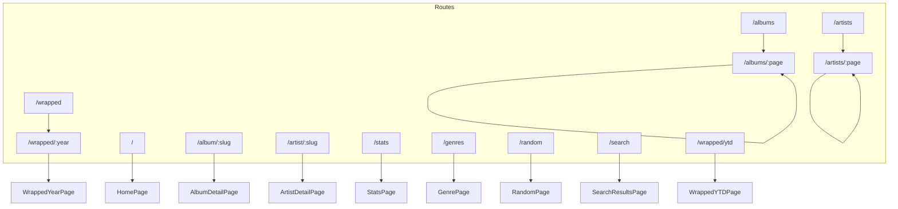

# Pages Reference

This document covers all route-level page components in russ.fm.

## Route Map



## Core Pages

### HomePage (`src/pages/HomePage.tsx`)

Landing page with featured content and collection highlights.

**Route:** `/`, `/home`

**Features:**
- Featured album hero carousel
- Recently added albums section
- Recently added artists section
- Random collection samples
- Genre highlights

**Data Sources:**
- `/collection.json` - Album data
- `/album-colors.json` - Color palettes

**Configuration:**
```typescript
// src/config/app.config.ts
homepage: {
  hero: {
    numberOfFeaturedAlbums: 6,
    autoRotateInterval: 12000 // 12 seconds
  },
  recentlyAdded: { displayCount: 12 },
  randomCollection: { displayCount: 12 },
  randomArtists: { displayCount: 12 },
  sectionOrder: ['hero', 'recentAlbums', 'recentArtists', 'genres', 'randomCollection']
}
```

**Example Usage:**
```tsx
// App.tsx routing
<Route path="/" element={<HomePage />} />
<Route path="/home" element={<HomePage />} />
```

---

### AlbumsPage (`src/pages/AlbumsPage.tsx`)

Paginated album collection browser with filtering and sorting.

**Route:** `/albums`, `/albums/:page`

**Features:**
- Paginated grid display
- Search within collection
- Genre filtering
- Year filtering
- Multiple sort options
- URL-based state (shareable filters)

**URL Parameters:**
| Parameter | Type | Default | Description |
|-----------|------|---------|-------------|
| page | `number` | 1 | Current page |
| sort | `string` | `date_added` | Sort field |
| genre | `string` | - | Genre filter |
| year | `string` | - | Year filter |
| q | `string` | - | Search query |

**Sort Options:**
- `date_added` - Most recently added first
- `date_added_asc` - Oldest additions first
- `release_name` - Album name A-Z
- `release_name_desc` - Album name Z-A
- `artist` - Artist name A-Z
- `year` - Newest releases first
- `year_asc` - Oldest releases first

**Example:**
```
/albums?sort=year&genre=Electronic&page=2
```

**Implementation:**
```tsx
function AlbumsPage() {
  const [searchParams, setSearchParams] = useSearchParams();
  const page = parseInt(searchParams.get('page') || '1');
  const sort = searchParams.get('sort') || 'date_added';
  const genre = searchParams.get('genre') || '';

  // Filter and sort albums
  const filtered = useMemo(() => {
    return albums
      .filter(a => !genre || a.genre_names.includes(genre))
      .sort((a, b) => sortFn(a, b, sort));
  }, [albums, genre, sort]);

  // Paginate
  const paginated = filtered.slice(
    (page - 1) * itemsPerPage,
    page * itemsPerPage
  );

  return (
    <>
      <FilterBar ... />
      <AlbumGrid albums={paginated} />
      <Pagination ... />
    </>
  );
}
```

---

### AlbumDetailPage (`src/pages/AlbumDetailPage.tsx`)

Individual album detail view with rich metadata.

**Route:** `/album/:slug`

**Features:**
- Full album artwork with dynamic theming
- Complete metadata display
- Tracklist with durations
- Artist links (multi-artist support)
- Service embeds (Spotify, Apple Music)
- Last.fm scrobbling
- OG meta tags for sharing

**Data Source:** `/album/{slug}/index.json`

**Dynamic Theming:**
```tsx
function AlbumDetailPage() {
  const { slug } = useParams();
  const { colors } = useAlbumColors(slug);

  return (
    <div style={{
      '--album-bg': colors?.background,
      '--album-accent': colors?.accent
    }}>
      {/* Album content with dynamic colors */}
    </div>
  );
}
```

**Description Fallback Chain:**
```typescript
// Description sources in priority order:
const description =
  album.apple_music?.editorial_notes?.short ||
  album.apple_music?.editorial_notes?.standard ||
  album.lastfm?.wiki_summary ||
  album.perplexity?.description ||
  null;
```

**Meta Tags:**
```tsx
useMetaTags({
  title: `${album.title} by ${album.artist} | russ.fm`,
  description: `${album.title} (${album.year}) - ${album.genres.join(', ')}`,
  image: getAlbumOGImageUrl(slug),
  url: `https://russ.fm/album/${slug}`
});
```

---

### ArtistsPage (`src/pages/ArtistsPage.tsx`)

Paginated artist browser.

**Route:** `/artists`, `/artists/:page`

**Features:**
- Paginated artist grid
- Alphabetical sorting
- Album count display
- "Various Artists" excluded by default

**Example:**
```tsx
function ArtistsPage() {
  const [artists, setArtists] = useState([]);

  useEffect(() => {
    // Derive artists from collection
    const artistMap = new Map();
    albums.forEach(album => {
      album.artists.forEach(artist => {
        if (artist.name !== 'Various Artists') {
          artistMap.set(artist.slug, artist);
        }
      });
    });
    setArtists([...artistMap.values()]);
  }, [albums]);

  return <ArtistGrid artists={artists} />;
}
```

---

### ArtistDetailPage (`src/pages/ArtistDetailPage.tsx`)

Individual artist detail with discography.

**Route:** `/artist/:slug`

**Features:**
- Artist biography
- Profile image
- External links
- Discography grid
- Genre associations

**Data Source:** `/artist/{slug}/index.json`

**"Various" Artist Handling:**
```tsx
// Redirect "Various" to artists list
if (slug === 'various' || slug === 'various-artists') {
  return <Navigate to="/artists" replace />;
}
```

---

### StatsPage (`src/pages/StatsPage.tsx`)

Collection statistics and insights.

**Route:** `/stats`

**Features:**
- Total album/artist counts
- Genre breakdown
- Decade distribution
- Year-over-year additions
- Random highlights

**Statistics Calculated:**
```typescript
interface CollectionStats {
  totalAlbums: number;
  totalArtists: number;
  uniqueGenres: number;
  totalTracks: number;
  decadeBreakdown: Record<string, number>;
  genreBreakdown: Record<string, number>;
  yearlyAdditions: Record<string, number>;
  topLabels: { name: string; count: number }[];
}
```

---

### GenrePage (`src/pages/GenrePage.tsx`)

Genre browser and filter.

**Route:** `/genres`

**Features:**
- Genre cloud/grid display
- Click to filter albums by genre
- Album count per genre
- Color-coded tags

---

### RandomPage (`src/pages/RandomPage.tsx`)

Random album discovery.

**Route:** `/random`

**Features:**
- Random album selection
- "Spin again" button
- Full album preview

---

### SearchResultsPage (`src/pages/SearchResultsPage.tsx`)

Full-page search results.

**Route:** `/search`

**Query Parameters:**
| Parameter | Description |
|-----------|-------------|
| q | Search query |
| type | Result type filter (album, artist) |

**Example:** `/search?q=radiohead&type=album`

---

## Wrapped Feature

Year-in-review analytics pages.

### WrappedYear (`src/pages/wrapped/WrappedYear.tsx`)

Main wrapped page for a specific year.

**Route:** `/wrapped/:year`

**Features:**
- Year summary statistics
- Top albums of the year
- Monthly breakdown
- Genre insights
- Decade analysis
- Presentation mode toggle

**Data Source:** `/wrapped.json`

**Components Used:**
```
WrappedYear
├── YearSelector
├── DynamicBentoGrid
│   ├── AnimatedCard
│   └── AnimatedCounter
├── TopArtistsSection
├── TopAlbumsPerMonthSection
├── GenreBreakdownSection
└── DecadesSection
```

---

### WrappedYTD (`src/pages/wrapped/WrappedYTD.tsx`)

Year-to-date wrapped statistics.

**Route:** `/wrapped/ytd`

**Features:**
- Current year statistics
- Live updating data
- Projection estimates

---

### WrappedPresentation (`src/pages/wrapped/WrappedPresentation.tsx`)

Full-screen presentation mode.

**Features:**
- Section-by-section reveal
- Keyboard navigation
- Auto-advance option
- Animation effects

**Navigation Controls:**
- Arrow keys: Next/Previous section
- Space: Auto-advance toggle
- Escape: Exit presentation

---

## Wrapped Sections

Located in `src/pages/wrapped/sections/`:

| Section | Description |
|---------|-------------|
| IntroSection | Welcome and year overview |
| YearSummarySection | Key statistics |
| HeroAlbumSection | Featured album of the year |
| TopArtistsSection | Most collected artists |
| TopAlbumsPerMonthSection | Monthly highlights |
| MonthlyJourneySection | Timeline visualization |
| GenreBreakdownSection | Genre distribution |
| DecadesSection | Release decade analysis |
| ExploreSection | Links to browse collection |

---

## Wrapped Components

Located in `src/pages/wrapped/components/`:

### DynamicBentoGrid

Responsive grid layout for wrapped data cards.

```tsx
<DynamicBentoGrid>
  <AnimatedCard size="large" delay={0}>
    <StatDisplay value={42} label="Albums" />
  </AnimatedCard>
  <AnimatedCard size="small" delay={0.1}>
    <GenreList genres={topGenres} />
  </AnimatedCard>
</DynamicBentoGrid>
```

### AnimatedCard

Card with entrance animation.

```tsx
<AnimatedCard
  size="medium"
  delay={0.2}
  onClick={handleClick}
>
  {content}
</AnimatedCard>
```

### AnimatedCounter

Animated number display.

```tsx
<AnimatedCounter
  value={1234}
  duration={2000}
  delay={500}
/>
```

### RevealText

Text reveal animation.

```tsx
<RevealText delay={0.3}>
  Your collection grew by 42 albums this year!
</RevealText>
```

---

## Page Data Loading Pattern

All pages follow a consistent data loading pattern:

```tsx
function ExamplePage() {
  const [data, setData] = useState(null);
  const [loading, setLoading] = useState(true);
  const [error, setError] = useState(null);

  useEffect(() => {
    fetch('/collection.json')
      .then(res => {
        if (!res.ok) throw new Error('Failed to load');
        return res.json();
      })
      .then(setData)
      .catch(setError)
      .finally(() => setLoading(false));
  }, []);

  if (loading) return <PageSkeleton />;
  if (error) return <ErrorMessage error={error} />;
  if (!data) return <EmptyState />;

  return <PageContent data={data} />;
}
```

---

## Meta Tag Management

Pages use the `useMetaTags` hook for SEO:

```tsx
import { useMetaTags } from '@/hooks/useMetaTags';

function AlbumDetailPage({ album }) {
  useMetaTags({
    title: `${album.title} | russ.fm`,
    description: album.description,
    image: getAlbumOGImageUrl(album.slug),
    url: `https://russ.fm/album/${album.slug}`,
    type: 'music.album'
  });

  // ...
}
```

---

## Page Title Management

```tsx
import { usePageTitle } from '@/hooks/usePageTitle';

function AlbumsPage() {
  usePageTitle('Albums | russ.fm');
  // ...
}
```
