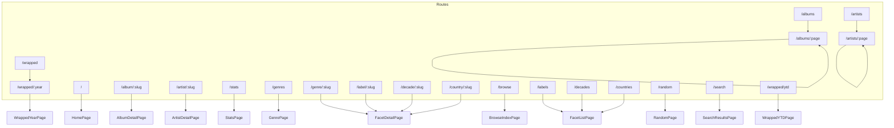

# Pages Reference

This document covers the route-level page components in russ.fm.

> **Player redesign.** Every page uses the player design described in
> [`design-system.md`](./design-system.md): a dark ground, colour floods
> taken from the sleeves, `CoverHero` / `RecordTile` / `SectionHeading`
> from `src/components/player/`, and plain section titles. Data contracts,
> query-string deep links and features (scrobbling, embeds, Wrapped
> presentation, search) are unchanged unless noted below.

## Structure by page

| Route | Structure |
|-------|-----------|
| `/` | `CoverHero` rotating through the latest additions → Latest additions row → Most collected + Genres (with headline counts) → Random picks → Browse by colour strip. |
| `/albums/:page` | `Albums` title with the count in dim type → sort pills (incl. Colour) → format chips → search + Genre / Year pill selects → `RecordTile` grid, or the colour wall when `sort=colour` → pill pager. |
| `/album/:slug` | `CoverHero` in the sleeve's flood with `HeroRecord` → About → Tracklist by side → Listen → Videos → artist bios → Last.fm / details sidebar → More by the artist → Similar albums. Box sets swap in the box hero and an "In this box" section. |
| `/artist/:slug` | Flood panel (portrait, name, stats, bio, service pills, genre links) → Discography (record tiles, Recently added / By year toggle) → Similar artists. The flood blends top to bottom through the sleeve colours of the last three additions. |
| `/artists/:page` | `Artists` title with count → search + sort pills → A–Z strip → `ArtistCard` grid → pill pager. |
| `/search?q=…` | `Search` title with count → search field → All / Albums / Artists pills → `SearchResults` grid. |
| `/genres` | `BrowseHeader` → optional "On the map" chip → Most collected ranked rows + A–Z index → D3 genre map, all coloured from sleeves. |
| `/browse`, `/labels`, `/decades`, `/countries` | `BrowseHeader` → `FacetCard` colour cards → chips for the long tail. |
| `/label/:slug`, `/decade/:slug`, `/country/:slug`, `/genre/:slug` | Flood hero with a fan of sleeves → paginated `RecordTile` grid. |
| `/stats` | `Stats` title → headline counts → month chart → growth → decades / genres → release years → most collected → formats / countries → labels → latest additions → hidden gems → random picks / artists. All bars take sleeve colours. |
| `/random` | Full-screen Three.js crate; background and nav fade to the active record's flood. |
| `/wrapped/:year` | `CoverHero` on the year's first addition → headline counts → month chart → top artists → genres / decades → a shelf per month → year links. `Presentation` opens the full-screen mode. |

## Route Map



## Core Pages

### HomePage (`src/pages/HomePage.tsx`)

**Route:** `/`, `/home`

The home page sections are local components in `HomePage.tsx`; the old
`src/components/home/` directory has been removed.

- **Hero** — `CoverHero` with a `HeroRecord` for each of the latest
  `numberOfFeaturedAlbums` additions (boxset members excluded). The page
  flood fades to each record's colour (`floodFor` over the sleeve palette
  plus Apple Music artwork colours), the active disc slides out and its
  "Added" sticker appears. The text column shows the title, artist,
  original year / label / format / sides / tracks, and pills for the album page,
  Spotify and Apple Music (read from each record's detailed JSON).
  Numbered progress bars pick a record; previous, pause/resume and next
  buttons control the rotation. Only the active `HeroRecord` spins
  (`spinning={on}`). The active bar is a CSS animation (`.hero-progress`
  in `src/styles/player.css`, `scaleX` 0 → 1 over `autoRotateInterval`)
  and its `onAnimationEnd` advances to the next record, so there is no
  interval timer; pause sets `animation-play-state: paused`. Under
  `prefers-reduced-motion` there is no bar and no auto-rotation. The
  featured releases' detail JSON is prefetched through `loadDetailJson()`,
  so opening one from the hero needs no further fetch.
- **Latest additions** — horizontal `shelf-scroll` row of `RecordTile`s,
  with the number added this year as the note.
- **Most collected** — top six artists by record count.
- **Genres** — genre chips sized by count and coloured by a representative
  sleeve, then headline counts (records, on vinyl, box sets, artists).
- **Random picks** — `RecordTile` grid with a Shuffle pill; tiles show the
  original year.
- **Browse by colour** — recent vivid vinyl sleeves sorted by hue, shown
  as a colour bar and a strip of cover tiles, linking to
  `/albums/1?sort=colour`.

**Data:** `useCollection()` and `useAlbumColorMap()`, plus each featured
record's `json_detailed_release`.

**Configuration** (`src/config/app.config.ts`, read by this page):

```typescript
homepage: {
  hero: {
    numberOfFeaturedAlbums: 6, // records in the hero rotation
    autoRotateInterval: 7000,  // ms per record
  },
  recentlyAdded: { displayCount: 16 },
  randomCollection: { displayCount: 12 },
}
```

---

### AlbumsPage (`src/pages/AlbumsPage.tsx`)

**Route:** `/albums`, `/albums/:page`

Paginated album browser. Page number is in the path, filters in the query
string; changing a filter goes back to page 1 and default values are
dropped from the URL.

**URL Parameters:**

| Parameter | Type | Default | Description |
|-----------|------|---------|-------------|
| `:page` | `number` (path) | 1 | Current page. A non-numeric value redirects to `/album/:page` |
| `sort` | `date_added \| release_name \| release_artist \| date_release_year \| colour` | `date_added` | Sort order. `date_release_year` keeps its name for existing links but sorts by original year (`originalYear()`) |
| `format` | `string` | – | `format_primary` filter (chips for Vinyl and Box sets) |
| `genre` | `string` | – | Genre filter |
| `year` | `string` | – | Original release year filter; the Year select and tile meta use the same year |
| `search` | `string` | – | Matches title, artist, genres, credited artists and band members |

**Colour sort (`?sort=colour`).** Records are ordered by the hue of their
most vivid sleeve colour (`vividFrom` + `hue` from
`src/lib/sleeveColour.ts`); sleeves with no usable colour go last, light
to dark. The page shows twice as many records per page, a colour bar of
the visible page above the grid, and a dense wall of `.tile` covers whose
caption slides up in the sleeve colour.

**Examples:**

```
/albums/1?genre=Electronic
/albums/2?genre=Electronic&sort=release_name
/albums/1?format=Vinyl&year=1990
/albums/1?sort=colour
```

Boxset members are excluded. Data comes from `useCollection()` and
`useAlbumColorMap()`.

---

### AlbumDetailPage (`src/pages/AlbumDetailPage.tsx`)

**Route:** `/album/:slug`

The page background is the sleeve's dark background swatch
(`flood.ground`) and the hero is the flood colour (sleeve palette plus
Apple Music artwork colours), which the nav also takes.

**Hero** (`CoverHero` + `HeroRecord`):

- Artist avatars and names (multi-artist support), the title in `t-cond`
  scaled to its longest word, and original year / label / sides / tracks /
  duration. The year is `originalYear()` (see
  [utilities](./utilities.md#release-years-srclibreleaseyearts)), not the
  pressing's date.
- **Band line-up** — when `collection.json` carries `members`, a "With …"
  line sits under the title; members with an artist page are linked.
  Member credits (`role: "member"` in the album JSON) are left out of the
  artist bio section.
- "From the box set" pill for boxset members.
- `AlbumScrobbleButton` as the main action (large, solid). While it runs
  the disc slides further out and spins at 45.
- Service pills (Spotify, Apple Music, Discogs) and genre links to
  `/albums/1?genre=…`.
- Sticker with the date added.

**Main column:**

- **About this record** — description with an expand toggle.
- **Tracklist** — grouped by side (and by LP for multi-disc sets). Each
  side has a small disc and its label; scrobbling is whole-album only, from
  the hero. Section-header rows render as kickers. Each track deep-links to Spotify when a match exists
  (matched by normalised title via
  [`src/lib/trackMatching.ts`](../../src/lib/trackMatching.ts)).
- **Listen** — `MusicPlayerSection` embeds.
- **Videos** — `VideoSection`.
- **Artist bios** — one panel per credited artist with a biography, with a
  link to the artist's records in the collection.

**Sidebar:** Last.fm panel in the flood colour (scrobbles, listeners,
link), release details, identifiers, sleeve colour swatches, copyright.
In the release details "Released" is the original year; "This pressing"
shows the pressing's own date (detail JSON `released`, else `year`) and
appears only when it differs.

**Below:** "More by" the artist (boxset members excluded; newest original
year first, labelled with that year) and **Similar
albums**, ranked by `getRelatedAlbumsForAlbum` from shared clean genres,
excluding the same artist.

**Box set view.** When the album has `boxset_contents`:

- The hero art is `BoxHeroArt`: the box cover with a thick edge and its
  discs fanned out behind it. The hero shows the number of albums instead
  of a scrobble button.
- An "In this box" section (`BoxContents`) sits above the main column.
  The discs come from `buildBoxDiscs()` in `src/lib/boxDiscs.ts`, which
  splits the **box's own tracklist** at its section headers (rows with no
  position) and links each section to a member album by title. Sections
  with no member page become generic discs drawn with the box cover and
  the section title; members the tracklist never mentions are appended.
- Selecting a disc (in the fan or the tab row) updates a panel in that
  album's flood colour with its sleeve and disc, tracks grouped by side,
  a scrobble button for that disc and a link to its album page.
- The normal tracklist is hidden; "About this record" becomes "About this
  box set".

**Data Source:** the shared collection from `useCollection()` for the
hero, artists, box contents and related records, plus the release's detail
JSON (`/album/{slug}/{slug}.json`) via `loadDetailJson()`. `findAlbum()`
resolves the slug synchronously (exact URI first, then sanitised name +
Discogs ID) and `findSimilarAlbums()` reads related records from
`getGenreExplorer()`, so the hero renders straight from collection data
while the detail JSON fills in the tracklist, notes and services. The route
goes through `AlbumRouteHandler`, which keys the page by slug so moving to
another album mounts a fresh page. The page meta description and the
JSON-LD `datePublished` use the original year too.

**Description Fallback Chain:**

```typescript
const description =
  album.apple_music?.editorial_notes?.short ||
  album.apple_music?.editorial_notes?.standard ||
  album.lastfm?.wiki_summary ||
  album.perplexity?.description ||
  null;
```

---

### ArtistsPage (`src/pages/ArtistsPage.tsx`)

**Route:** `/artists`, `/artists/:page`

- `Artists` title with the count in dim type
- Pill search field and sort pills (A–Z, Most records, Latest added)
- Scrollable A–Z strip (letters without artists are disabled)
- `ArtistCard` grid; each ring takes the flood colour of the artist's
  latest record from `useAlbumColorMap()`
- Pill pager
- "Various Artists" excluded; boxset members excluded

**URL Parameters:**

| Parameter | Type | Default | Description |
|-----------|------|---------|-------------|
| `:page` | `number` (path) | 1 | Current page |
| `sort` | `name \| albums \| latest` | `name` | Sort order |
| `letter` | `string` | – | First letter (A–Z) |
| `search` | `string` | – | Search query |

```
/artists/1?letter=A
/artists/1?sort=albums&letter=M
```

Loads the collection through the shared `loadCollection()`.

---

### ArtistDetailPage (`src/pages/ArtistDetailPage.tsx`)

**Route:** `/artist/:slug`

The top of the page is a vertical blend through the sleeve colours of the
artist's last three additions (two or one if that's all there is), newest
at the top so it meets the nav, which follows via `usePageFlood`. See
`blendedFlood()` in `src/lib/sleeveColour.ts`.

- **Header** — the portrait printed into the flood in greyscale, fading out at the
  bottom only (`PORTRAIT_MASK`: a long ease-out fade; the other edges stay crisp).
  It multiplies (a light backdrop takes the flood colour; a dark one stays a tinted print),
  except on a dark flood with a dark backdrop, where it screens so the black takes the
  flood instead. Screening on a pale flood washed subjects out to ghosts, hence the rule.
  The backdrop is judged by `useBackdropTone` from the avatar; unmeasured, it goes by the
  flood alone. The artist name is a `FitTitle` (up to 176px, shrunk until its longest word fits,
  never broken mid-word). Then stats
  (records, box sets, "Releases span" from the earliest to the latest
  original year, or "Released" when they match, Last.fm listeners), biography, service
  pills (Spotify, Apple Music, Last.fm, Discogs, Wikipedia) and genre links
  to `/genre/:slug`. Wikipedia uses the stored `wikipedia_url` when
  available, otherwise a constructed URL.
- **Discography** — `RecordTile`s on the dark ground with a two-way
  toggle in the section heading (hidden when the artist has one record):
  - **Recently added** (default) — one grid, newest additions first, each
    tile showing the date added.
  - **By year** — grouped by decade of original release, oldest first,
    with a decade label and record count beside each group (sticky on
    desktop); tiles show the original year, "Undated" groups last.
  "Box set" is appended to the tile meta where it applies. Tiles show the
  release artist only when it differs from the page's artist (joint
  releases, band-member credits). Years come from `originalYear()`, never
  `date_release_year`, which is often a reissue date. The flood always
  uses the last three additions, whichever order is showing.
- **Similar artists** — in-collection artists from
  `services.lastfm.similar_artists[]` first, then genre-overlap candidates,
  shown as `ArtistCard`s.

Records include releases where the artist is credited only as a band
member (`members[]` in `collection.json`).

**Data Source:** the shared collection from `useCollection()` and the
artist's detail JSON via `loadDetailJson()`. `findArtistAlbums()` picks the
artist's records (and the detail JSON path) from the collection
synchronously, and `findSimilarArtists()` falls back to
`getGenreExplorer()` for genre-overlap candidates. `ArtistRouteHandler`
keys the page by slug, so moving to another artist mounts a fresh page.

**"Various" Artist Handling:**

```tsx
if (slug === 'various' || slug === 'various-artists') {
  return <Navigate to="/artists" replace />;
}
```

---

### StatsPage (`src/pages/StatsPage.tsx`)

**Route:** `/stats`

Collection statistics. Every bar and chart takes colours from the sleeves
it counts: a month is a stack of that month's records, a genre or decade
takes the colour of a representative record. Boxset members are excluded.

**Sections:**

- Title with "Since" the first addition
- Headline counts (records, artists, genres, records per artist), each in
  a sleeve colour, then smaller counts (labels, countries, one-record
  artists, artists with 5+, busiest month)
- Added per month (one block per record) and cumulative growth
- Decades and genres (linking to `/decades`, `/genres`, `/genre/:slug`)
- Golden year and top release years

Decades, release years and the release-year colour groups use the
original year (`originalYear()`).
- Most collected artists
- Formats (`format_primary`) and countries
- Labels
- Latest additions
- **Hidden gems** — records under
  `redesignConfig.stats.hiddenGemsListenersThreshold` Last.fm listeners
- Random picks and random artists

Counts are driven by `redesignConfig.stats`. The aggregations read fields
denormalised into `collection.json` (`format_primary`, `labels`,
`country`, `lastfm_listeners`); there are no per-album JSON fetches.

---

### Browse facets (`src/pages/browse/`)

**Routes:**

| Route | Component | Purpose |
|-------|-----------|---------|
| `/browse` | `BrowseIndexPage` | Four large `FacetCard`s (genres, labels, decades, countries), each in the colour of a vivid record from its biggest value, with the distinct count and the top value |
| `/labels` | `FacetListPage facetKey="label"` | Every label with its record count |
| `/label/:slug` | `FacetDetailPage facetKey="label"` | Records on one label |
| `/decades` | `FacetListPage facetKey="decade"` | Every decade |
| `/decade/:slug` | `FacetDetailPage facetKey="decade"` | Records in one decade (e.g. `/decade/1980s`) |
| `/countries` | `FacetListPage facetKey="country"` | Every Discogs country |
| `/country/:slug` | `FacetDetailPage facetKey="country"` | Records for one country |
| `/genre/:slug` | `FacetDetailPage facetKey="genre"` | Records in one genre |

**List pages** show every value as a colour `FacetCard` when there are 12
or fewer; otherwise the top eight are cards and the full list follows as
`.chip`s coloured by a representative sleeve, with a text filter. Sort
pills switch between record count and name (decades default to name).

**Detail pages** open with a flood hero in the colour of the value's most
vivid recent sleeve (the nav follows): a back link, the name scaled to
its longest word (`heroTitleStyle`), record / artist / year-span counts,
the most collected artists as pills and a linked `FacetFan` hanging over
the grid. Below, a `RecordTile` grid with sort pills (Recently added,
Release year, A–Z) and a pill pager. Decades, the year span and the
Release year sort all use the original year (`originalDecade()` /
`originalYear()`).

All four pages use `useCollection()` and `useAlbumColorMap()`, exclude
boxset members, and share the helpers in
[`facetSleeves.ts`](./utilities.md#browse-sleeve-helpers-srccomponentsbrowsefacetsleevests).
Facet definitions come from
[`src/lib/browseFacets.ts`](../../src/lib/browseFacets.ts); adding a new
axis is one entry in `FACETS` plus two routes. The format filter on
`/albums?format=…` stays inline in `AlbumsPage`.

---

### GenrePage (`src/pages/GenrePage.tsx`)

Single-page hybrid D3/React/Motion genre explorer built from
`/collection.json` (via `loadCollection()`). The explorer data comes from
`getGenreExplorer()`, which is memoised per collection array and shared
with the album and artist pages.

**Route:** `/genres`

**URL Parameters:**

| Parameter | Type | Default | Description |
|-----------|------|---------|-------------|
| `genre` | `all \| string` | `all` | Active scope, e.g. `/genres?genre=Rock` |
| `artist` | `string` | – | Active artist slug; the graph switches to whole-collection artist focus |
| `album` | `string` | – | Legacy/shared-link record slug used to highlight a record node |
| `sort` | `dominance \| recent \| name \| year` | `dominance` | Artist/album ordering |
| `q` | `string` | – | Search across genres, artists and albums |
| `nodes` | `number` or legacy `standard \| more \| max` | responsive | Graph node budget |

**Layout:**

- `BrowseHeader` with genre / record / artist counts and the browse pills
- When a genre is selected, an "On the map" chip in that genre's flood and
  a pill to its `/genre/:slug` page
- **Most collected** — ranked rows with a bar in each genre's sleeve
  colour; **A–Z** index with letter tabs
- The genre map (`GenreExplorerPanel` + `GenreGraph`)

**Graph behaviour:**

- Two focus modes: selected genre (genre hub, artist field, related genre
  pills around the edge) or selected artist (artist portrait at the centre
  radiating to records, genres and related artists)
- D3 runs the off-DOM force layout and zoom/pan; React renders keyed SVG
  nodes and Framer Motion animates transitions
- Nodes take sleeve colours through `genreColours.ts`; the centre genre
  hub uses the selected genre's flood and the record glyph in its ink
- Click a genre to re-centre, an artist to focus them, a record to open it
- Search, sort and the node-budget slider keep state in the URL; in-graph
  Back / Forward, zoom and recentre controls
- Keyboard: `[` Back, `]` Forward, `0` recentre, `+`/`=` zoom in, `-` zoom
  out, `Esc` clears artist focus
- Loading and empty states use `EditorialSkeleton` / `EditorialEmpty`

---

### RandomPage (`src/pages/RandomPage.tsx`)

**Route:** `/random` (labelled "Shuffle" in the nav and footer)

- Full-screen Three.js vinyl crate of up to 25 shuffled records from the
  shared `loadCollection()` (boxset members excluded)
- The scene background and fog fade towards the active record's flood
  colour, and the nav takes the same colour through `usePageFlood`
- Overlay panels sit on dark glass so they read on any colour
- Pointer tap/drag inspects the active sleeve, wheel and arrow keys flip,
  Escape exits inspect mode; controls for previous, inspect, next, shuffle
  and open record
- No audio
- Loading stage, retryable error ("Try again") and empty states

---

### SearchResultsPage (`src/pages/SearchResultsPage.tsx`)

**Route:** `/search`

`Search` title with the result count, a search field, pills to filter by
All / Albums / Artists (with counts), then `SearchResults` in the `grid`
layout.

| Parameter | Description |
|-----------|-------------|
| `q` | Search query |

The type filter is local state and is reset when the query changes.

---

## Wrapped Feature

Year-in-review pages.

### WrappedYear (`src/pages/wrapped/WrappedYear.tsx`)

**Route:** `/wrapped/:year` (`/wrapped` redirects to last year)

- **Hero** — `CoverHero` in the flood of the year's first addition, with
  its `HeroRecord` and a "First in" sticker, the year in huge `t-disp`, the
  first record's title and artist, a `Presentation` button and the
  `YearSelector`
- Headline counts in sleeve colours (records, artists, per month, busiest
  month) and smaller counts (top genre, top style, records per artist,
  projected total for the year to date)
- Added per month (one block per record)
- Top artists (`ArtistCard`s)
- Genres and decades as colour bars
- Month by month: a `shelf-scroll` row of `RecordTile`s per month
- Links to other years

Colours come from `album-colors.json` through
[`utils/sleeves.ts`](./utilities.md#wrapped-sleeve-helpers-srcpageswrappedutilssleevests),
falling back to the palette in the Wrapped JSON.

**Data Source:** `/wrapped/wrapped-{year}.json` or
`/wrapped/wrapped-ytd.json`. Available years are derived from the shared
collection.

### WrappedYTD (`src/pages/wrapped/WrappedYTD.tsx`)

**Route:** `/wrapped/ytd` — the current year in the same layout, with a
"Year to date" kicker and the projected total.

### WrappedPresentation (`src/pages/wrapped/WrappedPresentation.tsx`)

Full-screen, snap-scrolling presentation opened from the year page. Each
chapter floods with a colour from the records it shows; colour changes
fade and motion respects `prefers-reduced-motion`.

| Chapter | Description |
|---------|-------------|
| Overview | Year intro and counts |
| First & last | The first and last additions of the year |
| Months | Monthly activity; selecting a month is shared with Shelves |
| Artists | Top artists and genres |
| Shelves | The selected month's records as tiles |
| Years | Previous / next / all-years navigation |

**Controls:** Arrow Down or Space for the next chapter, Arrow Up for the
previous one, the chapter rail (desktop) or dots (mobile) to jump, and
previous / next buttons. Album and artist links stay live.

### Wrapped components

Both views use the player components plus `YearSelector` and
`presentation/PresentationContainer`, the `useWrappedNavigation` hook and
the helpers in `utils/sleeves.ts`. The older bento, card and section
components have been removed.

---

## Page Data Loading Pattern

Pages that need `collection.json` use the shared, cached loader in
[`src/lib/collection.ts`](./utilities.md#collection-loader-srclibcollectionts):

```tsx
import { useCollection } from '@/lib/collection';
import { useAlbumColorMap } from '@/hooks/useAlbumColors';

function ExamplePage() {
  const { albums, loading, error } = useCollection();
  const colours = useAlbumColorMap();

  if (loading) return <EditorialSkeleton />;
  if (error) return <EditorialEmpty title="Nothing to show" detail={error} />;

  return <Grid albums={albums} colours={colours} />;
}
```

Once the collection has loaded, `useCollection()` returns it on the first
render, so revisiting a page shows no loading state. Pages with their own
loading flow call `loadCollection()` directly (Artists, Genres, Stats,
Random, Wrapped). The album and artist detail pages use `useCollection()`
and load their per-item JSON through `loadDetailJson()`, which caches each
response for the tab.

---

## Meta Tag Management

Pages use the `useMetaTags` hook for SEO:

```tsx
import { useMetaTags } from '@/hooks/useMetaTags';

useMetaTags({
  title: `${album.title} | russ.fm`,
  description: album.description,
  image: getAlbumOGImageUrl(album.slug),
  url: `https://russ.fm/album/${album.slug}`,
  type: 'music.album'
});
```

---

## Page Title Management

```tsx
import { usePageTitle } from '@/hooks/usePageTitle';

usePageTitle('Albums | russ.fm');
```
