# Pages Reference

This document covers the route-level page components in russ.fm.

> **Player redesign.** Every page uses the player design described in
> [`design-system.md`](./design-system.md): a dark ground, colour floods
> taken from the sleeves, `CoverHero` / `RecordTile` / `SectionHeading`
> from `src/components/player/`, and plain section titles. Data contracts,
> query-string deep links and features (scrobbling, embeds, Wrapped
> presentation, search) are unchanged unless noted below.

## Structure by page

| Route | Structure |
|-------|-----------|
| `/` | `CoverHero` rotating through the latest additions → Latest additions row → Most collected + Genres (with headline counts) → Random picks → Browse by colour strip. |
| `/albums/:page` | `Albums` title with the count in dim type → sort pills (incl. Colour) → format chips → search + Genre / Year pill selects → `RecordTile` grid, or the colour wall when `sort=colour` → pill pager. |
| `/album/:slug` | `CoverHero` in the sleeve's flood with `HeroRecord` → About → Tracklist by side → Listen → Videos → artist bios → Last.fm / details sidebar → More by the artist → Similar albums. Box sets swap in the box hero and an "In this box" section. |
| `/artist/:slug` | Flood panel (portrait, name, stats, bio, service pills, genre links) → Discography (record tiles, Recently added / By year toggle) → Similar artists. The flood blends top to bottom through the sleeve colours of the last three additions. |
| `/artists/:page` | `Artists` title with count → search + sort pills → A–Z strip → `ArtistCard` grid → pill pager. |
| `/search?q=…` | `Search` title with count → search field → All / Albums / Artists pills → `SearchResults` grid. |
| `/genres` | `BrowseHeader` → optional "On the map" chip → Most collected ranked rows + A–Z index → D3 genre map, all coloured from sleeves. |
| `/browse`, `/labels`, `/decades`, `/countries` | `BrowseHeader` → `FacetCard` colour cards → chips for the long tail. |
| `/label/:slug`, `/decade/:slug`, `/country/:slug`, `/genre/:slug` | Flood hero with a fan of sleeves → paginated `RecordTile` grid. |
| `/stats` | `Stats` title → headline counts → month chart → growth → decades / genres → release years → most collected → formats / countries → labels → latest additions → hidden gems → random picks / artists. All bars take sleeve colours. |
| `/shuffle` (also `/random`) | Split-flap board clatters to a random record; its colour drops down the page and the cover turns back over the spinning record. |
| `/wrapped/:year` | `CoverHero` on the year's first addition → headline counts → month chart → top artists → genres / decades → a shelf per month → year links. `Presentation` opens the full-screen mode. |

## Route Map

```mermaid
flowchart TB
    subgraph Routes
        Home["/"]
        Albums["/albums"]
        AlbumsPage["/albums/:page"]
        AlbumDetail["/album/:slug"]
        Artists["/artists"]
        ArtistsPage["/artists/:page"]
        ArtistDetail["/artist/:slug"]
        Stats["/stats"]
        Genres["/genres"]
        GenreDetail["/genre/:slug"]
        Browse["/browse"]
        Labels["/labels"]
        LabelDetail["/label/:slug"]
        Decades["/decades"]
        DecadeDetail["/decade/:slug"]
        Countries["/countries"]
        CountryDetail["/country/:slug"]
        Random["/shuffle, /random"]
        Search["/search"]
        Wrapped["/wrapped"]
        WrappedYear["/wrapped/:year"]
        WrappedYTD["/wrapped/ytd"]
    end

    Home --> HomePage
    Albums --> AlbumsPage
    AlbumsPage --> AlbumsPage
    AlbumDetail --> AlbumDetailPage
    Artists --> ArtistsPage
    ArtistsPage --> ArtistsPage
    ArtistDetail --> ArtistDetailPage
    Stats --> StatsPage
    Genres --> GenrePage
    GenreDetail --> FacetDetailPage
    Browse --> BrowseIndexPage
    Labels --> FacetListPage
    LabelDetail --> FacetDetailPage
    Decades --> FacetListPage
    DecadeDetail --> FacetDetailPage
    Countries --> FacetListPage
    CountryDetail --> FacetDetailPage
    Random --> RandomPage
    Search --> SearchResultsPage
    Wrapped --> WrappedYear
    WrappedYear --> WrappedYearPage
    WrappedYTD --> WrappedYTDPage
```



## Core Pages

### HomePage (`src/pages/HomePage.tsx`)

**Route:** `/`, `/home`

The home page sections are local components in `HomePage.tsx`; the old
`src/components/home/` directory has been removed.

- **Hero** — `CoverHero` with a `HeroRecord` for each of the latest
  `numberOfFeaturedAlbums` additions (boxset members excluded). The page
  flood fades to each record's colour (`floodFor` over the sleeve palette,
  which already folds in Apple Music artwork colours at build time) and the active disc slides
  out and its "Added" sticker appears from `md` up (`stickerOnMobile={false}`
  drops it on phones). The text column shows the title, artist,
  original year / label / format / sides / tracks (read from each record's
  detailed JSON), with the "View album" pill on the artist row (right-aligned
  and smaller below `md`, straight after the name from `md` up; long names
  wrap beside it rather than pushing it down). Streaming links live on the
  album page, not the home hero. The text
  slides are stacked absolutely and the stack's height follows the active
  slide (measured with a `ResizeObserver`, eased with a height transition),
  so a one-line title doesn't reserve the space a two-line title needs. From `lg` up the controls sit under the
  text column; below `lg` they render after the `CoverHero`, under the
  overhanging sleeve on the dark ground (the section after the hero drops
  to `pt-16` below `lg` to make room). Both copies come from one
  `controls()` render; the hidden one is `display: none`, so its progress
  animation never runs and only the visible copy advances the rotation.
  Below `md` the numbered bars stretch to share the width between the 40px
  previous/next buttons so all eight fit a phone; from `md` up the bars are
  fixed-width and the buttons are 48px.
  Numbered progress bars pick a record, flanked by previous and next
  buttons; there is no pause control. Only the active `HeroRecord` spins
  (`spinning={on}`). The active bar is a CSS animation (`.hero-progress`
  in `src/styles/player.css`, `scaleX` 0 → 1 over `autoRotateInterval`)
  and its `onAnimationEnd` advances to the next record, so there is no
  interval timer. Under
  `prefers-reduced-motion` there is no bar and no auto-rotation. The
  featured releases' detail JSON is prefetched through `loadDetailJson()`,
  so opening one from the hero needs no further fetch.
- **Latest additions** — horizontal `shelf-scroll` row of `RecordTile`s,
  with the number added this year as the note.
- **Most collected** — top six artists by record count.
- **Genres** — genre chips sized by count and coloured by the flood of the
  newest bold sleeve in the genre (`vivid` ≥ `BOLD_VIVID`, else `#e8e2d6`), then headline counts (records, on vinyl, box sets, artists).
- **Random picks** — `RecordTile` grid with a Shuffle pill; tiles show the
  original year.
- **Browse by colour** — recent bold vinyl sleeves (`vivid` ≥ `BOLD_VIVID`)
  sorted by the palette's `hue`, shown
  as a colour bar and a strip of cover tiles, linking to
  `/albums/1?sort=colour`.

**Data:** `useCollection()` and `useAlbumColorMap()`, plus each featured
record's `json_detailed_release`.

**Configuration** (`src/config/app.config.ts`, read by this page):

```typescript
homepage: {
  hero: {
    numberOfFeaturedAlbums: 8, // records in the hero rotation
    autoRotateInterval: 7000,  // ms per record
  },
  recentlyAdded: { displayCount: 16 },
  randomCollection: { displayCount: 12 },
}
```

---

### AlbumsPage (`src/pages/AlbumsPage.tsx`)

**Route:** `/albums`, `/albums/:page`

Paginated album browser. Page number is in the path, filters in the query
string; changing a filter goes back to page 1 and default values are
dropped from the URL.

**URL Parameters:**

| Parameter | Type | Default | Description |
|-----------|------|---------|-------------|
| `:page` | `number` (path) | 1 | Current page. A non-numeric value redirects to `/album/:page` |
| `sort` | `date_added \| release_name \| release_artist \| date_release_year \| colour` | `date_added` | Sort order. `date_release_year` keeps its name for existing links but sorts by original year (`originalYear()`) |
| `format` | `string` | – | `format_primary` filter (chips for Vinyl and Box sets) |
| `genre` | `string` | – | Genre filter |
| `year` | `string` | – | Original release year filter; the Year select and tile meta use the same year |
| `search` | `string` | – | Matches title, artist, genres, credited artists and band members |

**Colour sort (`?sort=colour`).** Records are ordered by
`colourSortKey()` from `src/lib/sleeveColour.ts`: sleeves with a bold
flood by its hue, then monochrome sleeves, light to dark. The page shows twice as many records per page, a colour bar of
the visible page above the grid, and a dense wall of `.tile` covers whose
caption slides up in the sleeve colour.

**Examples:**

```
/albums/1?genre=Electronic
/albums/2?genre=Electronic&sort=release_name
/albums/1?format=Vinyl&year=1990
/albums/1?sort=colour
```

Boxset members are excluded. Data comes from `useCollection()` and
`useAlbumColorMap()`.

---

### AlbumDetailPage (`src/pages/AlbumDetailPage.tsx`)

**Route:** `/album/:slug`

The page background is the sleeve's own dark (`flood.ground`) and the
hero is the flood colour, which the nav also takes. Accents below the hero
(links, kickers, track numbers) use `flood.glow`, the flood lifted to 3:1
on the ground.

**Hero** (`CoverHero` + `HeroRecord`):

- Artist avatars and names (multi-artist support), the title in `t-cond`
  scaled to its longest word, and original year / label / sides / tracks /
  duration. The year is `originalYear()` (see
  [utilities](./utilities.md#release-years-srclibreleaseyearts)), not the
  pressing's date.
- **Band line-up** — when `collection.json` carries `members`, a "With …"
  line sits under the title; members with an artist page are linked.
  Member credits (`role: "member"` in the album JSON) are left out of the
  artist bio section.
- "From the box set" pill for boxset members.
- `AlbumScrobbleButton` as the main action (large, solid). While it runs
  the disc slides further out and spins at 45.
- Service pills (Spotify, Apple Music, Discogs) and genre links to
  `/albums/1?genre=…`.
- Sticker with the date added.

**Main column:**

- **About this record** — description with an expand toggle.
- **Tracklist** — grouped by side (and by LP for multi-disc sets). Each
  side has a small disc and its label; scrobbling is whole-album only, from
  the hero. Section-header rows render as kickers. Each track deep-links to Spotify when a match exists
  (matched by normalised title via
  [`src/lib/trackMatching.ts`](../../src/lib/trackMatching.ts)).
- **Listen** — `MusicPlayerSection`: Apple Music, Spotify and YouTube tabs.
  The release's YouTube videos live in the YouTube tab (`YouTubeEmbed`), not
  a separate section, so an album with dozens of videos costs no extra
  height. The section shows when any of the three is available.
- **Artist bios** — one panel per credited artist with a biography, with a
  link to the artist's records in the collection.

**Sidebar:** Last.fm panel in the flood colour (scrobbles, listeners,
link), release details, identifiers, sleeve colours, copyright. "Sleeve
colours" is a strip of the sleeve's main swatches (`useAlbumSwatches()`),
each as wide as the share of the sleeve it covers, plus dots for the flood
and secondary colour; it appears once `album-swatches.json` has loaded.
In the release details "Released" is the original year; "This pressing"
shows the pressing's own date (detail JSON `released`, else `year`) and
appears only when it differs.

**Below:** "More by" the artist (boxset members excluded; newest original
year first, labelled with that year) and **Similar
albums**, ranked by `getRelatedAlbumsForAlbum` from shared clean genres,
excluding the same artist.

**Box set view.** When the album has `boxset_contents`:

- The hero art is `BoxHeroArt`: the box cover with a thick edge and its
  discs fanned out behind it. The hero shows the number of albums instead
  of a scrobble button.
- An "In this box" section (`BoxContents`) sits above the main column.
  The discs come from `buildBoxDiscs()` in `src/lib/boxDiscs.ts`, which
  splits the **box's own tracklist** at its section headers (rows with no
  position) and links each section to a member album by title. Sections
  with no member page become generic discs drawn with the box cover and
  the section title; members the tracklist never mentions are appended.
- Selecting a disc (in the fan or the tab row) updates a panel in that
  album's flood colour with its sleeve and disc, tracks grouped by side,
  a scrobble button for that disc and a link to its album page.
- The normal tracklist is hidden; "About this record" becomes "About this
  box set".

**Data Source:** the shared collection from `useCollection()` for the
hero, artists, box contents and related records, plus the release's detail
JSON (`/album/{slug}/{slug}.json`) via `loadDetailJson()`. `findAlbum()`
resolves the slug synchronously (exact URI first, then sanitised name +
Discogs ID) and `findSimilarAlbums()` reads related records from
`getGenreExplorer()`, so the hero renders straight from collection data
while the detail JSON fills in the tracklist, notes and services. The route
goes through `AlbumRouteHandler`, which keys the page by slug so moving to
another album mounts a fresh page. The page meta description and the
JSON-LD `datePublished` use the original year too.

**Description Fallback Chain:**

```typescript
const description =
  album.apple_music?.editorial_notes?.short ||
  album.apple_music?.editorial_notes?.standard ||
  album.lastfm?.wiki_summary ||
  album.perplexity?.description ||
  null;
```

---

### ArtistsPage (`src/pages/ArtistsPage.tsx`)

**Route:** `/artists`, `/artists/:page`

- `Artists` title with the count in dim type
- Pill search field and sort pills (A–Z, Most records, Latest added)
- Scrollable A–Z strip (letters without artists are disabled)
- `ArtistCard` grid; each ring takes the flood colour of the artist's
  latest record from `useAlbumColorMap()`
- Pill pager
- "Various Artists" excluded; boxset members excluded

**URL Parameters:**

| Parameter | Type | Default | Description |
|-----------|------|---------|-------------|
| `:page` | `number` (path) | 1 | Current page |
| `sort` | `name \| albums \| latest` | `name` | Sort order |
| `letter` | `string` | – | First letter (A–Z) |
| `search` | `string` | – | Search query |

```
/artists/1?letter=A
/artists/1?sort=albums&letter=M
```

Loads the collection through the shared `loadCollection()`.

---

### ArtistDetailPage (`src/pages/ArtistDetailPage.tsx`)

**Route:** `/artist/:slug`

The top of the page is one solid colour: the boldest (most `vivid`) sleeve
among the artist's last ten additions, via `recordsFlood(uris, map, 10)`.
The nav follows it via `usePageFlood`, and the sleeve's dark `ground`
swatch tints the rest of the page. No gradients.

- **Header** — from `lg` every artist hero is the same height (the grid row is fixed at
  56vh, clamped to 420–540px, with 2.5rem of flood above and below) and the text column is
  centred in it; the name is a `FitTitle` with `fitHeight`, shrinking until the whole text
  column fits. The portrait (`ArtistPortrait`, `.artist-portrait` in `player.css`) is
  printed into the flood in greyscale and placed from the photo's `-image.json`
  (`useArtistImageInfo` / `portraitLayout` in `src/lib/artistImage.ts`). Phones: a 4:5
  crop centred on the faces, fading out at the bottom. From `lg` there is no bottom fade:
  the `` box is the flood's full height, from the page edge to 32rem past the cell.
  The photo inside it is as tall as the flood (down to 85% to fit a wide group, then sat
  on the bottom edge), slid so every face ends before the text but never so far the
  leftmost face leaves the page. The box runs on past the photo, under the text (and to
  the page edge, and up to the top when the photo is shorter), filled with soft gradients
  of the photo's own edge colours from the `-image.json` profiles; `object-fit: contain`
  holds the photo at its size, and the filter, blend and fade treat the fill exactly like
  the photo, so there is no seam. One long smootherstep fade (16 stops, flat at both ends,
  so a black backdrop into a pale flood shows no bands) finishes under the text: on a harsh
  step in lightness under a fifth of the photo is left where the text starts, otherwise
  about half. Without an `-image.json` the photo just fills the stage.
  The backdrop tone comes from `-image.json` (`useBackdropTone` measures it in the browser
  only when there is none). It multiplies (a light backdrop takes the flood colour; a dark one stays a tinted print),
  except on a dark flood with a dark backdrop, where it screens so the black takes the
  flood instead. Screening on a pale flood washed subjects out to ghosts, hence the rule.
  The backdrop is judged by `useBackdropTone` from the avatar; unmeasured, it goes by the
  flood alone. The artist name is a `FitTitle` (up to 176px, shrunk until its longest word fits,
  never broken mid-word). Then stats
  (records, box sets, "Releases span" from the earliest to the latest
  original year, or "Released" when they match, Last.fm listeners), service
  pills (Spotify, Apple Music, Last.fm, Discogs, Wikipedia) and genre links
  to `/genre/:slug`. Wikipedia uses the stored `wikipedia_url` when
  available, otherwise a constructed URL.
- **Biography** — its own full-width section under the hero and above the
  discography, set in columns (one on phones, two from `md`, three from
  `xl`). It uses the longer of `biography` and Last.fm's full
  `services.lastfm.bio_content` (tags and the "Read more on Last.fm" /
  licence tail stripped), shows whole paragraphs up to about 1,500
  characters, then a Read more toggle.
- **Discography** — `RecordTile`s on the page ground with a two-way
  toggle in the section heading (hidden when the artist has one record):
  - **Recently added** (default) — one grid, newest additions first, each
    tile showing the date added.
  - **By year** — grouped by decade of original release, oldest first,
    with a decade label and record count beside each group (sticky on
    desktop); tiles show the original year, "Undated" groups last.
  "Box set" is appended to the tile meta where it applies. Tiles show the
  release artist only when it differs from the page's artist (joint
  releases, band-member credits). Years come from `originalYear()`, never
  `date_release_year`, which is often a reissue date. The flood always
  uses the last three additions, whichever order is showing.
- **Similar artists** — in-collection artists from
  `services.lastfm.similar_artists[]` first, then genre-overlap candidates,
  shown as `ArtistCard`s.

Records include releases where the artist is credited only as a band
member (`members[]` in `collection.json`).

**Data Source:** the shared collection from `useCollection()` and the
artist's detail JSON via `loadDetailJson()`. `findArtistAlbums()` picks the
artist's records (and the detail JSON path) from the collection
synchronously, and `findSimilarArtists()` falls back to
`getGenreExplorer()` for genre-overlap candidates. `ArtistRouteHandler`
keys the page by slug, so moving to another artist mounts a fresh page.

**"Various" Artist Handling:**

```tsx
if (slug === 'various' || slug === 'various-artists') {
  return <Navigate to="/artists" replace />;
}
```

---

### StatsPage (`src/pages/StatsPage.tsx`)

**Route:** `/stats`

Collection statistics. Every bar and chart takes colours from the sleeves
it counts: a month is a stack of that month's records, a genre or decade
takes the colour of a representative record. Boxset members are excluded.

**Sections**, ordered so sleeves and portraits alternate with charts, and
paired into columns on `lg`+ (stacked below that) with the artwork side
swapping from row to row:

- Title band ("Since" the first addition) in the latest additions' colour
- Headline counts (records, artists, genres, records per artist), each in
  a sleeve colour, then smaller counts (labels, countries, one-record
  artists, artists with 5+, busiest month)
- Latest additions (a shelf of sleeves, full width)
- Most collected artists (7 cols) | Genres (5 cols, 13 bars)
- Added per month (one block per record, full width)
- Decades (5 cols) | **Hidden gems** (7 cols, 8 sleeves under
  `redesignConfig.stats.hiddenGemsListenersThreshold` Last.fm listeners)
- Golden year (with four of its sleeves) | top release years
- Random picks (full width)
- Cumulative growth (8 cols) | Formats (`format_primary`, 4 cols)
- Labels (28 chips) | Countries
- Random artists

Decades, release years and the release-year colour groups use the
original year (`originalYear()`). Links go to `/decades`, `/genres`,
`/genre/:slug`, `/labels`, `/countries`.

Counts are driven by `redesignConfig.stats`. The aggregations read fields
denormalised into `collection.json` (`format_primary`, `labels`,
`country`, `lastfm_listeners`); there are no per-album JSON fetches.

---

### Browse facets (`src/pages/browse/`)

**Routes:**

| Route | Component | Purpose |
|-------|-----------|---------|
| `/browse` | `BrowseIndexPage` | Four large `FacetCard`s (genres, labels, decades, countries), each in the colour of a vivid record from its biggest value, with the distinct count and the top value |
| `/labels` | `FacetListPage facetKey="label"` | Every label with its record count |
| `/label/:slug` | `FacetDetailPage facetKey="label"` | Records on one label |
| `/decades` | `FacetListPage facetKey="decade"` | Every decade |
| `/decade/:slug` | `FacetDetailPage facetKey="decade"` | Records in one decade (e.g. `/decade/1980s`) |
| `/countries` | `FacetListPage facetKey="country"` | Every Discogs country |
| `/country/:slug` | `FacetDetailPage facetKey="country"` | Records for one country |
| `/genre/:slug` | `FacetDetailPage facetKey="genre"` | Records in one genre |

**List pages** show every value as a colour `FacetCard` when there are 12
or fewer; otherwise the top eight are cards and the full list follows as
`.chip`s coloured by a representative sleeve, with a text filter. Sort
pills switch between record count and name (decades default to name).

**Detail pages** open with a flood hero in the colour of the value's most
vivid recent sleeve (the nav follows): a back link, the name scaled to
its longest word (`heroTitleStyle`), record / artist / year-span counts,
the most collected artists as pills and a linked `FacetFan` hanging over
the grid. Below, a `RecordTile` grid with sort pills (Recently added,
Release year, A–Z) and a pill pager. Decades, the year span and the
Release year sort all use the original year (`originalDecade()` /
`originalYear()`).

All four pages use `useCollection()` and `useAlbumColorMap()`, exclude
boxset members, and share the helpers in
[`facetSleeves.ts`](./utilities.md#browse-sleeve-helpers-srccomponentsbrowsefacetsleevests).
Facet definitions come from
[`src/lib/browseFacets.ts`](../../src/lib/browseFacets.ts); adding a new
axis is one entry in `FACETS` plus two routes. The format filter on
`/albums?format=…` stays inline in `AlbumsPage`.

---

### GenrePage (`src/pages/GenrePage.tsx`)

Single-page hybrid D3/React/Motion genre explorer built from
`/collection.json` (via `loadCollection()`). The explorer data comes from
`getGenreExplorer()`, which is memoised per collection array and shared
with the album and artist pages.

**Route:** `/genres`

**URL Parameters:**

| Parameter | Type | Default | Description |
|-----------|------|---------|-------------|
| `genre` | `all \| string` | `all` | Active scope, e.g. `/genres?genre=Rock` |
| `artist` | `string` | – | Active artist slug; the graph switches to whole-collection artist focus |
| `album` | `string` | – | Legacy/shared-link record slug used to highlight a record node |
| `sort` | `dominance \| recent \| name \| year` | `dominance` | Artist/album ordering |
| `q` | `string` | – | Search across genres, artists and albums |
| `nodes` | `number` or legacy `standard \| more \| max` | responsive | Graph node budget |

**Layout:**

- `BrowseHeader` with genre / record / artist counts and the browse pills
- When a genre is selected, an "On the map" chip in that genre's flood and
  a pill to its `/genre/:slug` page
- **Most collected** — ranked rows with a bar in each genre's sleeve
  colour; **A–Z** index with letter tabs
- The genre map (`GenreExplorerPanel` + `GenreGraph`)

**Graph behaviour:**

- Two focus modes: selected genre (genre hub, artist field, related genre
  pills around the edge) or selected artist (artist portrait at the centre
  radiating to records, genres and related artists)
- D3 runs the off-DOM force layout and zoom/pan; React renders keyed SVG
  nodes and Framer Motion animates transitions
- Nodes take sleeve colours through `genreColours.ts`; the centre genre
  hub uses the selected genre's flood and the record glyph in its ink
- Click a genre to re-centre, an artist to focus them, a record to open it
- Search, sort and the node-budget slider keep state in the URL; in-graph
  Back / Forward, zoom and recentre controls
- Keyboard: `[` Back, `]` Forward, `0` recentre, `+`/`=` zoom in, `-` zoom
  out, `Esc` clears artist focus
- Loading and empty states use `EditorialSkeleton` / `EditorialEmpty`

---

### RandomPage (`src/pages/RandomPage.tsx`)

**Routes:** `/shuffle` (what the nav, footer and Stats "More" link use) and
`/random`, kept for old links. Both render the same page.

- Shuffle links (header pill, mobile menu, footer) come from `shuffleLink()`
  in `src/lib/shuffleLink.ts`. Away from the page they go to `/shuffle`; on it
  they keep the current URL and pass `{ reshuffle: true }` as navigation state
  (React Router replaces the entry, so Back is not filled with shuffles), and
  `ShuffleScene` runs a shuffle for each new location key carrying that state,
  scrolling to the top first. The nav closes its menus on every navigation
  (`location.key`), so the mobile menu closes too

- Loads the shared `loadCollection()` (boxset members excluded) and
  `preloadAlbumColors()` together, so the first record lands in its own colour
- `ShuffleScene` (`src/pages/random/ShuffleScene.tsx`): the cover and its
  record on the left (centred above the board below 1024px), the `FlapBoard`
  (`src/pages/random/FlapBoard.tsx`) on the right with Artist, Title, then
  Year and Genre rows, and Shuffle / View album pills under it
- Each shuffle runs three phases:
  1. **rolling**: the cover turns edge-on so the record hidden behind it shows,
     spinning at 45 with the incoming sleeve on its label, while the tiles
     flip to the new record in a left-to-right, top-to-bottom cascade (tiles
     blank before and after stay still)
  2. **dropping**: the new flood falls down the page like a flap (`.flap-drop`,
     a hard edge, no blend)
  3. **idle**: the page, nav (`usePageFlood` with the cover and ground) and
     text take the new colours and the cover turns back over the record
- At rest the record sits hidden directly behind the cover; it never slides
  out on this page
- Board layout comes from `redesignConfig.random`: 20 columns (1 artist row,
  3 title rows) from 640px up, 12 columns (2 artist rows, 3 title rows) below.
  Tiles size themselves from the board width with container units. Text is
  upper-cased with accents stripped; titles that run past the last row end in
  an ellipsis, and the genre is the first clean genre that fits
  (`src/lib/splitFlap.ts`)
- Year and genre letters use the record's `glow`; the Artist and Title rows
  link to the artist and album
- Reduced motion: tiles and colour switch at once, the cover does not turn
- Loading skeleton (blank sleeve and board), retryable error ("Try again")
  and empty states
- No audio

---

### SearchResultsPage (`src/pages/SearchResultsPage.tsx`)

**Route:** `/search`

`Search` title with the result count, a search field, pills to filter by
All / Albums / Artists (with counts), then `SearchResults` in the `grid`
layout.

| Parameter | Description |
|-----------|-------------|
| `q` | Search query |

The type filter is local state and is reset when the query changes.

---

## Wrapped Feature

Year-in-review pages.

### WrappedYear (`src/pages/wrapped/WrappedYear.tsx`)

**Route:** `/wrapped/:year` (`/wrapped` redirects to last year)

- **Hero** — `CoverHero` in the flood of the year's first addition, with
  its `HeroRecord` and a "First in" sticker, the year in huge `t-disp`, the
  first record's title and artist, a `Presentation` button and the
  `YearSelector`
- Headline counts in sleeve colours (records, artists, per month, busiest
  month) and smaller counts (top genre, top style, records per artist,
  projected total for the year to date)
- Added per month (one block per record)
- Top artists (`ArtistCard`s)
- Genres and decades as colour bars
- Month by month: a `shelf-scroll` row of `RecordTile`s per month
- Links to other years

Colours come from `album-colors.json` through
[`utils/sleeves.ts`](./utilities.md#wrapped-sleeve-helpers-srcpageswrappedutilssleevests),
falling back to the palette in the Wrapped JSON.

**Data Source:** `/wrapped/wrapped-{year}.json` or
`/wrapped/wrapped-ytd.json`. Available years are derived from the shared
collection.

### WrappedYTD (`src/pages/wrapped/WrappedYTD.tsx`)

**Route:** `/wrapped/ytd` — the current year in the same layout, with a
"Year to date" kicker and the projected total.

### WrappedPresentation (`src/pages/wrapped/WrappedPresentation.tsx`)

Full-screen, snap-scrolling presentation opened from the year page, played
like a record: seven chapters numbered as tracks (side A is the year, side B
who and what). Each chapter floods with colour from the records it shows.

| Track | Chapter | What it shows |
|-------|---------|---------------|
| A1 | Overview | Kicker, the year in huge `t-disp`, counts that count up on first view (records, artists, per month, busiest month). Three columns of sleeves ride up and down the right side (one row along the bottom on phones). Flood: the first record. |
| A2 | First & last | Split flood: first record's colour left, last record's right (top/bottom on phones), each with its `HeroRecord` ("First"/"Last" sticker from `md` up), date, title and artist. A round badge on the seam gives the days between them. |
| A3 | Months | Every record added that month is a spine on that month's stack, in its sleeve colour; stacks scale to the busiest month. Picking a month shows its name, count and a fan of its first sleeves. Dark ground. |
| A4 | Shelves | The selected month (shared with A3) as a row of `RecordTile`s, with a JAN–DEC switcher. Flood: the month's lead colour. |
| B1 | Artists | No. 1 artist's portrait blended into the flood of their top album, name in a `FitTitle`, then 2–6 as rows with avatar, bar and count. |
| B2 | Genres | Full-width bands, each as tall as its genre's count, in the genre's lead sleeve colour; labels scale with band height (container query units). |
| B3 | Years | The run-out: a large `Vinyl` with the last record on its label, the year, counts, previous/next year pills and every year. Flood: the last record. |

**Chrome:** the site logo (`SpinningMark`, as in the nav) sits top left with
the current chapter's lead sleeve on its label. The transport is a solid dark
bar at the bottom: track and label, previous/next, a numbered bar per chapter
(click to jump) and Play. Play runs each chapter for 9s with a
`.hero-progress` bar and stops after B3. Arrow Down / Space and Arrow Up still step chapters. The year
selector and "Year page" button sit top right (`WrappedYear`).

**Motion:** entrances (`.wr-rise`, `.wr-pop`, `.wr-spine`, `.wr-band`,
`.wr-fan`, `.wr-shelf` in `player.css`, staggered with `--d`) play the first
time a chapter comes round (`data-seen`); discs spin and conveyors run only in
the visible chapter (`data-active`). Under `prefers-reduced-motion` there are
no entrances, conveyors or spinning, and counts show their final values.

### Wrapped components

Both views use the player components plus `YearSelector` and
`presentation/PresentationContainer`, the `useWrappedNavigation` hook and
the helpers in `utils/sleeves.ts`. The older bento, card and section
components have been removed.

---

## Page Data Loading Pattern

Pages that need `collection.json` use the shared, cached loader in
[`src/lib/collection.ts`](./utilities.md#collection-loader-srclibcollectionts):

```tsx
import { useCollection } from '@/lib/collection';
import { useAlbumColorMap } from '@/hooks/useAlbumColors';

function ExamplePage() {
  const { albums, loading, error } = useCollection();
  const colours = useAlbumColorMap();

  if (loading) return <EditorialSkeleton />;
  if (error) return <EditorialEmpty title="Nothing to show" detail={error} />;

  return <Grid albums={albums} colours={colours} />;
}
```

Once the collection has loaded, `useCollection()` returns it on the first
render, so revisiting a page shows no loading state. Pages with their own
loading flow call `loadCollection()` directly (Artists, Genres, Stats,
Random, Wrapped). The album and artist detail pages use `useCollection()`
and load their per-item JSON through `loadDetailJson()`, which caches each
response for the tab.

---

## Meta Tag Management

Pages use the `useMetaTags` hook for SEO:

```tsx
import { useMetaTags } from '@/hooks/useMetaTags';

useMetaTags({
  title: `${album.title} | russ.fm`,
  description: album.description,
  image: getAlbumOGImageUrl(album.slug),
  url: `https://russ.fm/album/${album.slug}`,
  type: 'music.album'
});
```

---

## Page Title Management

```tsx
import { usePageTitle } from '@/hooks/usePageTitle';

usePageTitle('Albums | russ.fm');
```
